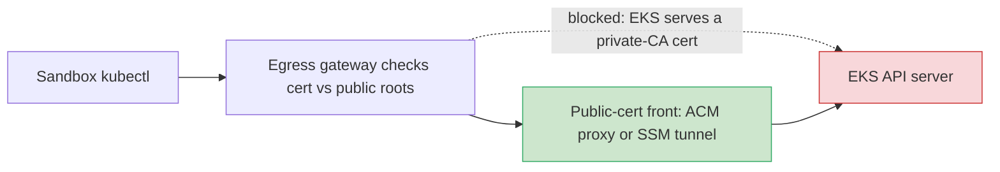

# Session Handoff — k8-platform

This file is the first thing a new session reads. It captures what was done
last, the current state, and the next concrete steps. Keep it factual
(AGENTS §8.3) and prune resolved items so the next session isn't misled.

---

## NEW SESSION QUICKSTART (read this first)

> ## ▶ 2026-09-08 — 🟢 STEP 1 OF THE NEW PLAN: repo re-verified after two idle months; fresh account probed; gate-ordering defect fixed in the recipe
> **Branch `claude/happy-goodall-3raowd`.** `main` = `d5e1ae1` (2026-07-05),
> no open PRs, all last gates green. Fresh Pluralsight account
> `058264287172` (empty: no EKS/state bucket/OIDC/Cognito; hosted zone only). <!-- noqa: account-id - run provenance, account rotates -->
> **GHA secrets VERIFIED for the new account** by the creds probe
> `terraform-test.yml` test/test-e2e run **34273668606** (creds PASS, zone
> PASS, state backend FAIL = expected before bootstrap). Dispatched and read
> via the **native GitHub MCP tools** (`actions_run_trigger`,
> `get_job_logs`) — first time; jentic not needed for dispatch/logs
> (`ai/environment.md` §6). Jentic hosted execution ends 2026-09-20.
> **Fixed this branch:** the build recipe waited for the XPlatformCluster
> XR Ready before pulling `spoke-access`, which deadlocks now that the
> IdP association (needs Keycloak, which needs spoke-access) is composed
> (retro 2026-07-06-255 remedy 8, never landed). Recipe now waits on the
> four published status facts + NodeGroup Ready, pulls gate 2, then waits
> XR Ready last (`docs/site/how-to/build-the-platform-from-nothing.md`;
> headers of `argocd/apps/spoke-access.yaml` and the XSpokeAccess XR).
> **Sandbox git facts (probed):** branch create + force-with-lease OK;
> non-branch refs and branch deletes → HTTP 403. Leftover branch
> `probe-delete-me-ref-test` on origin needs owner deletion (UI).
> **Beads groundwork:** `ai/beads-dolt-git-remotes.md` (condensed Dolt
> git-remote + beads facts + sandbox constraints + step-2 experiments).
> **STEP 2 INTAKE (owner plan 2026-09-08, steps 1–6):** replace this
> handoff + roadmap; classify every open issue defect-vs-feature for the
> "feature complete" definition (all non-feature OIs resolved; anything
> installed and erroring fixed + minimally tested); seed beads (Dolt on a
> branch ref, hooks-driven); rewrite the AGENTS.md posture block; carry
> the uncovered items from closed issue #22 into beads (shellcheck,
> actionlint, python lint, a `pull_request:` trigger = LESSONS S4).
> Retros are NOT harvested until the owner asks.


> ## ▶ 2026-07-06 LATEST — 🟢 ES ANTI-DRIFT DEFECT fixed red-first (L40); tunnel-reuse + docs remedies; retro addendum. PR #260. (Post-merge association verify was ALSO done independently by #259 — see that block below; this branch adds the defect #259 missed.)
> **Branch `claude/post-merge-propagation-verify-doeg57`, PR #260 (rebased
> onto `main` past #256–#259).** Account `975050361443` live + converged. <!-- noqa: account-id - run provenance, account rotates -->
> **The one thing #259 didn't catch:** the new cognito ExternalSecret sat
> spoke-keycloak **permanently OutOfSync** — three ESO-CRD-defaulted enums
> (`conversionStrategy`/`decodingStrategy`/`metadataPolicy`) omitted from
> `dataFrom[].extract`; ArgoCD's array diff can't ignore live-only
> additions, so selfHeal no-op-loops forever. Fixed red-first (contract
> test 3 FAIL → 55/55) + repo-wide lint `test_externalsecret_antidrift_enums.sh`
> (**L40**, enforced). Converges to Synced on merge (sources track `main`).
> **Delivery chain also proved live** (SUBSTRATE row 10 retrofit note): ES
> synced 12 s after terraform staged the ASM container; both KC pods
> rolled with the fail-closed `KC_COGNITO_*` env; broker ABSENT in the
> live realm via admin API (IGNORE_EXISTING). The EKS-side association
> ACTIVE is #259's record (row 11) — not re-litigated here.
> **Other remedies:** `sandbox-kubeconfig.sh` tunnel reuse (ends the
> setsid FATAL-flap; 5 cases live-tested); `ai/testing-guidelines.md` §7.1
> (run-ID-under-exact-HEAD sequencing); `self-retrospective` Step 0.5
> now checks `origin/main` for an existing retro before authoring.
> **Retro DONE:** `retrospective/2026-07-06-255-a.md` (addendum — the #255
> session merged its own retro as #257 mid-flight; #256 the L38/L39 rows +
> ADR-0013/0014). ADR-577f9c104d contract-docs-first draft proposed.
> **NEXT (supersedes the #259 "retro owed" note below — retro is done):**
> nothing on THIS account (build #5 fully exercised: evidence pass green,
> association ACTIVE, delivery chain proven, ES drift fixed). Rows 10/11
> need **clean build #6 on a ROTATED account**; stretch OI-2026-06-11-3/-4.


> ## ▶ 2026-07-06 (latest) — 🟢🟢🟢 CLEAN BUILD #5 + THE EVIDENCE PASS COMPLETE: all six oracles recorded, live-verify's first honest GREEN, OI-2026-06-12-1 CLOSED; phase-5 identity BUILT (pending build #6)
> **Everything on branch `claude/clean-build-5-evidence-ykmchk` (PR open —
> merge is the next owner action).** Account `975050361443`. <!-- noqa: account-id - run provenance, account rotates -->
> **Build #5 (zero manual steps, from `main` b85d7f2/0739c5e):** probe
> **28757370347** → base **28757434684** → management **28757800712**
> (first-attempt green — #245's first clean pass) → claim gate synced by
> explicit SHA (XR Ready 21 min) → spoke-access → registration Secret on
> its own → full stack Synced+Healthy incl. keycloak (observability pair
> = OI-2026-06-11-3; workload1 by design). ADR-0012 chain converged from
> committed source; Keycloak booted on the cross-cluster pull.
> **THE EVIDENCE PASS (the point):** all six oracles PASS recorded
> (RUN_ID build5-2347): hello-e2e (200/21 s) · spoke-cluster-secret (full
> contract) · sandbox-kubectl-relay (2 Ready) · rds-instance (base VPC) ·
> keycloak-e2e (discovery 200 https, 1 s) · secretsmanager-secret
> (**AWSCURRENT — the chain's first oracle-recorded evidence**).
> live-verify main dispatch **28759141867** RED — REAL: the scoped
> verifier role lacked 3 read verbs; two checks reported denied reads as
> world state (false OI-2026-06-11-1 FAIL + false "not provisioned").
> Fixed code-not-hands same-session (policy verbs incl. the phase-5
> Describe/ListIdentityProviderConfigs, check-honesty hardening red-first,
> + `test_verifier_policy_covers_check_reads.sh` enforcing the class);
> policy applied by branch mgmt run **28759438992** → branch live-verify
> 28760138628 GREEN with secretsmanager/Secret + iam
> OIDC/RolePolicy PROMOTED to expect-full → **OI-2026-06-12-1 CLOSED**;
> the fail-closed live-evidence PR gate has its first producer. SUBSTRATE:
> rows 1–5+8 = 4×, 6/7 = 3×, 9 = 2×.
> **PHASE-5 IDENTITY BUILT (same branch; rows 10/11 pending build #6):**
> contract docs FIRST per the documentation plan (kubectl-via-group + UI
> SSO how-tos, identity-mapping reference — they ARE the spec); (a) the
> Cognito broker + cognito:groups→groups + username-template mappers in
> the realm via `${KC_COGNITO_*}` env substitution (VERIFIED empirically
> on pinned KC 24.0.5 in docker: substitution precedes import validation;
> unset placeholders survive verbatim so `${CLAIM.email}` coexists);
> delivery = terraform/base → ASM `k8-platform/base/cognito` → spoke ES →
> NON-optional secretKeyRef env (pod can't start with the Secret missing
> — fail-closed by construction; the Cognito client secret is
> Cognito-generated so the ADR-0012 generate-once chain CANNOT carry it —
> ops doc updated, the pre-ADR-0012 keycloak-oidc-clients routing note was
> stale); (b) EKS IdentityProviderConfig composed (resource 16, issuer
> combined from the same env pair as the cert/KC_HOSTNAME, external-name
> `keycloak`, kc: prefixes matching the inert kc-* bindings) + coverage
> oracle/registry/live check/render golden/CRD schema; (c) the REQ-AUTH-10
> federation oracle `cognito-federation-live.sh` (instantiate tier,
> mutating-mode-only, self-reaped directory fixture user — the hosted-UI
> form leg live-verified standalone against the real pool on build #5).
> k8s-admins/k8s-viewers groups now terraform-managed.
> **KNOWN PROPERTIES (not defects):** a live realm never re-imports
> (IGNORE_EXISTING — realm changes converge at the next fresh-DB build);
> the IdP association on a fresh build fail-retries until Keycloak's
> issuer serves (extends XR Ready by the app-stack time).
> **POST-MERGE ASSOCIATION VERIFIED LIVE (2026-07-06 02:04Z, not via the
> timer — checked in-session):** after #255 merged, the live build-#5
> platform XR gained the 16th resource by GitOps auto-sync and the EKS
> association reached **ACTIVE** — `eks-identity-provider-config-live`
> PASS (issuer `auth.platform.<domain>/realms/platform`, claim contract correct);
> the composite XR is Synced=True **Ready=True** (NO upjet wedge). This
> proves the EKS-side half (REQ-AUTH-07) live; it does NOT flip rows
> 10/11 — the realm broker (REQ-AUTH-02/08) is only real on a fresh-DB
> build, so full sign-in→kubectl federation still awaits build #6.
> **NEXT SESSION: (1)** rows 10/11 evidence needs **clean build #6** on a
> ROTATED account (a live realm never re-imports; build #5's association
> is already confirmed ACTIVE above) — same recipe (then
> the federation oracle in mutating mode + all oracles + live-verify —
> note the promoted expect-full kinds now enforce). **(2)** Retro for THIS
> session (self-retrospective; the 2026-07-05-252 retro covered through
> #252). **(3)** Stretch: OI-2026-06-11-4 (CI-harness queue),
> OI-2026-06-11-3 (spoke EBS CSI + default StorageClass — the
> observability pair). Parallel tracks stay in `planning/scenario-corpus/`.

> ## ▶ 2026-07-05 NIGHT (docs track) — 🟢 DOCS SITE LIVE WITH THE FULL "NOW" WAVE; scenario corpus is unblocked
> **Parallel documentation session (`planning/scenario-corpus/documentation-plan.md`).
> The site is LIVE and publishes on every merge to main:
> <https://lago-morph.github.io/k8s-platform/>.**
> **Merged: #247** (skeleton: `docs/site/` diataxis layout, `docs/mkdocs.yml`
> — NOT at root, `test_root_file_allowlist` — `docs/hooks/status_banner.py`
> enforcing `status: stable|contract|draft` front matter via
> `mkdocs build --strict -f docs/mkdocs.yml`, mkdocs pins in `versions.env`,
> `.github/workflows/docs-site.yml` strict-gate + Pages publish; that file
> is writable ONLY via the jentic bridge, ext-github §8) · **#249**
> (exemplar how-to, owner-approved template; + `.claude/settings.json` MCP
> permission allowlist, owner-directed) · **the now-wave PR** (this block
> rides it): 7 more how-tos, 5 reference pages, the first-application
> tutorial, the topology explanation — 16 pages total, all `stable`,
> authored from committed sources (XRDs, Compositions, AppProjects,
> ApplicationSets, chainsaw scenarios, ADR-0003/0010/0012) with v2
> vocabulary (XR, never "claim").
> **Owner focus: scenario authoring starts NOW against the published
> site** (docs-blindness per `planning/scenario-corpus/charter.md`; the
> blocked-on-docs count is the docs quality metric).
> **Docs still owed (later waves, not blockers):** phase-5 identity pages
> written as `contract` in their own owner-reviewed PR (they double as the
> phase-5 spec); observability pages once the storage gap closes; docs
> upkeep = new pages ride the PRs that change public surfaces. Docs
> sessions need NO cluster/AWS access; the strict build is the only gate.

> ## ▶ 2026-07-05 EVE (superseded by 2026-07-06 above) — 🟢 MATERIAL CHAIN LIVE ON BUILD #4; FOUR live defects fixed in code; oracles + live-verify still OWED
> **Session end state (sandbox expired mid-build; all work merged, all
> gates that ran are green).** Seven PRs merged to `main` (HEAD
> `145ea6e`), each with its honest gates:
> **#243** the OI-2026-06-12-1 material chain (chainsaw
> **28745436950** green for exact HEAD; ADR-0012 adopted) · **#244**
> handoff · **#245** kubeconfig truncate-race fix (11 provisioners
> shared one truncate-rewritten file; validated by management attempt
> #3 = run **28750304494** green) · **#246** scenario-corpus charter
> package (parallel track) · **#248** producer-RBAC bootstrap-ordering
> fix (chainsaw **28752221450** green; the RBAC now rides the claim
> app with 00-namespace) · **#250** tag-charset fix (parens/comma in
> XR descriptions broke CreateSecret) · **#251**
> secretsmanager:GetResourcePolicy for the crossplane policy (upjet's
> observe path; applied by management run **28755969208** green).
> **Build #4 chain (fresh account `211125323087`):** probe <!-- noqa: account-id - run provenance, account rotates -->
> **28744551280** → base **28746752536** → management **28750304494**
> (+ final policy apply **28755969208**) → both deliberate-sync gates
> pulled (claim re-pulled at `5d75248` after bootstrap propagated the
> include-list change — remember: app-spec changes need BOOTSTRAP to
> sync first, THEN the gate) → registration Secret complete on its own
> → spoke registered, app stack converged: spoke-hello /
> ingress-nginx / external-dns / eso / keycloak ALL Synced+Healthy
> (observability pair = known OI-2026-06-11-3; workload1-cluster
> OutOfSync by design).
> **THE HEADLINE (observed live 21:57Z, not yet oracle-recorded):
> both XPlatformSecret XRs Synced=True Ready=True — the platform
> generated material, the SecretVersions wrote AWSCURRENT into the
> deterministic containers, the spoke keycloak-admin ES pulled the
> cross-cluster key, and Keycloak BOOTED on it.** ADR-0012 works
> end-to-end live. All four defects were first-live-exercise finds:
> chainsaw runs on admin CI creds + paren-free descriptions, so only
> the live IRSA/tagging path could surface them — exactly the
> defense-in-depth the oracle layers predict.
> **NOT DONE — the evidence half (owed to the next session):**
> (1) the six oracles were NEVER RUN as recorded checks
> (hello-e2e-live, spoke-cluster-secret-live, sandbox-kubectl-relay,
> rds-instance-live, keycloak-e2e-live, + the ASM AWSCURRENT check);
> (2) **live-verify.yml was NEVER DISPATCHED** — OI-2026-06-12-1's
> close condition (live-verify green) is UNMET and the OI stays OPEN;
> (3) SUBSTRATE-READINESS has NO build-#4 row yet (no oracle run IDs =
> no row, per the gate's own rule); (4) no retrospective for this
> session yet.
> **NEXT SESSION:** (1) `scripts/whereami.sh` — if account
> `211125323087` is still alive, run the six oracles + dispatch <!-- noqa: account-id - run provenance, account rotates -->
> `live-verify.yml` immediately (substrate is up and converged),
> record run IDs in SUBSTRATE + close OI-2026-06-12-1; if rotated,
> clean build #5 from `main` (zero manual steps — all four fixes are
> merged; recipe unchanged) then the same evidence pass. (2) Phase-5
> identity half (SUBSTRATE rows 10/11; the docs plan says its
> user-facing pages get written as `contract` first). (3) Stretch:
> OI-2026-06-11-4, OI-2026-06-11-3. Parallel tracks live in
> `planning/scenario-corpus/` (charter → new scenarios repo; docs
> plan → docs-track session).

> ## ▶ 2026-07-05 (superseded by EVE above) — 🟢 MATERIAL CHAIN MERGED (#243, ADR-0012 adopted); account rotated to `211125323087`; next = clean build #4 <!-- noqa: account-id - run provenance, account rotates -->
> **The OI-2026-06-12-1 rework is LANDED on `main` (`b2880a9`).** Creds
> probe run **28744551280** confirmed the GHA secrets resolve to the
> fresh account (Route53 zone reachable; only the expected
> un-bootstrapped bucket/lock-table failures). PR **#243** re-landed the
> chain from the bdcc56a design state per ADR-12992f055b — **adopted as
> `docs/decisions/0012-secretversion-writes-mr-owned-asm-values.md`**:
> deterministic `k8-platform/<ns>/<name>` naming; Password generator →
> generate-once ES → crossplane-native **SecretVersion** writer; the
> `keycloak-secrets` producer Application; the spoke keycloak-admin
> ASM-pull swap (deletionPolicy **Retain**, the #231 lesson) with
> `test_keycloak_admin_secret_source.sh` rewritten to the
> producer-coupled contract in the same PR. **Chainsaw run
> `28745436950` GREEN for the exact HEAD `91acd17`** (~9 min, full
> real-ASM suite — the chain's FIRST green gate; the June job-timeouts
> stay attributed to the retired account). Chainsaw-verify green on
> attempt 2 (post-run re-run); unit + validate green; live-evidence
> gate red by design (pre-producer, precedent #227). Scenario 00 now
> asserts the AWSCURRENT `{"value":…}` payload out-of-band.
> **What remains for OI-2026-06-12-1 to CLOSE: live-verify.yml green**
> — needs build #4's substrate (the scoped verifier role + provisioned
> XRs); dispatch it after the spoke + keycloak-secrets sync.
> **NEXT (run order): (1) clean build #4 from `main`** (`b2880a9`) —
> same recipe as #1–#3: base → management `apply-and-verify`; sync
> `platform-cluster-claim` then `spoke-access` via the SSM relay
> (`argocd app sync --core`, no patches); all six oracles incl. the
> material chain's live evidence; append run IDs to
> SUBSTRATE-READINESS. **(2) live-verify.yml** (closes
> OI-2026-06-12-1). **(3) Phase-5 IDENTITY half** (SUBSTRATE rows
> 10/11): (a) Cognito broker block ABSENT-or-real in the realm, URLs
> from terraform/base outputs, client secret via the
> keycloak-oidc-clients chain (now landed); (b) EKS
> IdentityProviderConfig in the platform-cluster Composition
> (usernameClaim=preferred_username, groupsClaim=groups, prefix `kc:`);
> (c) REQ-AUTH-10 federation oracle. Stretch: OI-2026-06-11-4 (CI
> queue), OI-2026-06-11-3 (spoke EBS CSI + StorageClass).
> **PARALLEL TRACK (owner-directed 2026-07-05, contained in
> `planning/scenario-corpus/`):** a separate `k8s-platform-scenarios`
> repo (charter.md is its first commit — docs-blind scenario corpus,
> four-way defect triage) + documentation as a first-class deliverable
> (documentation-plan.md: diataxis, source in `docs/site/` here,
> published via Pages; phase-5 pages written as `contract` BEFORE the
> implementation). Scenario seed backlog: scenario-brainstorm.md.
> Neither track blocks the build/identity work in this session.
> **Build-#4 note:** TWO real committed defects surfaced (both fixed
> red-first, code-not-hands): (1) 11 local-exec provisioners shared one
> truncate-rewritten kubeconfig (parallelism race; builds #1–#3 won the
> timing) — #245, `test_tf_provisioner_kubeconfig_isolation.sh`;
> management attempt #3 (run 28750304494) GREEN with the fix. (2) The
> ADR-0010 producer RBAC lived in crossplane/rbac/ but targets ns
> `platform`, created only by the MANUAL claim gate ~15 min after
> bootstrap — crossplane-resources' auto-sync failed "namespaces
> \"platform\" not found", exhausted retries, spoke never registered
> (masked on builds #1–#3 by mid-build merges retriggering the sync).
> Moved to clusters/platform/01-provider-kubernetes-rbac.yaml (rides
> the claim app include list with 00-namespace.yaml);
> `test_crossplane_resources_namespace_bootstrap_safe.sh` pins the
> class. Re-pull BOTH gates after merging (claim app then spoke-access
> — the claim sync now also applies the RBAC).
> **Sandbox note:** this remote sandbox's egress policy 403s
> github.com release downloads (helm charts, yq, kubeconform binaries)
> — `test_helm_render.sh` fails HERE on unmodified main; CI is fine.
> Tool workaround: `go install` via proxy.golang.org (yq, kubeconform).

> ## ▶ 2026-06-12 EVE (superseded — material chain merged 2026-07-05; account rotated) — 🟢🟢🟢 CLEAN BUILD #3 COMPLETE incl. the FIRST keycloak boot (OI-2026-06-07-5 + OI-2026-06-11-1 CLOSED)
> **Build #3 ran end-to-end on fresh account `798802785871`** <!-- noqa: account-id - run provenance, account rotates -->
> from post-#227 `main` (`0dd6114`), zero manual steps. Chain: probe
> 27429228144 → base **27429951073** → management **27430525986** →
> `platform-cluster-claim` synced from main via the SSM relay
> (`argocd app sync --core`; XR Ready ~21 min) → `spoke-access` from
> main, no patches → registration Secret complete on its own → ALL
> oracles PASS: hello-e2e-live (200 first poll),
> spoke-cluster-secret-live, sandbox-kubectl-relay (spoke 2 Ready),
> rds-instance-live (instance IN THE BASE VPC — OI-2026-06-11-1
> CREATE-path close), **keycloak-e2e-live (https OIDC issuer — the
> OI-2026-06-07-5 behavioral close)**. SUBSTRATE rows 1-5+8 now 3×,
> rows 6+7 now 2×.
> **The keycloak first boot surfaced FOUR committed defects; all fixed
> in code red-first and merged mid-build** (GitOps propagation only):
> **#231** the OI-2026-06-12-1 chain revert missed the spoke admin ES
> (ASM-pull on an unproduced key + deletionPolicy Delete →
> SecretDeleted, pods CreateContainerConfigError); **#232** realm JSON
> carried `"comment"` doc fields — Keycloak's strict parser aborts the
> import; **#233** the deferred cognito IdP block shipped TODO_
> placeholder URLs — import-time validation fails closed (block now
> ABSENT until live wiring); **#234** http issuer behind the L4-TLS
> NLB → KC_HOSTNAME(+STRICT_HTTPS) templated from cluster facts in the
> ApplicationSet. Plus **#235**: rds-instance-live compared the CLI's
> `False` to lowercase `"false"` (false negative on the fixed
> placement); keycloak oracle now logs real HTTP status (a 503 window
> had logged as "connection refused").
> **⚠️ ACCOUNT `798802785871` SHUTS DOWN ~2026-06-12 21:20 UTC** <!-- noqa: account-id - run provenance, account rotates -->
> **— treat the next account as EMPTY; probe the GHA creds first** (the
> build-#3 recipe needs no changes — everything load-bearing is in
> `main` with run-ID evidence; no live state is owed anything).
> **Final live snapshot before shutdown (20:45 UTC):**
> hub-observability-alloy **Synced+Healthy** — the #227 CRD-whitelist
> fix VERIFIED live (was Missing on builds #1+#2; diagnosis closed
> behaviorally). keycloak-db Synced+Healthy. kube-prometheus-stack
> Degraded / loki Progressing = the known OI-2026-06-11-3 CSI gap,
> unchanged. **workload1-cluster "OutOfSync" DIAGNOSED AS NOT A
> DEFECT:** the app has NO automated syncPolicy — it is a
> deliberate-sync gate (it provisions a third EKS cluster) that no
> build has ever pulled; OutOfSync/Missing is its designed pre-sync
> state. Drop it from the leftovers list.
> **NEXT (unchanged order):** (1) Task 3 = the OI-2026-06-12-1
> XPlatformSecret material-chain rework (design in the OI entry;
> chainsaw-gate it — chainsaw needs NO substrate, kind + real ASM under
> the GHA creds, so it works the moment the secrets point anywhere
> valid; the #231 unit test self-flags to force the file+producer+test
> swap in one PR) → then dispatch `live-verify.yml` for the
> live-evidence producer. (2) OI-2026-06-11-4 CI-harness queue (safe,
> no concurrent consumer). (3) OI-2026-06-11-3 spoke EBS CSI +
> StorageClass (un-Pendings kube-prometheus-stack/loki).
> **(4) Phase-5 IDENTITY half (SUBSTRATE rows 10/11, the new headline
> feature):** the Cognito broker block + the EKS IdentityProviderConfig
> do NOT exist; "phase 5" today = "Keycloak runs", not "humans get
> kubectl access from their directory group". The largest remaining
> design-heavy item.

> ## ▶ 2026-06-13 (superseded — the deferred material chain landed 2026-07-05, PR #243) — three guards + SUBSTRATE phase-5 rows merged; material chain DEFERRED to the account session
> Implemented the sandbox-completable retro remedies (PR #241, four
> commits, all unit-green): the chainsaw-dispatch **commit_sha guard**
> in the pre-dispatch hook (blocks the hallucinated-SHA dispatch class;
> now also recognizes the `mcp__github__actions_run_trigger` transport,
> not just the jentic execute path); the **placeholder-value lint**
> (`TODO_` in any runtime value = defect; `PLACEHOLDER_` must be one of
> the four inert-by-override tokens — the #233 class); the
> **aws-`--output text` boolean-compare lint** (the #235 case-mismatch
> class); and **SUBSTRATE rows 9/10/11** making the phase-5 identity gap
> explicit. Retro-236 Proposal 4 (revert-verification) was **retired**
> after owner review — it was circular (choosing the pre-feature
> baseline needs the knowledge whose absence caused the bug); the real
> safeguard is the per-file content-invariant test, already policy and
> already done for the file that broke.
> **DEFERRED — material chain (Task 3 above) was NOT touched this
> session BY DESIGN:** its only proof is the heavy real-ASM chainsaw
> gate, unreachable without the account. The design (ADR-12992f055b,
> drafted, on disk) and its now-cleared blocker (catch-block fix merged,
> chainsaw proven green run 27429434084) are ready; the account session
> implements + validates it. This is the one outstanding suggested
> implementation that could not be finished in the sandbox.

> ## ▶ 2026-06-12 PM (superseded — build #3 completed; see EVE) — 🟢 #227 MERGED (chainsaw green on the fresh account); clean build #3 IN FLIGHT
> **Account rotation CONFIRMED: `798802785871`** <!-- noqa: account-id - run provenance, account rotates -->
> **— GHA secrets already resolve to it** (probe test-e2e run 27429228144:
> creds → new account, Route53 zone reachable; only the expected
> no-bootstrap bucket/lock-table failures).
> **PR #227 MERGED** at main `0dd6114`. The chainsaw gate cleared
> honestly: run **27429434084** (HEAD `b3f0363`, full suite, real ASM)
> green in ~5 min; verify check green (27429887657); unit green
> (27429357854). Before dispatching, the OI-2026-06-12-1 catch-block fix
> landed on the branch — the MR-describe loop had THREE fatal bugs
> (wrong jsonpath `.spec.resourceRefs` vs v2 `spec.crossplane.resourceRefs`;
> `kind.$apiVersion` type arg kubectl misparses as TYPE/NAME; cluster-scoped
> describe of namespaced .m. MRs) and had NEVER produced output. The
> 23:58→04:5x reds on the retired account stay consistent with
> account-side ASM behavior there (same content green before 23:05 and
> green again on the new account) — see the OI entry.
> **Build #3 chain (run IDs are the evidence):** base apply-and-verify
> = run **27429951073** (dispatched 16:50Z from main `0dd6114`) → next:
> management apply-and-verify → SSM relay → sync `platform-cluster-claim`
> from main → XR Ready → sync `spoke-access` from main (no patches) →
> hello 200 + oracles (hello-e2e-live, spoke-cluster-secret-live,
> sandbox-kubectl-relay) **+ NEW keycloak-e2e-live.sh** (first-boot
> OI-2026-06-07-5 close; fresh RDS lands in the base-VPC subnet group).
> Append row-6 / build-#3 evidence to SUBSTRATE-READINESS.md.
> **Then:** Task 3 = OI-2026-06-12-1 material-chain rework (design in the
> OI entry; chainsaw-gate it), then live-verify.yml producer; stretch =
> OI-2026-06-11-4 (CI-harness queue), OI-2026-06-11-3 (spoke EBS CSI).

> ## ▶ 2026-06-12 (superseded by the PM block above) — ⚠️ ACCOUNT ROTATES BEFORE THE NEXT SESSION; merge #227 FIRST, then build #3
> **The `608553548146` account is being retired** <!-- noqa: account-id - run provenance, account rotates -->
> **— treat the next account as EMPTY.** All live state from build #2 dies
> with it: hub, spoke, RDS, ASM contents, the in-flight keycloak
> convergence, and the planned keycloak-db delete/recreate dance (the
> instance was stuck in the default VPC's us-east-1d, unreachable and
> un-movable — OI-2026-06-11-1). That dance is now MOOT: on a fresh
> account the merged composition creates the instance directly in the
> base-VPC subnet group. Probe the GHA secrets first
> (`terraform-test.yml phase=test action=test-e2e`, read the account the
> creds resolve to) before trusting CI.
>
> **STEP 1 — merge PR #227 (branch `claude/clever-hamilton-b9kol3`,
> conflict-free vs main, all unit/validate gates green).** Its ONLY
> honest blocker is the chainsaw gate: a green `chainsaw.yml` run for
> the exact HEAD SHA, then a re-run of the `Verify chainsaw ran green`
> check. Chainsaw needs NO substrate — kind on the runner + real-ASM
> calls under the GHA creds — so this happens BEFORE any bring-up:
> 1. (Recommended first) push the OI-2026-06-12-1 catch-block fix to
>    the branch: the chainsaw catch scripts describe v2 MRs
>    cluster-scoped (`kubectl describe <kind> <name>`, no `-n`), so the
>    failing asm-secret MR's actual condition has never been visible —
>    switch to namespaced/`-A` describes so ONE run surfaces the real
>    error either way.
> 2. Pre-dispatch audit → dispatch `chainsaw.yml` on the branch HEAD
>    (45-min job cap is already in). GREEN → re-run the verify check →
>    merge #227 (live-evidence stays red by design, 5 merged
>    precedents). RED → the fixed catch block now names the real error;
>    diagnose per OI-2026-06-12-1 and fix in code.
> 3. Diagnostic value either way: every run 23:58→04:5x on the OLD
>    account failed the claim scenarios CONTENT-INDEPENDENTLY (even the
>    long-proven composition). Green-on-the-new-account sharpens
>    OI-2026-06-12-1 to account-side ASM behavior; red-with-real-error
>    ends the guessing.
> **Why merge before building:** #227 carries the kyverno
> OOM/cleanup-image fix, both IAM multi-resource-auth Sids, the
> bitnamilegacy keycloak image, and the alloy CRD whitelist — a build
> from pre-#227 main re-hits every one of them live.
>
> **STEP 2 — clean build #3 from the post-#227 main** (same recipe as
> builds #1/#2: base + management `apply-and-verify`, sync
> `platform-cluster-claim` then `spoke-access` from main, zero manual
> steps). NEW oracle on this build: `keycloak-e2e-live.sh` — with the
> image fix and the DB path in main, Keycloak should boot against RDS
> through the spoke ingress on the FIRST bring-up; that is the
> OI-2026-06-07-5 behavioral close + fresh row-6 evidence.
> **STEP 3** — the OI-2026-06-12-1 material-chain rework (unblocks the
> Task-3 `live-verify.yml` producer / the secretsmanager-Secret kind),
> then **OI-2026-06-11-4** (the retro's CI-harness hardening queue —
> safe now, no concurrent CI consumer), then OI-2026-06-11-3 (spoke
> CSI/StorageClass) for the observability stack.

> ## ▶ 2026-06-11 (build #2) — 🟢🟢 CLEAN BUILD #2 GREEN: the green-twice gate is SATISFIED
> **The S1 loop ran end-to-end a second time on fresh account `608553548146`** <!-- noqa: account-id - run provenance, account rotates -->
> from unmodified `main` (`582761f`), zero manual steps. Chain: probe
> test-e2e 27379831475 (CI creds → new account confirmed) → base
> 27379934113 → management 27380296208 (both `apply-and-verify` green) →
> `platform-cluster-claim` synced from `main` (XR Ready ~14 min) →
> `spoke-access` synced from `main`, NO oidcIssuer patch → registration
> Secret complete on its own → `hello.platform.<domain>` **HTTP 200,
> verified chain, first poll**. Oracles on this build: `hello-e2e-live.sh`
> PASS, `spoke-cluster-secret-live.sh` PASS, `sandbox-kubectl-relay.sh`
> (spoke, 2 Ready) PASS. `SUBSTRATE-READINESS.md` rows 1-5+8 now **DONE
> (2×)**; rows 6+7 earned first CREATE-path evidence (keycloak-db RDS +
> the SG rules provisioned from scratch under the fully narrowed policy,
> `rds-instance-live.sh` PASS). **The owner's green-twice posture gate is
> met — unattended volume runs unblock per AGENTS "Current operating
> posture".**
> - **The loop caught a NEW defect** (working as designed):
>   **OI-2026-06-11-1** — the RDS Instance lands in the account DEFAULT
>   VPC (no subnet group/SG composed) → unreachable from the platform
>   clusters. Durable fix AUTHORED (not yet merged) in **PR #226**.
> - **PR #226** (branch `claude/clever-hamilton-b9kol3`) carries, all
>   unit-green + chainsaw green (run 27381691574 for 30a2a87; re-dispatch
>   for the final HEAD after the RDS-fix commit):
>   (1) OI-2026-06-07-5 keycloak DB path — hub PushSecret→ASM
>   `k8-platform/keycloak-db`→spoke ExternalSecret; extraEnvVarsSecret
>   host/port override, the envFrom-last-wins premise PROVEN by
>   `test_keycloak_db_env_precedence.sh` (12/12) against pinned chart
>   21.4.4; connection-secret key names verified against the LIVE provider
>   output (host = bare hostname). keycloak-admin via ESO Password
>   generator (the XPlatformSecret XRs were never synced + provision
>   EMPTY shells = manual-step material, banned); realm CM moved to
>   `platform-services/keycloak/spoke/` (was never synced by anything),
>   all spoke-dir manifests wave -1 (wave>0 would deadlock the first sync
>   behind StatefulSet health). (2) Spoke ESO baseline (ADR-0005): eso
>   ApplicationSet + ClusterSecretStore + XSpokeAccess eso-role/eso-policy
>   + SIXTH contract key `eso-role-arn` (ADR-0010 amended). (3) The
>   OI-2026-06-11-1 RDS networking fix (SubnetGroup+SG+5432 rule from the
>   EnvironmentConfig; terraform publishes vpcId/vpcCidr; crossplane
>   policy + ec2:Create/DeleteSecurityGroup).
> - **#226 MERGED** (3be6afc) + management applied (run 27383258071).
>   Convergence on the live account then caught FOUR more real defects —
>   all fixed in code on **PR #227** (chainsaw-gated), each validated by a
>   branch `apply-and-verify` run:
>   1. **OI-2026-06-11-2** kyverno admission OOM-CrashLoop + all cleanup
>      jobs ImagePullBackOff (bitnami/kubectl pullback) → fail-closed
>      webhook blocked hub applies (incl. the xdatabase reconcile AND its
>      own helm upgrade hook — bootstrap deadlock; manifests landed on the
>      failed first apply, re-run recorded the release). Fix: bitnamilegacy
>      images + 768Mi (runs 27384384429 → 27384541609).
>   2. `ec2:CreateSecurityGroup` multi-resource auth (vpc resource carries
>      no ec2:Vpc key) → EC2CreateSecurityGroupInBaseVpc Sid (27383963580).
>   3. `rds:ModifyDBInstance` multi-resource auth (subgrp resource) →
>      RDSModifyInstanceSubnetGroup Sid (27385088657).
>   4. spoke keycloak image unpullable (same pullback class) →
>      bitnamilegacy/keycloak in values.
>   PLUS the Task-3 unblocked design: **XPlatformSecret in-platform
>   material chain + deterministic k8-platform/<ns>/<name> ASM naming**
>   (generator → generate-once ES → ARN-gated PushSecret; keycloak-secrets
>   hub app syncs the XRs at last; spoke keycloak-admin ES pulls the
>   deterministic key). ES manifests carry explicit ESO defaults (ArgoCD
>   perpetual-OutOfSync fix) + 5m refresh on the DB legs.
> - **2026-06-12 amendment:** the XPlatformSecret material chain was
>   REVERTED off #227 after four chainsaw job-timeouts — and the
>   post-revert run (27392834302, 45-min cap via the jentic workflow PUT,
>   full bounds honored) STILL failed every claim scenario with
>   `Unready: asm-secret, external-secret` on the LONG-PROVEN composition.
>   The chainsaw failure is NOT the chain: same content green 22:38+23:05,
>   red from 23:58 on — environmental-looking (full exclusion list +
>   hypotheses: **OI-2026-06-12-1**). FIRST next step: fix the chainsaw
>   catch blocks (they describe v2 MRs cluster-scoped → namespaced `-A`
>   describes) so ONE run surfaces the asm-secret MR's actual error; then
>   re-land the chain. **#227 is mergeable-on-green ONLY — its chainsaw
>   gate is red; do not merge around it.** #227 carries the seven
>   independently-validated fixes (kyverno OOM+images, 2× IAM
>   multi-resource-auth, keycloak bitnamilegacy image, alloy CRD
>   whitelist, ES normalization+5m refresh, chainsaw sweep+45min cap).
>   Task-3 live-verify stays blocked on the secretsmanager-Secret kind
>   until the chain is reworked.
> - **NEXT:** (1) merge #227 when its chainsaw (final HEAD) is green → GitOps
>   converges the spoke (legacy keycloak image + ES swaps + keycloak-secrets)
>   → RDS completes its base-VPC move (subgrp Sid landed; provider retry)
>   → **keycloak-e2e-live.sh** (the committed boot oracle). (2) dispatch
>   `live-verify.yml` (Task 3): with the material chain + the RDS move +
>   keycloak up, all 18 expect-full kinds have real producers; the
>   live-evidence PR gate gets its green producer. (3) OI-2026-06-11-3
>   (spoke CSI/StorageClass — DIAGNOSED, fix is feature-sized): EBS CSI +
>   default StorageClass into the platform-cluster Composition; that
>   un-Pendings kube-prometheus-stack/loki. (4) hub-observability-alloy
>   OutOfSync/Missing still undiagnosed; workload1-cluster OutOfSync —
>   re-check after kyverno settles (likely webhook down-windows).

> ## ▶ 2026-06-10 (superseded by build #2 above) — 🟢 CLEAN BUILD #1 GREEN: the substrate built itself from `main` with ZERO manual steps
> **The S1 loop ran end-to-end on fresh account `341221860475`** <!-- noqa: account-id - run provenance, account rotates -->
> after merging the durable-fix stack (#220/#221/#222) + the mid-build fix
> (#223). Full evidence + run IDs: `SUBSTRATE-READINESS.md` (rows 1-5 and 8
> now hold clean-build evidence; **the gate is green ONCE — owner posture
> needs it green TWICE before unattended volume runs resume**).
> - Chain: base CI run 27305258998 -> management CI run 27305788371 (both
>   `apply-and-verify` green from `main`) -> `platform-cluster-claim` synced
>   from `main` -> `spoke-access` synced from `main` **with NO oidcIssuer
>   patch** (the ADR-0010 PR-2 Observe path supplied it) -> registration
>   Secret appeared complete (all 3 labels + 5 contract annotations) -> all 7
>   ApplicationSets generated -> spoke hello/ingress-nginx/external-dns
>   Synced+Healthy -> `hello.platform.<domain>` **HTTP 200, verified public
>   chain**. Oracles on this build: `hello-e2e-live.sh` PASS (first-ever
>   run), `spoke-cluster-secret-live.sh` PASS, `sandbox-kubectl-relay.sh`
>   (spoke, 2 Ready nodes) PASS.
> - **The loop caught a real defect mid-build** (working as designed):
>   OI-2026-06-10-1 — ACM provider v2.5.0 leaves the Certificate
>   external-name EMPTY, so `certificateArnSelector` never resolves; fixed
>   in code (PR #223, ARN routed via the composite) and converged by GitOps,
>   no hand-edits.
> - Observed non-gate states on the live spoke (NOT silently skipped, NOT
>   investigated this session): `spoke-keycloak` Progressing (expected —
>   OI-2026-06-07-5 DB host/port unbuilt, PLACEHOLDER_DB_HOST stands),
>   `spoke-observability-kube-prometheus-stack` Degraded,
>   `spoke-observability-loki` Progressing, `hub-observability-alloy`
>   OutOfSync/Missing. Next session: diagnose alloy + the observability pair.
> - **NEXT SESSION:** (1) clean build #2 on the next fresh account (same
>   recipe, zero manual steps) to satisfy the green-twice posture;
>   (2) OI-2026-06-07-5 (keycloak-db PushSecret->ASM->ExternalSecret + the
>   recorded extraEnvVarsSecret direction with a helm-render fixture —
>   ADR-0010 PR-2 Decision 3) which unlocks SUBSTRATE row 6 (RDS CREATE
>   path); (3) dispatch `live-verify.yml` on this account so the
>   live-evidence PR gate finally has a green producer; (4) the alloy/
>   observability diagnoses above; (5) **OI-2026-06-11-4** — the CI-harness
>   hardening queue (chainsaw-verify wait loop, kind-URL pin, verifier
>   trigger diagnosis; owner-approved, deferred only for session
>   concurrency — do these when no other session is using CI).

> ## ▶ 2026-06-10 (earlier) — ALL FOUR DURABLE FIXES AUTHORED (ADR-0010 PR-2 + rows 2/3)
> Three stacked PRs (base→tip: `claude/adr-0010-durable-fixes-hg7909` →
> `…-sg-443` → `…-subnet-tags`) complete the durable-fix backlog
> (`SUBSTRATE-READINESS.md` rows 2, 3, 5; row 4's producer dependency now
> built). **Everything is `pending clean-build verification` — zero live
> evidence exists; the live-evidence gate on these PRs is RED by design
> (fail-closed, the PRs touch crossplane/** + terraform/**).**
> 1. **Row 5 / OI-2026-06-07-1 (ADR-0010 PR-2, the producer):** the spoke
>    ArgoCD registration Secret is now composed by `xspokeaccess-aws` via two
>    provider-kubernetes Objects — a cluster-facts OBSERVE Object reading the
>    PAIRED XPlatformCluster (same XR name/namespace; readiness requires all
>    four facts → loud wait-state) and the complete-or-absent
>    `spoke-cluster-secret` writer (every manifest patch Required; name
>    `<subdomain>-spoke`; five contract annotations + selector labels;
>    config = awsAuthConfig/clusterName + observed caData). The
>    `spec.oidcIssuer` placeholder overlay is RETIRED (XRD rejects it).
>    Four deferred ADR-0010 decisions resolved + recorded in ADR-0010
>    "PR-2 resolutions" (mechanism fork → provider-kubernetes, amending
>    ADR-0005's Alternatives in place; region → spec.region; keycloak DB
>    host/port stay out of contract, extraEnvVarsSecret direction rides
>    OI-2026-06-07-5; single-writer honestly framed as convergence control).
>    Brief + 2 adversarial review rounds:
>    `planning/adr-0010-cluster-facts/adr0010-pr2-producer-brief.md`.
>    New plumbing: kubernetes.m.crossplane.io ClusterProviderConfig `hub`
>    replaces the legacy-group ProviderConfig (terraform), pinned
>    `provider-kubernetes` SA, namespaced RBAC (`crossplane/rbac/02-*`),
>    k8-platform AppProject whitelists Role/RoleBinding.
> 2. **Row 2 / OI-2026-06-07-4:** `hub-eks-api-ingress` (classic
>    SecurityGroupRule — upjet v2.5.0 can't observe SecurityGroupIngressRule)
>    in the platform-cluster Composition; `managementNodeSecurityGroupId`
>    added to the cluster-network EnvironmentConfig.
> 3. **Row 3 / OI-2026-06-07-3:** terraform/base tags
>    `kubernetes.io/cluster/<name>=shared` on elb+internal-elb subnets for
>    every `hosted_cluster_names` entry (default = every committed
>    XPlatformCluster spec.name; the new lint caught workload1 immediately).
> Gates: full unit suite green on every branch; terraform validate green
> (base + management); render goldens regenerated (xspokeaccess golden now
> renders the COMPLETE Secret from a status-populated input); chainsaw
> `xspokeaccess/00-xrd-establishes` authored (v2 CRD-boundary change,
> ADR-0001) — dispatch status in the PR threads. New live oracle authored:
> `tests/live/checks/after/spoke-cluster-secret-live.sh` (registry
> `kubernetes.m.crossplane.io/Object`).
> **NEXT SESSION = the build loop (`ai/LESSONS.md` §5 S1):** merge the stack
> in order (or rebuild from the tip branch), then tear down / take a fresh
> account and rebuild 0→1→spoke from committed source with ZERO manual
> steps; fill the SUBSTRATE evidence columns by run ID. Watch specifically:
> spoke-access sync now needs NO oidcIssuer patch (the observe path does
> it); the registration Secret must appear labeled+complete on its own; the
> hub→spoke ArgoCD reachability and the spoke NLB must come up with zero
> hand-fixes.

> ## ▶ 2026-06-10 (later) — KEYSTONE CONSUMER HALF SHIPPED (ADR-0010)
> **OI-2026-06-07-2 mechanism decided + consumer half implemented** (owner-ratified;
> ADR-0010 — supersedes ADR-0005's "cluster-facts ConfigMap" carrier, which
> tree-grounded review proved infeasible for annotation-borne facts):
> - The ten `argocd/apps/spoke/` Applications are now **seven per-add-on
>   ApplicationSets**. Cluster generators select labeled spoke cluster Secrets
>   (`k8-platform.io/cluster-role=spoke`, `short-name`) and template the
>   **five-fact contract** (`k8-platform.io/{domain,subdomain,certificate-arn,
>   external-dns-role-arn,region}` annotations) into helm values.
>   `missingkey=error`, `preserveResourcesOnDeletion: true`, waves ride the
>   generated apps. The workload1-* mirror files collapsed into the shared sets
>   (phase-6 fan-out is now free); alloy keeps its deliberate hub destination
>   (reverses auto-008 F1, recorded in the ADR); hello stays cloud-agnostic
>   (domain+subdomain only). NO hand-overlay surface remains under apps/spoke/.
> - Gates: `test_cluster_facts_contract.sh` (bidirectional contract lint),
>   rewritten `test_spoke_apps/observability/keycloak/workload1` suites,
>   kubeconform now ACTUALLY validates ApplicationSets (schema added; argo CRD
>   pin aligned v2.13.1→**v2.10.4** = the deployed chart 6.7.3). Full unit
>   suite green. Adversarial reviews in `planning/adr-0010-cluster-facts/`.
> - **NOT done (= ADR-0010 PR-2, the next scoped session = readiness row 5):**
>   the PRODUCER — OI-2026-06-07-1's durable registration Secret must carry the
>   contract labels/annotations (resolve the ESO-vs-provider-kubernetes fork
>   there), `region` needs a surfaced source (NOT in the `cluster-network`
>   EnvironmentConfig today), keycloak DB host/port path (`extraEnvVarsSecret`
>   vs contract extension), and the single-writer RBAC note. Until PR-2 + a
>   clean build, row 4 of `SUBSTRATE-READINESS.md` stays
>   `pending clean-build verification`.
> - **Cutover caveat:** the swap is non-atomic on a live hub (bootstrap prunes
>   the old Applications; the AppSet-generated same-named ones re-sync fresh).
>   Fine for the teardown+rebuild validation path; do not expect continuity on
>   a running environment.

> ## ▶ 2026-06-10 — INSTRUCTION SURFACE RESTRUCTURED (forensics round 2)
> The 748-line AGENTS.md + 46 detail files were replaced by a ~140-line
> operating agreement (`AGENTS.md`); environment/capability facts moved to
> `ai/environment.md`; lessons + the remedy-decision protocol live in
> `ai/LESSONS.md` (read it before proposing any rule/skill/process change).
> The old rulebook is archived intact at `docs/archive/agents-v1/` — all
> historical "§x.y" citations resolve there. 10 skills archived to
> `.claude/skills-archive/`. New push-gated lints: no hardcoded account IDs
> (SPEC-B5), no committed next-session prompts, root-file allowlist.
> **Operating posture (owner-set):** unattended volume runs PAUSED until the
> `SUBSTRATE-READINESS.md` gate is green twice; short scoped sessions with
> machine-verifiable exits; the only feature backlog is the four durable
> fixes + the from-scratch evidence loop (`ai/LESSONS.md` §5: S1–S3).
>
> The auto-017 run order below remains the correct *platform* work queue.

> ## ▶ NEXT SESSION — auto-017 (account may have rotated; re-verify per §8.1)
> **⚠️ CLEAN-BUILD HONESTY (read `SUBSTRATE-READINESS.md` + AGENTS §6.41 FIRST).**
> auto-016 declared progress but **clean-build-tested NONE of it**. Every "fix" below was
> validated by a **live hand-workaround**, not by the committed artifact from a clean
> build, or not tested at all. NOTHING here is "done" — every item is
> `pending clean-build verification`. The auto-017 job is NOT more features: it is to
> build the missing durable fixes, then **tear down and rebuild from committed source with
> ZERO manual steps**, and fill in the evidence column of `SUBSTRATE-READINESS.md`. Do not
> resume test-overhaul work until that checklist is green.
>
> **auto-016 work (PRs #209–#214) — status, honestly stated:** Full narrative: `run-summary-auto-016.md`.
> Account this ran on: `471112679140` (us-east-1) — may rotate; confirm with <!-- noqa: account-id - historical run provenance; account rotated -->
> `aws sts get-caller-identity` first.
>
> **Substrate brought up fresh + the auto-015 IAM narrowing RE-VALIDATED on the
> CREATE path.** base + management via CI `apply-and-verify` (runs `27174339355`,
> `27174531578`, green); the spoke via ArgoCD GitOps (synced `platform-cluster-claim`
> on committed `main`). Hub `k8-platform-mgmt` 3 Ready, spoke `k8-platform-services`
> ACTIVE 2 Ready. The narrowed Crossplane policy was applied **from the start**: the
> spoke OIDC provider + 3 Roles + RolePolicy + 2 AccessEntries + 2 AccessPolicyAssociations
> all reached `Ready=True` under it (re-validates OI-2026-06-08-1's identity narrowing).
>
> **⚠️ FOUND + FIXED a real fail-closed regression (OI-2026-06-09-1, PR #213).** The
> auto-015 narrowing scoped `iam:GetRole` to `role/k8-platform-*`, which broke EKS
> `CreateNodegroup` (it validates the SLR `AWSServiceRoleForAmazonEKSNodegroup` via
> `iam:GetRole`) → **the spoke came up with 0 nodes**. Fixed by an `EKSServiceLinkedRoles`
> Sid scoped to `role/aws-service-role/eks*.amazonaws.com/*`; proven live (nodegroup
> ACTIVE immediately after). **Merge #213 first** — a fresh-account spoke bring-up is
> broken under `main` without it.
>
> **RDS/EC2 narrowing (OI-2026-06-08-1 follow-up): drafts.** RDS PR #211 (applied live
> via mgmt apply on the branch, run `27176069142`; ongoing reconcile green; pristine
> CREATE proof deferred — the Instance pre-existed the narrowing). EC2 PR #212 (draft,
> stacked on #211; one reviewer recommends defer — close #212 to take it). Brief:
> `planning/test-overhaul/decisions/auto-016-001-*` (2 rounds, 6 reviewers).
>
> **OI-2026-06-08-2 hello e2e: check authored (PR #210), NOT live-validated.** It is a
> HARD bounded-poll (no self-gating skip). Blocked from a clean-build validation by
> the overlay gap below.
>
> **3 recurring gaps bit again; live-fixed, durable fixes STILL OWED:**
> 1. **OI-2026-06-07-4** hub→spoke API SG 443 (ArgoCD couldn't reach the spoke) —
>    authorized live; durable Composition `SecurityGroupRule` (mgmt SG → spoke API)
>    owed.
> 2. **OI-2026-06-07-3** shared ELB subnet tags (NLB "no suitable subnets") — tagged
>    live; durable base-terraform tag owed.
> 3. **OI-2026-06-07-2** placeholder overlays vs bootstrap selfHeal — **NOW BLOCKING.**
>    The spoke apps' `domain` + `aws-load-balancer-ssl-cert` placeholders won't stay
>    overlaid (selfHeal reverts), so the spoke NLB never gets a valid cert and
>    `hello.platform.<domain>` is unreachable. Needs the ADR-0005 cluster-facts
>    ConfigMap (not another hand-overlay).
>
> **NEXT SESSION RUN ORDER (auto-017):**
> 1. Merge #213 (regression fix). Bring up base→hub→spoke from `main` (the SLR fix +
>    the live SG/subnet fixes recur — apply them, or ship the durable fixes first).
> 2. **Implement OI-2026-06-07-2** (cluster-facts ConfigMap, ADR-0005) — this unblocks
>    the hello app stack AND the 2 SKIP flips. Then ship durable OI-2026-06-07-3/-4.
> 3. With overlays working: sync the spoke app stack → `hello.platform.<domain>` 200 →
>    **live-validate PR #210** (run `tests/live/checks/after/hello-e2e-live.sh`).
> 4. Once Keycloak's `XPlatformSecret` provisions: flip the last 2 SKIP kinds
>    (`secretsmanager Secret` + `ExternalSecret`) into `LIVE_EXPECT_FULL`.
> 5. STEP 0 producer (live-verify.yml) green on the 10-kind set; live-evidence-verify
>    flips GREEN on a trivial `crossplane/**` PR.
> 6. Track B mutating (P4/P5) + pristine RDS CREATE proof (delete+recreate keycloak-db
>    under the narrowed policy) to flip #211 ready; decide #212 (ship/defer EC2).
> Constraints unchanged (ADR-0006 NON-GOALs; zero-wildcard verifier role; LIVE_MODE
> mutating off by default; §6.35 clean-build; §6.37 self-grant — do NOT call the
> sandbox read-only). Do NOT author a committed next-session prompt (§6.38).

> ## ▶ [SUPERSEDED by auto-016 results above] ORIGINAL auto-016 BRIEF (account may have rotated; re-verify per §8.1)
> **DONE 2026-06-08 (auto-015, PRs #201–#207).** Full narrative: `run-summary-auto-015.md`.
> Account this ran on: `176646220910` (us-east-1) — may rotate; confirm with <!-- noqa: account-id - historical run provenance; account rotated -->
> `aws sts get-caller-identity` before trusting any live state below.
>
> **Substrate brought up live + verified:** terraform base + management via CI
> `apply-and-verify` (green); the platform **spoke** via ArgoCD GitOps (synced
> `platform-cluster-claim` on committed `main`). Hub `k8-platform-mgmt` 3 Ready,
> spoke `k8-platform-services` ACTIVE 2 Ready, `*.platform.<acct>...` ACM ISSUED.
> `cloud_user` self-grant of `AmazonEKSClusterAdminPolicy` on the hub was a no-op
> (the mgmt terraform already grants it) — full kubectl write via the relay.
>
> **OI-2026-06-08-1 (IAM `Resource:*`) — IAM RESOLVED + VALIDATED LIVE (#203).**
> Narrowed the Crossplane provider role: role actions→`role/k8-platform-*`,
> OIDC→`oidc-provider/*` (EKS/EC2/RDS/ACM stay `*`). 2 adversarial rounds (6 real
> reviewers). Applied (run 27157161037) then **proven on the spoke CREATE path** —
> the hub Crossplane created the spoke OIDC provider + external-dns Role + inline
> RolePolicy under the narrowed policy (all crossplane-tagged), cluster stayed
> Synced=True, 0 MRs not-Ready. ⚠️ **The live policy is now NARROWER than `main`** —
> merge #203 to align (else a future mgmt apply from `main` reverts to the broad
> superset, which is safe). Live FINDING: `aws iam simulate-principal-policy` returns
> `implicitDeny` for *every* action on a freshly-modified IRSA role (even `*`-scoped
> ones), so the simulate-based deny check **skips** when the simulator is unusable —
> the authoritative proof is the CREATE path + the Sid-anchored lint.
>
> **Track B shipped (hermetic, off-by-default; live mutating runs are the remaining step):**
> P3 mutex+reaper wired into `tests/live/run.sh` (#202); P4 instantiate-and-verify
> harness for `iam Role` + `secretsmanager Secret` (#204, bare ASM Secret MR — not
> XPlatformSecret, which couples to the ClusterSecretStore); P5 three guard-fired
> negatives — AppProject sourceRepo/destination + crossplane-SA RBAC (#206; the
> Kyverno guard was correctly rejected — all policies are Audit, not Enforce).
> ExternalSecret check hardened against relay flake (#205).
>
> **Iteration-5 OIDC federation AUDITED — NO BUG.** Cognito is brokered *behind*
> Keycloak (Keycloak = relying party); AWS IAM/STS never trusts Cognito directly, so
> the absent `aws_iam_openid_connect_provider` for Cognito is correct.
> `aws_eks_identity_provider_config` is genuinely unbuilt (Iteration 5), not a bug.
>
> **NOT done (carried forward):**
> 1. **Flip the last 2 SKIP kinds** — `secretsmanager Secret` + `ExternalSecret` need
>    Keycloak's `XPlatformSecret` claim, which provisions with the spoke **app stack**
>    (ingress-nginx → external-dns → keycloak → hello), not yet synced this run. (The
>    OIDC provider + inline RolePolicy SKIPs ARE flipped — real + crossplane-tagged.)
> 2. **STEP 0 full 10-kind producer** — needs the spoke app stack provisioned. The
>    pipeline is unchanged + working; this is a provisioning gap.
> 3. **Live-validate P4/P5 in mutating mode** — `LIVE_PROFILE=full LIVE_MODE=mutating`
>    against the hub/spoke (create→verify→cleanup; apply-forbidden→assert-denied).
> 4. **OI-2026-06-08-2 hub→spoke curl e2e** — still deferred; `hello.platform.<acct>...`
>    does NOT resolve yet (spoke app stack + external-dns record not up). Build the
>    HARD bounded-poll public-NLB curl once it resolves (no self-gating SKIP stub).
> 5. **RDS/EC2 IAM narrowing follow-up** (OI-2026-06-08-1) — RDS IS derivable
>    (`xdatabase.yaml` pins external-name to the XR name ⇒ `db:<xr-name>`); EC2 has an
>    `ec2:Vpc` condition key. Each gated on the provision that exercises it.
> 6. Sync the spoke **app stack** (the spoke-access AccessEntry is now created, so
>    ArgoCD can reach the spoke) → then 1/2/4 above unblock.
>
> ⚠️ **TOOLING INCIDENT (retro):** a worktree-isolated subagent's `git checkout -B`
> moved the MAIN worktree's HEAD; one commit (the OI-1 impl) landed on the wrong
> branch. Caught + recovered via cherry-pick (no work lost). Verify `git branch
> --show-current` before every commit when background worktree subagents are running.

> ## ▶ [SUPERSEDED by auto-015 above] NEXT SESSION — auto-015, on a **NEW AWS account**
> The prior account (`878302603783`) is gone — assume **zero live resources**; no <!-- noqa: account-id - historical run provenance; account rotated -->
> evidence exists for any SHA, so every live/chainsaw gate starts RED until a
> bring-up + producer dispatch on the new account.
>
> **DONE 2026-06-08 (auto-014, PRs #191–#199, merged to `main`):**
> - **STEP 0 confirmed** — the #190 live-evidence round-trip works (producer green,
>   evidence uploaded).
> - **Track A: 13 read-only `after`-tier behavioral checks** authored, one per kind
>   (`tests/live/checks/after/*-live.sh`), selecting the real resource by its
>   provider `crossplane-kind` stamp. 11 PASS / 4 SKIP / 0 FAIL against the old
>   account. Registry `defended_by` flipped off `pending:P*`.
> - **Scoped role +3 read verbs** (`acm:ListTagsForCertificate`, `iam:ListRoles`,
>   `iam:ListRoleTags`, zero-wildcard) + `LIVE_EXPECT_FULL` broadened to the **10
>   AWS-describe kinds**. ⚠️ Takes effect only on a `terraform apply` — see step 2
>   of the prompt.
> - **Four owner-decision briefs** (two adversarial rounds each):
>   `planning/test-overhaul/decisions/auto-014-00{1,2,3,4}-*.md`. Cost-tiers
>   re-tiered (final hermetic set = `iam Role` + `secretsmanager Secret`);
>   Resource:* tightening deferred (OI-2026-06-08-1); hub→spoke e2e deferred
>   (OI-2026-06-08-2); spoke confirmed reachable (not isolated).
> - **P3 isolation libs** authored + unit-tested (mutex also live-validated):
>   `tests/live/lib/account-mutex.sh`, `tests/live/lib/reaper-select.sh`.
>
> **NOT done (deferred — drive via the REAL controller / CI, not admin-AWS writes;
> ADR-0006 + §6.35):** wiring P3 into `tests/live/run.sh`; P4 instantiate-and-verify
> harness; P5 guard-fired negatives + Keycloak-DB gate + spoke GitOps watch; the two
> open-issue follow-ups. **Access note:** the sandbox has admin AWS + relay kubectl
> — do NOT assume "read-only"; use `workflow_dispatch` for clean-build validation.
>
> **NEXT SESSION RUN ORDER (new account):**
> 1. Bring up the substrate: terraform phases 0→1 incl. the **base env**
>    (VPC / Route53 / **Cognito user pool** — `terraform/base/cognito.tf`), then the
>    platform cluster via ArgoCD GitOps. Verify hub + spoke reach Ready.
> 2. Dispatch `terraform-test.yml apply-and-verify` (management) — this applies the
>    verifier role's +3 read verbs — then `live-verify.yml`; confirm the producer
>    goes GREEN on the 10-kind `LIVE_EXPECT_FULL`, and a `crossplane/**` PR's
>    `live-evidence-verify` flips GREEN. Don't green-wash: a declared-but-unprovisioned
>    kind correctly goes RED.
> 3. Flip the 4 SKIP kinds as they provision: **manually SYNC `spoke-access`**
>    (`XSpokeAccess` is MANUAL-SYNC-ONLY) → spoke IRSA OIDC provider + external-dns
>    inline RolePolicy become real. NOTE: the `iam OIDCProvider` kind is **IRSA**
>    (EKS-issuer→STS), NOT Cognito — Cognito is the Terraform base-env user pool
>    that sits *behind Keycloak* (ADR-004/007); the EKS-API-server→Keycloak OIDC
>    config (`aws_eks_identity_provider_config`) is Iteration-5 and not yet built.
>    **FIX the ExternalSecret check to cover the SPOKE reliably** — Keycloak's
>    `XPlatformSecret` emits an ExternalSecret there; the auto-014 SKIP was a check
>    gap (mgmt-targeted + a flaked relay counted as "0 found").
> 4. Resume Track B driving the **REAL controller** (GitOps Claim-apply / CI per
>    §6.35; self-grant kube-admin per §6.37 — do NOT call the sandbox "read-only"):
>    wire P3 (mutex + reaper) into `tests/live/run.sh`; build P4 (hermetic
>    instantiate-and-verify on `iam Role` + ASM `Secret`); build P5 (XRD/AppProject/
>    RBAC/confused-deputy negatives, red-first; Keycloak-DB gate; spoke GitOps watch).
> 5. Owner follow-ups: **OI-2026-06-08-1** (narrow `Resource:"*"` to
>    `role/k8-platform-*` + `oidc-provider/*` with a clean bring-up to validate, +
>    deny test); **OI-2026-06-08-2** (public-NLB curl e2e as a HARD bounded-poll once
>    `hello.platform.<domain>` resolves).
> Constraints: ADR-0006 NON-GOALs; zero-wildcard verifier role; `LIVE_MODE=mutating`
> off by default; instantiate/negative tiers only under `LIVE_PROFILE=full`.
> (Full narrative: `run-summary-auto-014.md`. Do NOT author a committed
> "next-session prompt" file — AGENTS.md §6.38.)

> **[sandbox-kubectl — 2026-06-07]** PR **#184** (branch
> `claude/sandbox-kubectl-access-cmUMQ`).
>
> # ✅ DONE — clean-build verified and MERGED (2026-06-08, AGENTS §6.35 satisfied)
> Merged to `main` as `bd1d45a`. Verified on a clean build from merged `main`: phases
> 0→1 applied via `terraform-test.yml apply-and-verify`; the spoke `k8-platform-services`
> was created by **ArgoCD GitOps** (triggered the committed-source sync of the
> `platform-cluster-claim` Application — no paused auto-sync, no manual `kubectl apply`).
> `kubectl get nodes` through the shared relay returned **hub 3 Ready, spoke 2 Ready**,
> and the committed live check `tests/live/checks/after/sandbox-kubectl-relay.sh` PASSED
> for both. The chainsaw flake fix was folded into #184; chainsaw `27111014995` green.
>
> Full rationale:
> `docs/decisions/0008-sandbox-kubectl-via-ssm-tunnel.md` (ADR-0008, scoped
> implementation-only). Skill: `.claude/skills/sandbox-kubectl-access`; rule:
> AGENTS §6.34 (points at ADR-0006 test discipline), §6.35 (clean-build rule).
>
> **HOW TO USE.** The sandbox runs kubectl directly against a cluster via an SSM
> Session Manager port-forward tunnel (gateway accepts the public `ssmmessages` cert;
> kubectl verifies the REAL cluster CA; no public listener):
> `scripts/sandbox-kubeconfig.sh -c <cluster> --exec kubectl get nodes`
> (read-only on spokes: AmazonEKSAdminViewPolicy; cloud_user is hub admin). ONE shared
> `t3.nano` relay serves every cluster (9-EC2 cap) from the base VPC; each cluster's SG
> admits it on 443. Sandbox prereqs: `kubectl` + `session-manager-plugin` are NOT
> pre-installed — install them (this session installed kubectl v1.36.1 + smp 1.2.814.0).
> To create a spoke from the sandbox: open the relay to the hub, then
> `kubectl -n argocd patch application platform-cluster-claim --type merge -p
> '{"operation":{"sync":{"revision":"main"}}}'` (= click Sync on committed source).
>
> **Clean-build evidence (2026-06-08, §6.35 satisfied):** on a build from merged `main`
> — phases 0→1 via terraform apply-and-verify, spoke synced by ArgoCD from `main` with
> NO paused-sync / NO manual apply — `kubectl get nodes` via the relay returned **hub
> `k8-platform-mgmt` 3 Ready, spoke `k8-platform-services` 2 Ready**. The committed live
> check `tests/live/checks/after/sandbox-kubectl-relay.sh` PASSED for both. Chainsaw
> `27111014995` green (flake fix folded in). #184 merged as `bd1d45a`.
>
> **Two defects ADR-0006 behavioral testing caught (invisible to render/yq):**
> 1. upjet `provider-aws-ec2 v2.5.0` can't observe `SecurityGroupIngressRule`
>    ("Missing Resource Identity", tf-aws#45303) → Composition uses the classic
>    `SecurityGroupRule`. (Hub uses direct-Terraform `aws_vpc_security_group_ingress_rule`, unaffected.)
> 2. crossplane IRSA role lacked `ec2:Authorize/RevokeSecurityGroupIngress` → added in `irsa.tf`.
>
> **What's where:** hub = `terraform/management/kube-access.tf` (relay + SG +
> ingress rule + relay-SG-id into the `cluster-network` EnvironmentConfig) +
> `irsa.tf` (ec2 perms). All clusters = `crossplane/compositions/platform-cluster.yaml`
> (`kube-relay-ingress` SecurityGroupRule + read-only `sandbox-access-entry`/`-policy`).
> Behavioral check: `tests/live/checks/after/sandbox-kubectl-relay.sh` (coverage
> registry `defended_by` points at it, no longer pending). Helper: `scripts/sandbox-kubeconfig.sh`.
>
> **Durability note:** the hub relay + access (terraform) are durable; on merge of
> #184 ArgoCD recreates the spoke's relay-ingress + access-entry MRs from `main` for
> every platform cluster automatically (confirmed this session — the spoke was built
> purely by GitOps).
>
> **RESOLVED 2026-06-08:** the OI-2026-05-28-1 chainsaw flake that blocked #184 is
> fixed (deterministic bounded polls + a 600s XR-Ready bound), folded into #184, and
> chainsaw `27111014995` is green. #184's gate cleared honestly (no re-kick) and #184
> is merged. The §6.36 restructure intent (every gating real-AWS assert is now a
> bounded poll accepting all valid terminal states) is satisfied for the
> platform-secret suite.
>
> **🧹 EXCISE NIGHTLY / NON-GATING — ✅ MECHANISM EXCISED (PR #188, 2026-06-08).**
> Deleted: the `CHAINSAW_INCLUDE_REALAWS` exclusion block in `tests/chainsaw/run.sh`;
> the two `REAL-AWS / NIGHTLY` scenarios `xdatabase/{01-claim-creates-rds,02-deletion-cleanup}`;
> `tests/unit/test_chainsaw_realaws_gated.sh` (de-enumerated from `tests/unit/run.sh`);
> the real-AWS/nightly exemption in `test_chainsaw_golden_files_present.sh`; and the
> stale "nightly" comments in both `00-xrd-establishes` scenarios. Chainsaw
> `27112866450` green with the exclusion removed. Repo grep for the mechanism now
> returns only historical / ADR-0009 records.
> **REMAINING (carried to the live-suite capstone below):** add the GATING RDS
> behavioral live check to `tests/live/` (registry owes `rds.aws.m.upbound.io/Instance`).
> It can only *gate* once the live suite is wired fail-closed — until then it would be
> a non-gating lane, the very thing just excised — so it lands with that capstone.
>
> **⏭ NEXT PHASE (after #184 is truly done): the test-strategy continuation** (the auto-013 CARRIED-FORWARD
> items below) — finish the P0 spike (`spec.crossplane.resourceRefs` on a live XR
> + drive-a-claim ⇒ real `AccessDenied`), the jentic workflow-integration capstone
> (wire `tests/live/run.sh` into the dispatch suite under the scoped role), then
> P2–P6. Direct kubectl now makes these much easier.

> **[auto-013 — 2026-06-07 — SUPERSEDES auto-012 below.]** Full detail:
> `overnight-summary.md` (root) + `retrospective/2026-06-07-177/` + PRs #170–#177.
>
> **Run goal:** EXECUTE the test overhaul per `planning/test-overhaul/FINAL-PLAN.md`.
> This run shipped the **P1 static scaffold** as 7 stacked implementation PRs
> (#171–#176, on trunk #170) and brought the substrate up live on the fresh
> account `695454131301`. <!-- noqa: account-id - historical run provenance; account rotated -->
>
> **✅ Substrate is LIVE on `695454131301`:** phase-0 base (run 27085405081) and <!-- noqa: account-id - historical run provenance; account rotated -->
> phase-1 **management apply-and-verify GREEN** (run 27085571769) — EKS
> `k8-platform-mgmt` ACTIVE, ArgoCD + Crossplane + all providers + ESO + Kyverno +
> IRSA up, mgmt e2e-verify passed. Phase-3 platform cluster NOT yet synced.
>
> **What auto-013 built (all cluster-INDEPENDENT, hermetically unit-tested):**
> 1. **#171** `mgmt_live_verify` derived gate — any mgmt apply ⇒ live verify (§4.1).
> 2. **#172** Pipeline-mode coverage deriver + byte-identical fixture test (§4.5);
>    extractor reproduces the 14-kind oracle exactly; drift gate ENFORCE.
> 3. **#173** inverted-skip live orchestrator `tests/live/run.sh` (§4.4): all-skip⇒RED,
>    expect-full-from-git, exit-code contract, LIVE_PROFILE/LIVE_MODE.
> 4. **#174** FAIL-closed live-evidence gate (§4.3, round-3 centerpiece) — logic +
>    config-only-trigger; profile re-arming; 17 hermetic assertions.
> 5. **#175** scoped zero-wildcard verifier/reaper IAM role + K=0 ceiling lint (§3.4).
> 6. **#176** SKIP_REGISTER lint — attributable, time-boxed disables (§4.6).
>
> **CARRIED FORWARD (NOT done — see overnight-summary.md §Morning-review + §NOT-done):**
> - **P0 SPIKE live confirmation** — read-only probe dispatched via `kube-diagnose`
>   (source:IRSA, no-static-creds, provider health, v2 composed-ref field). The
>   "drive a claim ⇒ real AccessDenied" half needs a provisioned cheap XR + a
>   crippled-twin grant removal; carried forward. **The P1 scaffold is built to the
>   plan's documented assumptions; confirm the spike before merging P4 behavioral code.**
> - **The jentic workflow integration capstone** (wire `tests/live/run.sh` into
>   `terraform-test.yml`'s apply-and-verify job gated on `mgmt_live_verify`, under
>   the scoped role; emit the clean-pass evidence artifact; wire the live-evidence
>   gate + the static wired/gating/scoped/on-by-default lints into a push workflow).
>   DEFERRED deliberately: it edits the live bring-up flow and must be
>   dispatch-validated before merge — do not land it unvalidated.
> - **P2–P6** (deepen after-the-fact, isolation/reaper, instantiate-and-verify,
>   negatives + spoke trigger, hardening) — not started.
> - **Stand up the verifier/reaper role + mutex table live** on the next mgmt apply
>   (the #175 terraform is committed but not yet applied).
>
> **Owner decisions (FINAL-PLAN §14, pre-answered in the run brief — resolutions in
> overnight-summary.md):** #1 scoped verifier/reaper role = built (#175); #2 spoke
> CIDR/AccessEntry = confirm at spike time (carried); #3 tighten `Resource:"*"` =
> recommend, ship deny tests with it in P4 (carried); #4 ArgoCD controller
> `role_policy_arns={}` = confirmed present at `terraform/management/irsa.tf`
> (module.irsa_argocd) — investigate if spoke registration needs a policy (carried).

---

### ⏭ NEXT PHASE (proposed, assessed-feasible, NOT yet implemented) — give the sandbox direct `kubectl`

**Sequence.** This is the **immediate next focused session** — full build spec in
[`planning/sandbox-kubectl-access-task.md`](../planning/sandbox-kubectl-access-task.md).
Do it **first**: direct `kubectl` makes finishing the P0 spike and building the
behavioural test layers much easier. **As soon as it is done, kick off the
test-strategy continuation** — the auto-013 "CARRIED FORWARD" items above (finish
the P0 spike: `spec.crossplane.resourceRefs` on a live XR + drive-a-claim ⇒ real
`AccessDenied`; the jentic workflow-integration capstone; then P2–P6). The two are
sequential, not parallel.

**Goal.** Let this sandbox run `kubectl` against the cluster API directly, instead of
going through the `kube-diagnose` CI workflow + the ArgoCD REST API for every live
read. Tighter inner loop. Wanted **for every cluster we create** (hub + spokes), so
the plumbing belongs in the `XPlatformCluster` Composition, not a one-off on the hub.

**Why it's blocked today (the real constraint, confirmed against our config).** Our
EKS endpoints are *already public* (`cluster_endpoint_public_access = true` on the
hub in `terraform/management/eks.tf`; `endpointPublicAccess: true` in the cluster
Composition). So network reach is **not** the problem. TLS is: the Anthropic egress
gateway verifies the *upstream* server certificate against **public** roots, and the
EKS API server always presents a cert signed by the cluster's **private** CA → every
direct kube-API call 503s. (Trusting the gateway's own MITM CA fixes only the
sandbox→gateway leg; the gateway→EKS leg still fails.) This is the exact reason
ArgoCD needed a public ACM cert on its NLB before the sandbox could reach it.



#### The two approaches, assessed

**Approach B — give each cluster's API a publicly-trusted cert (the preferred
option): NOT FEASIBLE on EKS.** The API-server serving certificate is part of the
AWS-managed control plane. EKS exposes no knob to replace it with an ACM/public
cert, and no way to attach a custom domain to the managed `*.eks.amazonaws.com`
endpoint. Making the endpoint public (already done) does not change the cert. The
only way to present a publicly-trusted cert for the kube API is to put something *in
front* of it — which is Approach A. (A self-managed control plane — kops/kubeadm —
could set the apiserver cert, but moving off managed EKS is a non-starter.)

**Approach A — a non-cluster AWS resource that fronts the API with a public cert:
FEASIBLE.** The pattern is already proven by ArgoCD, and two building blocks for
"all clusters" already exist: the per-cluster DNS-validated **ACM cert the
Composition already mints** (`*.platform.<domain>` + its `CertificateValidation`)
and the Route53 zone. The catch is *which* front-end: `kubectl` is not only
request/response — it also does long-lived watches and **bidirectional connection
upgrades** for `exec`/`port-forward`/`attach` — so the choice decides how much of
kubectl actually works.

| Front-end (non-cluster AWS resource) | Public-cert source | kubectl coverage | Compute footprint | Main risk |
|---|---|---|---|---|
| **Lambda function URL** (the example given) | auto AWS public cert | plain CRUD only (`get`/`apply`/`delete`); **`exec`/`port-forward` break**; 15-min + payload caps | serverless | streaming/upgrade limits make it a partial kubectl |
| **NLB with a TLS listener** (ACM public cert) → EKS endpoint | our ACM cert | **full kubectl** (L4 passthrough forwards the raw stream, so HTTP/2 + websockets + SPDY all work) | none (pure AWS resource) | the EKS endpoint is AWS-managed IPs behind a DNS name; NLB targets are IPs → needs an IP-refresh mechanism |
| **Small reverse proxy** (nginx/haproxy on Fargate) behind NLB+ACM | our ACM cert | full kubectl, proxies by DNS (no IP problem) | a small standing service (still non-cluster) | one always-on component to run/patch |
| **SSM Session Manager port-forward tunnel** (not named, strong) | the AWS `ssmmessages` endpoint's public cert | **full kubectl** — raw TCP tunnel; kubectl does real end-to-end TLS to the apiserver and **verifies the real cluster CA, no cert substitution** | a tiny SSM-registered instance per VPC | does the egress gateway permit the SSM data-channel **websocket**? (short `aws` calls already pass; a long-lived websocket is untested) |

#### Recommendation (this is opinion, not a settled decision)

Two finalists. If you want **zero standing compute** and only need CRUD-ish kubectl,
the **NLB TLS-passthrough** is the cleanest pure-AWS-resource path — but solve the
IP-target refresh. If you want **full kubectl** (`exec`/`port-forward`/`logs -f`)
with the least cert fuss, the **SSM port-forward tunnel** is the most elegant
(kubectl verifies the real cluster CA; nothing internet-facing is added) — but it
must pass a one-time gateway-websocket test first. Lambda is the weakest finalist
(no `exec`/`port-forward`).

#### Validate before building it "for all clusters"

First step is a **throwaway proof on the existing hub** that the chosen mechanism's
TLS/handshake passes the egress gateway and that `kubectl get nodes` returns —
*before* wiring it into the Composition. For SSM: stand up one SSM-managed instance,
try `aws ssm start-session ... AWS-StartPortForwardingSessionToRemoteHost
host=<eks-endpoint> portNumber=443 localPortNumber=8443` from the sandbox, point
kubeconfig at `https://localhost:8443`. For NLB: one NLB + the ACM cert + a target
group at the hub endpoint. The gateway-websocket question is the single thing that
decides SSM-vs-NLB, so test it first.

#### Needed regardless of mechanism

- **Auth.** kubectl still needs a valid token: the sandbox has AWS creds, runs
  `aws eks get-token`, and the cluster needs an **EKS access entry** for the
  sandbox's IAM identity (`user/cloud_user`) with read RBAC — the same access-entry
  work already tracked for the CI identity (FINAL-PLAN §14.2 / owner-decision #2).
- **Security tradeoff.** A public-cert proxy adds an internet-facing kube-API
  surface — restrict it with the EKS public-access CIDR allowlist (to the gateway
  egress IPs, if they're stable) on top of IAM/access-entry auth. The **SSM tunnel
  adds no public listener** (IAM-gated, nothing inbound) — strictly better on this
  axis, another point in its favour.
- **"For all clusters."** Fold the chosen resource into the `XPlatformCluster`
  Composition next to the ACM `Certificate` it already provisions, so every hub and
  spoke gets it automatically.

#### Effort (descriptive, not hours)

Approach B is ruled out, so no work there. Approach A is a small, self-contained
build on top of existing AWS primitives plus the ACM cert the Composition already
mints: the **SSM-tunnel** variant is mostly configure-existing (one SSM instance +
IAM + a kubeconfig helper); the **NLB** variant is mostly AWS wiring plus the
IP-refresh wrinkle. The gateway-websocket spike that picks between them is a single
short throwaway test.

**If A's validation fails** (gateway blocks the SSM websocket *and* the NLB
IP-target proves too fragile): keep today's working path — `kube-diagnose` workflow
for kube reads + the ArgoCD REST API — and treat direct sandbox kubectl as
not-worth-the-cost.

---

> **[auto-012 — 2026-06-07 — SUPERSEDES auto-011 below.]** Full detail:
> `run-summary-auto-012.md` + `docs/open-issues.md` (OI-2026-06-07-1..5) + PR #165.
>
> **⚠️ AWS ACCOUNT EXPIRED — the `596430611165` account auto-012 ran on is GONE.** <!-- noqa: account-id - historical run provenance; account rotated -->
> The next session gets a FRESH account (normal §8.4 rotation): all auto-012 LIVE
> state (the spoke cluster, the ArgoCD spoke registration, the RDS instance, the
> out-of-band IAM/SG/subnet changes) is destroyed. **What survives is the CODE in
> PR #165** (durable fixes + tests). The next session REBUILDS 0→1→3→5 on the fresh
> account; because PR #165's fixes are in the code path, the 8-link blocker chain
> below will not recur. Reminders: kube-API is private-CA blocked from the sandbox —
> `kube-diagnose` workflow (read-only) + AWS API for reads; the **in-cluster ArgoCD
> server** (REST `/api/v1/clusters`, `argocd app sync/patch-resource`,
> `argocd app actions run … restart`) + terraform apply for writes; NEVER sandbox
> kubectl (AGENTS §6.26/§6.27 + retro 2026-06-07-165 AGENTS-MD-66a8a93ecf).
>
> **PR #165 status:** OPEN at account expiry; carries all 8 durable fixes + tests.
> The chainsaw-verify gate was mid-dispatch when the account died — on the fresh
> account, re-dispatch `chainsaw.yml` for HEAD, confirm green, then merge so the
> rebuild includes the fixes.
>
> **What auto-012 did (PR #165, branch `claude/k8s-platform-phase3-5-m9evX`):**
> The inherited "just finish spoke registration" was understated — phase-3 had an
> 8-link chain of failing-closed blockers, all now fixed (durable code + live):
> 1. spoke EKS `authenticationMode` CONFIG_MAP→**API_AND_CONFIG_MAP** (AccessEntries).
> 2-3. crossplane IAM policy missing `iam:Tag/UntagOpenIDConnectProvider`,
>    `iam:UpdateAssumeRolePolicy`, `iam:GetRolePolicy` (live policy v2→v3).
> 4. hub→spoke EKS-API **security-group** ingress 443 (mgmt node SG → spoke cluster SG).
> 5. ArgoCD **application-controller SA** was missing the IRSA role-arn annotation
>    (only server had it) → all spoke syncs failed `argocd-k8s-auth exit 20`. Fixed
>    in `helm.tf` + applied (mgmt apply 27078501716).
> 6. `platform-spoke` AppProject missing cluster-scoped `IngressClass`.
> 7. shared-VPC ELB **subnets** not tagged `kubernetes.io/cluster/k8-platform-services`
>    → spoke cloud-provider couldn't place the ingress NLB. Tagged live.
>
> **(auto-012 verified end-to-end on the now-expired account before it died:**
> spoke registered, XSpokeAccess Ready=True, `https://hello.platform.<domain>` → 200
> with the ACM wildcard chain, RDS `available` + `keycloak-db` connection Secret
> published. That live proof is gone with the account; the rebuild reproduces it.)
>
> **DECISIONS RECORDED (apply these in the rebuild):** ADR
> `docs/decisions/0005-eso-for-lightweight-secrets-xplatformsecret-for-aws-grade.md`
> — ESO (`PushSecret`+`ExternalSecret`, `generatorRef`) is the default for secret
> movement/generation in EVERY cluster; `XPlatformSecret` is reserved for
> AWS-resource-grade secret management (KMS/replica/policy/tags); **do NOT retrofit
> working XPlatformSecret usages** (forward-looking only). OI-2026-06-07-1..5
> resolutions are folded into the tasks below.
>
> **═══ EXPLICIT TASKS FOR THE NEW SESSION (run AFTER the fresh AWS account is up) ═══**
>
> **⚠️ TEST DISCIPLINE — READ FIRST, APPLIES THROUGHOUT (OI-2026-06-07-6).** A static
> `yq`/`grep` assertion is a LINT, not a test — it never catches "we told the platform
> to create X but X was never actually created / doesn't work." That blind spot caused
> ALL 8 auto-012 blockers (found live, serially, only when a dependent tripped). So:
> **verify what you built, at the moment you build it — every time, coupled to the
> change, NOT on a schedule.** Every create step (claim/XR, IAM role/policy, helm
> release, ConfigMap/Secret, ArgoCD cluster registration, DNS record) is immediately
> followed — as part of that same step — by a real-cloud/cluster existence+function
> check against the REAL cluster (real Crossplane under the real IRSA role), using the
> `crossplane-claim-verify` skill at every claim and AWS-API / ArgoCD-API checks for
> the rest. If the resource didn't actually build, the step is NOT done. A static
> `yq`/`grep` "unit test" is a lint, not a test of behaviour; a green kind chainsaw is
> a syntax/render pre-flight, NOT evidence the thing builds. Do NOT defer real
> verification to a "nightly" or a gate that runs later — that decoupling is the bug
> that caused all 8 auto-012 blockers. Also add a hub→spoke integration test
> (provision→register→hello 200→Keycloak-on-RDS) and close the `[mgmt] e2e-verify`
> gaps (BOTH ArgoCD SAs, spoke registration, subnet tags, SG reachability). See
> OI-2026-06-07-6 for the full rationale.
>
> Do these in order; (1) gates everything else.
> 1. **Bring up the fresh account + merge PR #165.** Rebuild phases 0→1, then the
>    phase-3 cluster. Re-dispatch `chainsaw.yml` for PR #165 HEAD, confirm green,
>    merge #165 (its 8 fixes are prerequisites for a clean spoke bring-up).
> 2. **OI-2026-06-07-2 — make per-cluster facts + ESO part of the cluster XRD.**
>    Extend the **`XPlatformCluster`** abstraction (XRD/composition + its
>    provisioning path) so every cluster it creates ships:
>    (a) a **per-cluster ConfigMap** carrying cluster facts (domain, region, ACM cert
>        ARN, external-dns role ARN) that the add-ons read FROM — stop threading
>        these through per-app Helm `valuesObject` overlays;
>    (b) an **ESO install + IRSA-backed `ClusterSecretStore`** (AWS Secrets Manager)
>        on the cluster. ESO is a baseline component in EVERY cluster (hub + spokes),
>        not hub-only (ADR 0005).
>    Then rework `spoke-*` apps to source those values from the ConfigMap; make the
>    `hello` workload AWS-agnostic (no ARNs/region — at most a hostname from the
>    ConfigMap). This removes the bootstrap-selfHeal-vs-overlay conflict entirely, so
>    bootstrap stays fully auto-sync/self-heal (no pausing).
> 3. **OI-2026-06-07-1 — `platform-spoke` ArgoCD cluster Secret via plain ESO.**
>    Enable the EKS Cluster MR's connection secret → ESO `PushSecret` → Secrets
>    Manager → `ExternalSecret` with `target.template` assembling the cluster-secret
>    `config` (caData-in-JSON). NOT provider-kubernetes, NOT XPlatformSecret (ADR 0005).
> 4. **OI-2026-06-07-5 — cross-cluster Keycloak DB secret via plain ESO.** Hub
>    `PushSecret` (`keycloak-db` → SM) → spoke `ExternalSecret` → spoke `keycloak` ns
>    (chart's `existingSecret`). Depends on task 2's spoke-side ESO.
> 5. **OI-2026-06-07-3 — durable subnet tags.** In `terraform/base`, tag the
>    `kubernetes.io/role/elb` + `internal-elb` subnets
>    `kubernetes.io/cluster/<name>=shared` for every cluster the VPC hosts.
> 6. **OI-2026-06-07-4 — durable hub→spoke SG rule.** Add a `SecurityGroupIngressRule`
>    MR (443) to the platform-cluster Composition; mgmt SG from the extended
>    `cluster-network` EnvironmentConfig.
> 7. Verify end-to-end on the fresh account: hello 200 + Keycloak boots against RDS.
> All five OI entries in `docs/open-issues.md` carry the same resolutions + the
> "implement in a new session" note.

> **[auto-011 — 2026-06-06/07 — SUPERSEDES auto-010 below.]** Full detail:
> `run-summary-auto-011.md` + `decisions/auto-011-*` + `retrospective/2026-06-…`.
>
> **⚠️ SAME INHERITED LIVE ACCOUNT `596430611165` (us-east-1). Phases 0/1 up.** <!-- noqa: account-id - historical run provenance; account rotated -->
> Tools are NOT preinstalled in a fresh sandbox — install `aws` v2 + `argocd` (and
> `kubectl` is useless: kube-API is private-CA blocked; use the **`kube-diagnose`
> workflow** (`workflow_dispatch`, read-only script input) + the **ArgoCD REST API**
> (`/api/v1/applications/{app}/resource…` with the login token) for live kube reads).
>
> **What auto-011 did (all on branch `claude/k8-pods-phase-validation-7oqVK-k5sS4`):**
> - **#160 MERGED** — AppProject `k8-platform` now permits ClusterRole/Binding
>   (the ESO-RBAC manifest was blocking the whole `crossplane-resources` app).
> - **#161 MERGED** — added the shared **`ClusterProviderConfig/default` (IRSA)**
>   via GitOps (`crossplane/providerconfig/`); it was a manual bootstrap step
>   (SEG-1 §0c) never automated, absent on the rebuilt cluster, blocking ALL AWS MRs.
> - **#162 (MERGED 2026-06-07)** — XSpokeAccess XRD+Composition+spoke-access wiring
>   (phase-3 spoke AWS trust plane) + EnvironmentConfig `accountId`/`argocdRoleArn`
>   extension + provider-kubernetes (**v1.2.1**) install + the child-provider IRSA
>   fix + the SessionStart tools hook + run docs/retro. Its terraform was applied
>   live (`management apply-and-verify`, green) BEFORE merge.
>
> **✅ PHASE-3 CLUSTER IS LIVE.** The three blockers are all fixed and the platform
> cluster provisioned:
> - #160 AppProject RBAC; #161 ClusterProviderConfig/default (IRSA); **blocker #3
>   (child-provider IRSA) FIXED via Option A** — `runtimeConfigRef: aws-provider-config`
>   on all 6 child providers so their pods run under `upbound-provider-family-aws`
>   (the only subject the crossplane role trusts). Confirmed live: the eks provider
>   pod has `AWS_WEB_IDENTITY_TOKEN_FILE`; XR `Synced=True`.
> - **`provider-kubernetes` was failing** because the subagent guessed tag `v0.16.0`
>   which is NOT published to xpkg (404 MANIFEST_UNKNOWN) and predates Crossplane v2.
>   Bumped to **v1.2.1** (the v1.x line is the Crossplane-v2 series); now Healthy,
>   `providerconfig.kubernetes.crossplane.io/hub` created.
> - **Live now:** EKS `k8-platform-services` **ACTIVE**, node group **ACTIVE**,
>   `*.platform.596430611165.realhandsonlabs.net` ACM cert **ISSUED**, mgmt e2e-verify <!-- noqa: account-id - historical run provenance; account rotated -->
>   all green (ArgoCD HTTP 200). The XR `Ready` may still show `Creating` briefly while
>   it aggregates the last MR condition — verify it flips to `Ready=True`.
>
> **IMMEDIATE NEXT STEPS — spoke registration (resume `decisions/auto-009-phase3-live-completion-runbook.md`):**
> 1. Confirm `crossplane-resources` synced the **XSpokeAccess XRD + Composition**
>    (now on main) and the **`spoke-access` Application** exists (manual-sync).
> 2. Read the cluster's live `oidcIssuer`:
>    `argocd`/ArgoCD-API → `XPlatformCluster.status.oidcIssuer` (or kube-diagnose).
>    Overlay it onto the XSpokeAccess XR (`clusters/platform/spoke-access/spoke-access.yaml`
>    spec.oidcIssuer is a placeholder), then `argocd app sync spoke-access` → creates
>    the OIDC provider + external-dns IRSA Role/RolePolicy + EKS AccessEntry on the spoke.
> 3. Build the **`platform-spoke` ArgoCD cluster Secret** from the EKS Cluster MR's
>    connection secret (endpoint+CA, aws/exec auth via the argocd role) — provider-kubernetes
>    + the `hub` ProviderConfig are installed for this. NOTE: provider-kubernetes Object
>    MRs need RBAC to write the Secret (same class as the ESO ClusterRole) — grant it.
> 4. Overlay spoke values (certArn/domain/region) → spoke apps converge (ingress-nginx →
>    external-dns → hello) → verify `https://hello.platform.596430611165.realhandsonlabs.net` <!-- noqa: account-id - historical run provenance; account rotated -->
>    (200, valid ACM chain).
> 5. **Phase 5:** sync `keycloak-db` XDatabase XR; verify RDS + connection secret +
>    Keycloak. (xdatabase XRD now syncs — include-glob widened to `xrds/*`.)
>
> Open issues: `OI-2026-06-06-5` (child-provider IRSA — FIXED via Option A, keep the
> note as the rationale record), `OI-2026-06-06-3` (xdatabase `-master` secret orphan),
> `OI-2026-05-28-1` (claim-creates-secret flake).

> **[auto-010 — 2026-06-06 — SUPERSEDES the auto-009 block below.]** Full detail:
> `run-summary-auto-010.md` + `retrospective/2026-06-06-159/`.
>
> **⚠️ ACCOUNT IS INHERITED, NOT ROTATED.** Unlike the usual §8.4 assumption, the
> next session inherits the SAME LIVE account `596430611165` (us-east-1). **Phases <!-- noqa: account-id - historical run provenance; account rotated -->
> 0 and 1 are already APPLIED and VERIFIED live — do NOT rebuild them.** Run
> `scripts/whereami.sh` first to confirm the account/cluster are still up, then
> proceed straight to phase 3. Work continues on branch
> `claude/k8-pods-phase-validation-7oqVK` (PR #159, open, NOT yet merged).
>
> Live state on the inherited account (run 27072048311):
> - **EKS `k8-platform-mgmt` ACTIVE, 3 nodes Ready**, full mgmt stack running
>   (ArgoCD, Crossplane + all providers **incl. provider-aws-rds**, ESO, Kyverno,
>   ingress-nginx, external-dns), all `policies/audit` applied.
> - **ArgoCD UI is REACHABLE**: `https://argocd.management.596430611165.realhandsonlabs.net` <!-- noqa: account-id - historical run provenance; account rotated -->
>   (HTTP 200; admin password = `terraform/management` output `argocd_admin_password`,
>   read from S3 state `s3://k8-platform-tfstate-596430611165/k8-platform/management/terraform.tfstate`). <!-- noqa: account-id - historical run provenance; account rotated -->
> - **maxPods → 110 DONE + proven** (AL2023 nodeadm node group up in 1m47s; eks.tf).
> - **Phase 4 COMPLETE**: hub Alloy via new `hub-addons` AppProject (Option A).
> - **Phase 5 COMPLETE (authored+tested)**: `XDatabase` XRD + RDS Composition +
>   `keycloak-db` wiring; provider-aws-rds INSTALLED on the cluster. Live RDS not
>   yet provisioned.
> - **6 real bugs fixed w/ regression tests** (run-summary §2): helm static-token
>   expiry → exec auth; Kyverno bare-CRD-kind → group-qualified; external-dns
>   `--aws-zone-match-parent`; mikefarah-yq glob `==` → `test()`; async-CRD
>   ordering (policy12↔RDS CRD); chainsaw real-AWS scenarios gated out of the
>   per-PR kind run.
>
> **IMMEDIATE NEXT STEPS (in order):**
> 1. `scripts/whereami.sh` — confirm account `596430611165` + cluster ACTIVE. <!-- noqa: account-id - historical run provenance; account rotated -->
> 2. **Confirm phase-2 chainsaw green** on commit `fab6026` (run dispatched; real-AWS
>    scenarios excluded). If only `claim-creates-secret` flaked (OI-2026-05-28-1),
>    re-kick once. Then re-run the `chainsaw-verify` PR check so #159 goes green.
> 3. **Phase 3 LIVE** — ArgoCD is reachable, so follow
>    `decisions/auto-009-phase3-live-completion-runbook.md` end-to-end: argocd login →
>    sync `platform-cluster-claim` (platform EKS + ACM cert, ~20 min) → build the
>    XSpokeAccess composition (OIDC/IRSA/AccessEntry) → register the spoke → overlay
>    ephemeral values → verify `https://hello.platform.<domain>`.
> 4. **Phase 5 LIVE** — on the spoke, sync the `keycloak-db` XDatabase XR
>    (`platform-services/keycloak/database/keycloak-db.yaml`); verify the RDS
>    Instance + connection Secret; Keycloak consumes it. Or run a nightly real-AWS
>    chainsaw with `CHAINSAW_INCLUDE_REALAWS=1` to validate the RDS flow.
> 5. **Merge PR #159** once chainsaw-verify is green.
> - Sandbox tools: `aws`/`kubectl`/`helm`/`kubeconform`/mikefarah-`yq` installed;
>   kube-API is private-CA-blocked from the sandbox (use ArgoCD CLI / CI / AWS CLI).
> - Open issues: `OI-2026-06-06-3` (xdatabase `-master` secret orphan),
>   `OI-2026-06-06-4` (real-AWS chainsaw gating), `OI-2026-05-28-1` (claim-creates-secret flake).

> **[auto-009 — 2026-06-06 — SUPERSEDES the auto-007 block below.]** Full

> **[auto-009 — 2026-06-06 — SUPERSEDES the auto-007 block below.]** Full
> detail: `run-summary-auto-009.md` + `retrospective/2026-06-06-157.md`.
> Durable state now on `main`:
> - **Phase 3-6 GitOps stack landed** (#144-148): phase-3 spoke, phase-4
>   observability, phase-5 Keycloak, phase-6 workload1 (all scaffolding).
> - **The recurring crossplane provider-bootstrap deadlock is FIXED** (#156,
>   `OI-2026-06-06-2`): the explicit family Provider is now named
>   `upbound-provider-family-aws` (the child-dependency name) + `depends_on`
>   ordering + an idempotent orphan-cleanup + a one-Provider assertion.
>   Supersedes the partial OI-2026-06-05-3/4 fixes. Phases 0+1 are now
>   **reproducibly green** (confirmed live, run 27056287208).
> - **Decisions recorded** (`decisions/2026-06-06-phase4-alloy-phase5-db.md`):
>   phase-4 Alloy = Option A (`hub-addons` AppProject); phase-5 Keycloak DB =
>   general `XDatabase` XRD, RDS-backed.
> - **CI-red fixed** (#153, crossplane render `:stable` pin) + a working
>   `.github/workflows/*` write path via the jentic PAT / `ext-github`
>   Contents-PUT endpoint (the git/MCP path lacks `workflow` scope).
>
> **Next session** (account rotates per §8.4 — live mgmt cluster is gone):
> rebuild 0→1→2→3 on the fresh account (now reproducibly green), then build
> phases 4/5/6 LIVE — the `hub-addons` AppProject (convert
> `argocd/apps/spoke/observability-alloy-mgmt.yaml.todo`), the `XDatabase`
> XRD + RDS Composition for Keycloak's `keycloak-db`, and finish
> **maxPods/prefix-delegation** (nodes still cap ~17 pods) before the 4/5/6
> pod load. Open PRs to merge: #155 (envelope), #157 (this summary).

**Resume context: 2026-06-06 (`auto-007` — phase-3 provisioning push) on a LIVE
account (phases 0-1 already applied, management cluster up). Cleared FOUR phase-3
blockers; the `XPlatformCluster` XR reached `Ready=False/Creating` with 11 managed
resources composing before the AWS account was RESET (~02:30). Code is durable in
git; live AWS is gone. The auto-005 "rebuild 0→2" content further below still
applies on the fresh account.**

Branches/PRs from this session (NOT merged):
- **#149** `fix/management-argocd-cert-coverage` — the `*.management.<domain>` ACM
  cert (`acm-management.tf`) + ingress-nginx ssl-cert repoint, PLUS `node_min_size=3`
  and the VPC-CNI **prefix-delegation** addon (`eks.tf`).
- **#150** `docs/agents-never-remove-error-checks` — AGENTS §6.23 (never disable a
  check to dodge an undiagnosed error).
- **this PR** `chore/handoff-phase3-progress-2026-06-06` — render-fixtures exclude
  fix (`argocd/apps/crossplane-resources.yaml`) + this handoff.

### The FOUR phase-3 blockers found + fixed this session

1. **ArgoCD unreachable from sandbox — cert SAN gap (the "directly reachable" note
   below was WRONG).** The base wildcard `*.<acct>.realhandsonlabs.net` covers only
   ONE label, so NOT the two-label host `argocd.management.<acct>…`. The sandbox
   egress is an Anthropic MITM gateway doing STRICT upstream SAN verification → 503
   "verify SAN list", refused to proxy. FIX (#149): a dedicated `*.management.<domain>`
   ACM cert on the ingress NLB. After it landed, `argocd login` from the sandbox works.
2. **`kubectl` from the sandbox is STRUCTURALLY blocked.** The same gateway can't
   verify the EKS API's **private-CA** serving cert on the upstream leg (`unable to
   get local issuer certificate`) → every kube-API call 503s. Trusting the gateway
   CA fixes the CLIENT leg only. Use the **`argocd` CLI** (via the public NLB) + the
   **AWS CLI** for all sandbox-side diagnostics; kube-API needs CI.
3. **ingress-nginx admission-webhook hook timeout = pod-IP exhaustion, NOT mem/CPU.**
   Both t3.medium nodes were at 3/3 ENIs, 18/18 IPs (max-pods ~17), CPU idle 5-7% —
   diagnosed via AWS CLI ENI/IP counts (kube-API blocked). The certgen hook Job
   couldn't get an IP → couldn't schedule → helm hook timed out (and a taint-driven
   recreate DESTROYED ingress-nginx, taking ArgoCD down until restored). FIX (#149):
   `node_min_size=3` (the eks module IGNORES `desired_size`, so `min_size` is the
   lever; AWS rejects `min>desired`, so scale `desired`→3 via
   `aws eks update-nodegroup-config` FIRST) + the prefix-delegation addon. Restored
   to 3 healthy nodes; cert fix confirmed (`argocd login` OK).
4. **`crossplane-resources` app couldn't sync → XRDs never installed.** SPEC-S9
   `render-fixtures/{input,expected}.yaml` under `crossplane/xrds/platform-*/` were
   swept into the synced path, so each `render-probe-*` XR appeared TWICE → invalid
   sync → nothing applied. UNBLOCKED live by syncing only the XRDs+Compositions
   (`argocd app sync crossplane-resources --resource …`); DURABLE fix in this PR
   (`exclude: '**/render-fixtures/**'`). Then `argocd app sync platform-cluster-claim`
   applied the XR and Crossplane began provisioning (11 MRs). A
   `cluster-cert-validation-record` ReconcileError was transient ordering (waits on
   the cert's DNS-validation CNAME).

### Terminology + a half-done follow-up
- It's an **`XPlatformCluster` XR**, not a "claim" (Crossplane v2 has no claims —
  AGENTS §12.1). `platform-cluster-claim` is only the (v1-era) ArgoCD-app/file name.
- **prefix delegation is HALF done:** #149 adds the ADDON but NOT the kubelet
  `maxPods` bump (nodes still cap ~17). TRAP: `enable_bootstrap_user_data=true`
  emitted **AL2 `/etc/eks/bootstrap.sh`** user-data — WRONG for the AL2023 AMI, no
  `maxPods` — which would have failed node bootstrap and downed the cluster (caught
  by plan + user-data DECODE, not applied). To finish: pin
  `ami_type=AL2023_x86_64_STANDARD`, re-plan, DECODE the LT user-data to confirm
  nodeadm-format `maxPods: 110`, THEN apply (node recycle). 3×17≈51 slots suffices
  without it.
- **`crossplane render` CI breakage** (`unexpected argument internal`) fails
  `test_composition_render_fixtures.sh` on every push — ENVIRONMENTAL (crossplane CLI
  version), unrelated to any change here; needs its own pin fix (log to open-issues).

> Earlier-snapshot note (PR #145 / 2026-06-05 framing, retained): this branch is
> the phase-3 spoke GitOps foundation. PR #142 was merged; the live build ran on a
> rotated account. Verify the account is still live first (`scripts/whereami.sh` /
> `aws sts get-caller-identity`) — it may rotate again.

This session (auto-007) rebuilt the stack live and started phase 3:

| Phase | Live result | Evidence |
|---|---|---|
| 0 base | apply-and-verify GREEN | run 27035432871 |
| 1 management | apply-and-verify GREEN — EKS `k8-platform-mgmt` ACTIVE, ArgoCD + Crossplane + providers + ESO + Kyverno + IRSA | run 27035617598 |
| 2 xrds | chainsaw dispatched (run on `534a0ce`) — check conclusion | chainsaw.yml |
| 3 cluster | **NOT yet synced** — blocked on ArgoCD 503 (see below) | — |

**Open in-flight (auto-007):** PRs #144 (trunk/envelope), #145 (phase-3 spoke
GitOps foundation, CI-green locally), + phase 4/5/6 scaffolding branches
(subagent-authored). Merge order in the run summary.

**Immediate next step — finish phase 3 live:** follow
`decisions/auto-009-phase3-live-completion-runbook.md` step-by-step (sync
`platform-cluster-claim` via ArgoCD → platform EKS + ACM cert → XSpokeAccess MRs
→ spoke registration → verify `https://hello.platform.<domain>`). The runbook has
the exact MR manifests (from the auto-008 R1/R2 adversarial review).

**ArgoCD 503 note (auto-007):** mgmt apply-and-verify passed WITH an ArgoCD
HTTPS-200 check (~19:45Z), but ArgoCD went 503 minutes later (argocd-server
settling after the app-of-apps sync). If still 503 on resume: re-poll
`https://argocd.management.<domain>/healthz` until 200, or dispatch
`phase=management action=verify` to force a CI-side re-check. Do NOT sandbox-kubectl
the EKS API (private CA — blocked from the sandbox; use ArgoCD/CI).

⚠️ Per AGENTS §8.4 a rotated account is FRESH+EMPTY. The CODE is durable in git;
live AWS resources are not. Re-verify with the live API before assuming.

### What this session proved (durable evidence — the code WORKS on a fresh account)

Built phases 0→2 live on a fresh account this session (before it expired):

| Phase | Result | Evidence |
|---|---|---|
| 0 base | apply-and-verify GREEN | run 27021589131 |
| 1 management | apply-and-verify GREEN — EKS cluster ACTIVE, 2 nodes, ArgoCD UI HTTPS 200 (ExternalDNS Route53 record), Crossplane + all providers + ESO + Kyverno + IRSA + cluster-network EnvironmentConfig | run 27024349261 |
| 2 xrds (chainsaw) | 4/6 scenarios PASS (`claim-creates-secret`, `claim-rotation`, `xrd-establishes`, smoke); 2 FAIL on the known OI-2026-05-28-1 flake | run 27024518071 |

Phase 1 surfaced **3 real bugs** on the fresh account, all FIXED on PR #142
(these are why #142 must merge before the next rebuild):
- **OI-2026-06-05-2** — `charts.crossplane.io` 403s the GitHub runner. Fixed by
  vendoring the digest-verified chart at
  `terraform/management/vendor/crossplane-2.3.0.tgz`; both `helm.tf` and
  `tests/chainsaw/run.sh` install from it.
- **OI-2026-06-05-3/4** — `terraform_data.crossplane_aws_provider` raced the
  package manager and used a by-label selector the v2.5.0 family-provider
  Deployment doesn't carry. Fixed: wait for the Provider to be `Healthy`, then
  a label-agnostic SA-readiness check + diagnostics dump.

### Immediate next steps (in order)

1. **Merge PR #142 to main.** It carries the 3 phase-1 fixes (required for a
   clean rebuild) plus the ASM-cleanup fix, the unit-suite SIGPIPE-flake fix,
   AGENTS §8.5/§8.6, and the session plans/briefs. ArgoCD tracks `main`, so the
   fixes must be on main for the live build.
2. **Rebuild phase 0→1→2 on the fresh account** via CI (the fixes are now in):
   - `terraform-test.yml phase=base action=apply-and-verify`
   - `terraform-test.yml phase=management action=apply-and-verify` (the 3 bugs
     above are fixed; expect it to complete)
   - `chainsaw.yml` full set. If `composition-drift` / `claim-deletion-cleanup`
     time out on the ResourceExistsException flake (OI-2026-05-28-1 Issue A),
     re-kick once — established remedy.
3. **Phase 3 — provision the platform cluster.** The agent drives the
   `platform-cluster-claim` sync directly from the sandbox via the ArgoCD
   Terraform-output credential — see **Phase-3 sync** below (manual-sync stays).
4. **Phase 3 spoke (REQ-PLAT-02/03/04/06)** — build LIVE per the full execution
   plan in `decisions/auto-005-session-plan.md` (spoke registration, ingress-nginx
   with the cross-cluster cert ARN, ExternalDNS + spoke OIDC/IRSA, hello app,
   ApplicationSet; verify `https://hello.platform.<domain>`).

### Phase-3 sync — the AGENT drives it; manual-sync STAYS

`platform-cluster-claim` **stays manual-sync** (don't flip it to auto — an
everyday push must never kick off a real EKS-cluster provision). The agent
performs that manual sync **itself**, with no human and no new CI workflow:

1. The ArgoCD admin credential is created **at install time** and exposed as
   Terraform outputs (AGENTS §10.1): `argocd_admin_password` (sensitive) +
   `argocd_server_url` = `https://argocd.management.<domain>`. Get them from the
   `terraform/management` outputs.
2. ArgoCD is **internet-facing** (the NLB at `argocd.management.<domain>`, with a
   publicly-trusted ACM cert) and **the sandbox has permissive network egress**,
   so call the ArgoCD API **directly from the sandbox** — no CI proxy, no kube-API
   access needed:
   `argocd login "$argocd_server_url" --username admin --password "$argocd_admin_password" --grpc-web`
   then `argocd app sync platform-cluster-claim` (and `argocd app wait ...`).

Crossplane then provisions the platform EKS cluster + `*.platform.<domain>` ACM
cert (~20 min). Verify `status.certificateArn` + `CertificateValidation` Ready.

> **The thing sessions keep missing:** a service you *installed* that exposes a
> public endpoint is reachable **directly from the sandbox**. Create the
> credential at install time (done — it's a Terraform output) and call the API
> directly. Don't treat ArgoCD as "CI-only / unreachable" and don't hunt for a
> sync workflow. (Only the EKS *kube-API* — private CA — and reading TF state /
> AWS APIs without creds genuinely need CI.)

**Pre-check before syncing:** `provider-aws-eks` and `provider-aws-route53` were
still `HEALTHY=False` at 14m this session — confirm they reach Healthy (the
cluster XR needs them).

To CHECK AWS creds, dispatch a workflow (AGENTS §8.5) — do not assume stale.

---

## Environment State

| Field | Value |
|---|---|
| Active phase | **Account RESET 2026-06-06 (auto-007). Phase-3 XR provisioning was reached LIVE (11 MRs composing) then wiped. Nothing live now. Next: rebuild 0→1→2 (merge #142 + #149 + #150 + this PR), then phase-3 sync — the 4 blockers in QUICKSTART are all fixed. Phases 0-1 had VERIFIED live earlier (runs 27035432871 / 27035617598); auto-009 runbook drives phase-3.** |
| Last update | 2026-06-06 (auto-007 — phase-3 blockers cleared) |
| AWS account | **ephemeral — derive from `aws sts get-caller-identity`** (AGENTS §8.1) |
| Route53 zone | `<account-id>.realhandsonlabs.net.` |
| EKS cluster | `k8-platform-mgmt` in the region from `$AWS_REGION` |
| State backend | s3 `k8-platform-tfstate-<account-id>`, lock table `k8-platform-tfstate-lock` |

### Phase states

State semantics: `code-only` = never applied on THIS (fresh) account; `applied`
= applied this session; `verified` = applied AND probed. Cross-session
`applied`/`verified` are NOT durable (AGENTS §8.1) — treat all as `code-only`
on the next account until the live API proves otherwise.

| Phase | Code state | Last live result (account now gone) |
|---|---|---|
| 0 base | complete (main) | VERIFIED — run 27021589131 |
| 1 management | complete; **fixes on #142 (merge first)** | VERIFIED — run 27024349261 |
| 2 xrds | complete (main) + chainsaw vendored-chart fix on #142 | 4/6 chainsaw — run 27024518071 (2 known-flake fails) |
| 3 cluster+cert | complete (main, PR #140) | not applied — blocked on phase-3 mechanism |
| 3 spoke | not started | REQ-PLAT-02/03/04/06 — plan in decisions/auto-005-session-plan.md |

### Live AWS resource shape (when applied)

```
EKS cluster name:   k8-platform-mgmt
IRSA role names:    k8-platform-mgmt-{argocd,crossplane,eso,external-dns}
                    crossplane trust subject:
                      system:serviceaccount:crossplane-system:upbound-provider-family-aws
Route53 zone:       <account-id>.realhandsonlabs.net.
ACM wildcard cert:  *.<account-id>.realhandsonlabs.net (base) ; *.platform.<...> (platform cluster)
ASM secrets:        k8-platform/<XR-uid>
```

Run `scripts/whereami.sh` first to confirm the account (AGENTS §8.1).

---

## Open follow-ups (roughly prioritized)

1. **Merge PR #142** (see QUICKSTART step 1) — unblocks the rebuild.
2. **Phase-3 sync** (QUICKSTART) — agent runs `argocd app sync platform-cluster-claim`
   directly from the sandbox using the §10.1 Terraform-output cred; manual-sync stays.
3. **OI-2026-05-28-1 Issue A** (ASM `ResourceExistsException` flake on
   `composition-drift`/`claim-deletion-cleanup`): durable fix is the
   `crossplane.io/external-name` change in `decisions/auto-006-asm-external-name-fix.md`
   (Round-1 brief written; needs render-golden regen + live chainsaw to confirm
   the external-name format upjet expects). Until then, re-kick clears it.
4. **Unit-test coverage audit** — content audit for missing contracts (the
   §6.16 run.sh↔unit-tests.yml wiring is already satisfied via the catch-all).
5. **Rename surviving v1-era `*-claim` artifacts to `*-xr`** (AGENTS §12.1):
   `clusters/platform/platform-cluster-claim.yaml`, the ArgoCD Application
   `platform-cluster-claim`, the `claim-*` chainsaw scenario dirs. Own small PR.
6. **Orphaned chainsaw ASM secrets:** the cleanup sweep can't delete secrets
   whose MR is already gone at trap time; chainsaw runs may leave `k8-platform/<uid>`
   secrets in the account (different uids, so no collision). Minor.

See `docs/open-issues.md` for the full register (OI-2026-05-28-1,
OI-2026-06-05-1/2/3/4).

---

## Critical behavioral rules

| Action | Evidence to check |
|---|---|
| `terraform apply` on management | Look for `Plan: N to add`. Zero changes after a manifest edit = `triggers_replace` missing a hash. See `docs/runbooks/runbook-apply-zero-resources.md`. |
| Provider SA (IRSA) | The v2.5.0 family-provider Deployment is NOT labelled `pkg.crossplane.io/provider=provider-family-aws` (OI-2026-06-05-4). Verify by pod: `kubectl -n crossplane-system get pods -o jsonpath='{range .items[*]}{.spec.serviceAccountName}{"\n"}{end}'` must include `upbound-provider-family-aws`; the SA object must exist. |
| IRSA trust | `aws iam get-role --role-name k8-platform-mgmt-crossplane --query 'Role.AssumeRolePolicyDocument'` |
| XR Ready | `kubectl wait --for=condition=Ready --timeout=180s ...` is the unambiguous signal. |
| ArgoCD app | `kubectl get application <name> -n argocd -o jsonpath='{.status.sync.status}/{.status.health.status}'` must be `Synced/Healthy`. |

---

## Key Design Decisions

| Decision | Choice | Why |
|---|---|---|
| Multi-cluster pattern | Hub-spoke via ArgoCD | Management cluster manages all others |
| Cluster provisioning | Crossplane XRDs (v2 namespaced XRs) | Self-service composites |
| Secret distribution | ESO + AWS Secrets Manager | Single source of truth |
| TLS | Per-cluster DNS-validated ACM cert provisioned by the cluster Composition + NLB termination (no cert-manager/ACME) | docs/decisions/0003 |
| Ephemeral inputs (subnets/zone/domain) | `cluster-network` EnvironmentConfig materialized from base Terraform outputs | docs/decisions/0003, ADR-e557a40123 |
| State backend | S3 + DynamoDB | Standard; auto-bootstrapped by CI |
| Instance sizing | `t3.medium` × 2 | Fits within 9-instance EC2 quota |
| Crossplane chart source | vendored tarball, not charts.crossplane.io | CDN 403s the runner (OI-2026-06-05-2) |

---

## Scripts inventory

| Script | One-liner |
|---|---|
| `scripts/whereami.sh` | One call for account, region, EKS, zone, kubectl ctx, ArgoCD URL, Crossplane version (SPEC-S4). |
| `scripts/irsa_trust_validator.py` | IRSA fleet sweep — `--all --ci` for gating, `--role <arn>` for triage (SPEC-S3). |
| `scripts/composition-render.sh` | SPEC-S9 author-time `crossplane render` dry-run vs committed golden. |
| `scripts/pre-chainsaw-audit.sh` | Static audit before any `chainsaw.yml` dispatch (AGENTS §6.13). |
