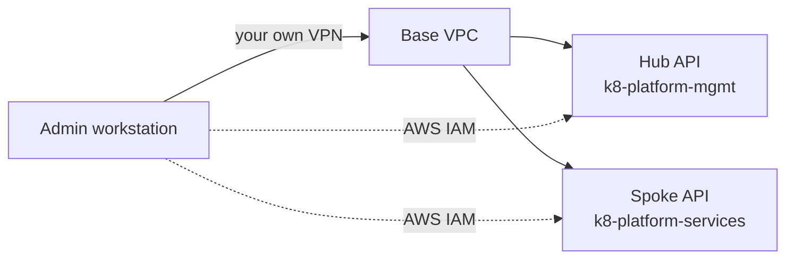
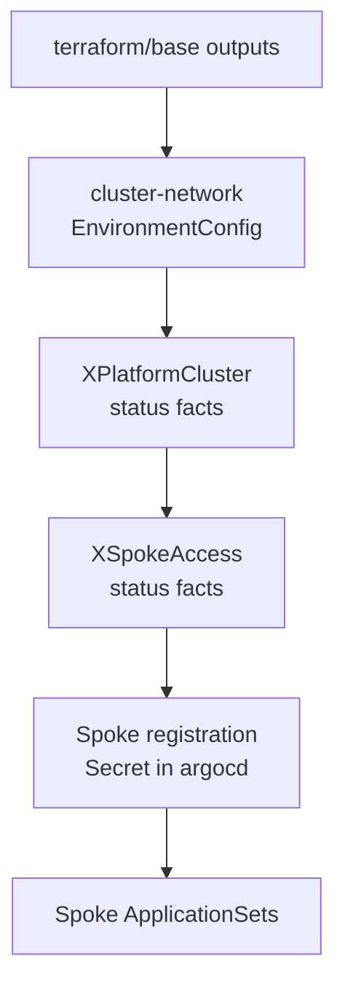

# Get admin access and the platform facts

You are the platform's administrator. This page gets you three things:
a `kubectl` that works against both clusters, the Argo CD URL and admin
password, and the account-specific values the platform discovered for
itself — the domain, the certificate ARN, the role ARNs, the API
endpoints. It documents the design as it stands, including the places
where the design assumes something it does not provide.

!!! warning "Mechanisms verified; these instructions not executed by a person"
    Every mechanism below has run on a clean build — as a workflow step,
    or from an agent session inside the sandbox. **Nobody has worked
    through this page as written from a workstation.** Where a command
    has an attested form somewhere in this repository, this page names
    where; where it does not, it says so instead of guessing.

    A person executing this page end to end on a fresh build is what
    flips it to `stable`.

If you got here from
[Build the platform from nothing](build-the-platform-from-nothing.md),
this is the page that closes its open item: how a human obtains the
Argo CD credentials.

## The three surfaces

| Surface | What it is | How you authenticate |
|---|---|---|
| Management cluster API (`k8-platform-mgmt`) | The hub: Argo CD, Crossplane, the composite resources | AWS IAM |
| Platform services cluster API (`k8-platform-services`) | The spoke: ingress, DNS, SSO components, workloads | AWS IAM (read-only) **or** your directory group (admin) |
| Argo CD UI and API (`argocd.management.<domain>`) | The delivery surface | A local `admin` account whose password is a Terraform output |

They are independent. Losing one does not lose the others, and the
Argo CD credential is not derived from your cluster access.

---

## 1. Cluster access

### The design assumption

The platform assumes **you already have direct network access into the
base VPC, over a VPN you provisioned yourself**. That is an explicit
owner ruling in the roadmap's MVP criterion: "The admin is assumed to
have direct VPC access (their own VPN). A platform-provisioned VPN is
v2.0." Nothing in `terraform/` or `crossplane/` creates a VPN, a bastion
for human use, or any other operator network path.



The dotted lines are the honest part: both clusters currently enable
the **public** API endpoint as well as the private one, so in practice
an admin with AWS credentials reaches either API from anywhere. The hub
sets `cluster_endpoint_public_access = true`
(`terraform/management/eks.tf`) and the spoke's composition sets both
`endpointPrivateAccess: true` and `endpointPublicAccess: true`
(`crossplane/compositions/platform-cluster.yaml`). Neither restricts
the source CIDR, so both default to open. The Terraform carries its own
note about this — "Restrict to operator IP ranges in production
environments" — and it has not been acted on. **Gap:** the VPN
assumption is a statement about how the admin is expected to connect,
not a control the platform enforces.

### Getting a kubeconfig

Both clusters are EKS, so the kubeconfig comes from the AWS CLI, not
from the platform:

```bash
aws eks update-kubeconfig --name k8-platform-mgmt      --region <region>
aws eks update-kubeconfig --name k8-platform-services  --region <region>
```

The hub form is the one the supported build path uses at its two gates,
and the management Terraform runs the identical command inside its own
provisioner when it patches the Argo CD password
(`terraform/management/argocd-credentials.tf`).

### What your AWS identity is allowed to do

| Cluster | Your IAM principal | Access | Where it is granted |
|---|---|---|---|
| Hub | The identity that applied `terraform/management` | Cluster admin | `enable_cluster_creator_admin_permissions = true` in `terraform/management/eks.tf` |
| Spoke | `cloud_user` in the same account | **Read-only** (`AmazonEKSAdminViewPolicy`) | The `sandbox-access-entry` / `sandbox-access-policy` resources in `crossplane/compositions/platform-cluster.yaml` |
| Spoke | The hub's `…-argocd` role | Cluster admin | The `access-entry` / `access-policy-association` resources in `crossplane/compositions/xspokeaccess.yaml` |

Two consequences worth stating plainly:

- On the hub you are an admin **because you created the cluster**. If
  the platform is rebuilt by CI with different credentials than yours,
  the admin access entry belongs to those credentials, not to you.
- On the spoke, AWS IAM gives you **read-only and nothing more**. The
  composition creates exactly one human-principal access entry, hard-coded
  to `arn:aws:iam::<account>:user/cloud_user`, with the read-only
  policy. **Gap:** there is no committed mechanism that grants a named
  human AWS-IAM admin on a spoke.

To act as an admin on the spoke, use the directory path instead:
[Get kubectl access via your directory group](kubectl-access-via-directory-group.md),
with your account in `k8s-admins`. That path is the spoke's admin path
by design — see
[Identity mapping](../reference/identity-mapping.md), which records the
hub as deliberately excluded from it ("operator break-glass via AWS IAM
only").

### The SSM relay is not your path

You may find `scripts/sandbox-kubeconfig.sh` and the `kube-relay` EC2
instance and wonder whether you should be using them. You should not.
That relay exists because the **agent sandbox** cannot speak to an EKS
API server at all: the sandbox's egress gateway verifies upstream
certificates against public roots, and the EKS API always presents a
certificate signed by the cluster's private CA, so a direct `kubectl`
from the sandbox is rejected before it reaches the cluster. The relay
tunnels raw TCP over an AWS Systems Manager session, whose own
certificate is publicly trusted, so `kubectl` still verifies the real
cluster CA end to end.

That is a build-and-debug capability for people and agents working *on*
the platform, scoped that way explicitly in ADR-0008 ("not part of the
platform's runtime"). From a workstation with VPC access, the ordinary
`aws eks update-kubeconfig` above is the path; the relay adds nothing.

---

## 2. The Argo CD URL and password

### Where they actually come from

Both are **outputs of the `terraform/management` module**:

| Output | Value | Sensitive |
|---|---|---|
| `argocd_server_url` | `https://argocd.management.<domain>` | no |
| `argocd_admin_password` | A 24-character alphanumeric value generated by Terraform | yes |
| `argocd_url` | The same URL string as `argocd_server_url` — a second, older name for it | no |

The password is a `random_password` resource. Terraform bcrypts it and
patches the hash into the `argocd-secret` Secret's `admin.password`
field, then restarts the Argo CD server so the new password takes
effect immediately (`terraform/management/argocd-credentials.tf`).

**Do not read `argocd-initial-admin-secret`.** That Secret holds the
password Argo CD generated for itself at install time; the Terraform
patch above replaces the stored hash afterwards, so the initial-admin
value no longer opens the account. The repository states the rule
directly in `ai/environment.md`: read the Terraform outputs, "never
depend on `argocd-initial-admin-secret`".

### What you need in order to read an output

| You need | Why |
|---|---|
| A checkout of this repository | `terraform output` reads the module directory's initialized state |
| `terraform` ≥ 1.6 | `required_version` in `terraform/management/versions.tf` |
| AWS credentials for the account | To read the state object and take the state lock |
| The state backend coordinates: bucket, key, region, lock table | The `backend "s3"` block is deliberately empty — it is configured by flags, not committed |

For a platform built by the supported CI path, the backend values are
derived, not chosen. The workflow computes them from the account ID
(`.github/workflows/terraform-test.yml`):

| Backend setting | Value |
|---|---|
| `bucket` | `k8-platform-tfstate-<account-id>` |
| `key` | `k8-platform/management/terraform.tfstate` |
| `region` | The build region (`us-east-1` by default) |
| `dynamodb_table` | `k8-platform-tfstate-lock` |

(If you built from a workstation instead, you named the bucket, key and
lock table yourself — use the values you passed to `terraform init`
then.)

### The command

```bash
cd terraform/management
terraform init \
  -backend-config="bucket=k8-platform-tfstate-<account-id>" \
  -backend-config="key=k8-platform/management/terraform.tfstate" \
  -backend-config="region=<region>" \
  -backend-config="dynamodb_table=k8-platform-tfstate-lock"

terraform output -raw argocd_server_url
terraform output -raw argocd_admin_password
```

What is attested here, and what is not:

- **Attested:** `terraform init` with exactly those four
  `-backend-config` flags, and `terraform output -raw <name>` run from
  `terraform/management`, both run on every clean build inside
  `.github/workflows/terraform-test.yml` — the management verify step
  reads the URL that way. The commands above are that form, with the
  derived backend values written out.
- **Not attested:** nobody has run them from a workstation. The
  `terraform -chdir=terraform/management output -raw …` variant that
  appears in `terraform/management/outputs.tf`'s comments is a
  documented alternative, not one this page has seen executed.

Then sign in at the URL as user `admin` with that password.

### What is missing here

- **Argo CD has no SSO.** There is no `oidc.config` or Dex
  configuration anywhere in the deployed Argo CD values, so the local
  `admin` account is the only way in.
  [Log into platform UIs with SSO](log-into-platform-uis-with-sso.md)
  already lists Argo CD as planned rather than shipped; this is the
  same gap seen from the admin side.
- **No rotation procedure.** The password changes only when Terraform
  generates a new one. The repository documents no way for an admin to
  rotate it deliberately, and no owner for that decision.
- **The certificate on that hostname is not asserted by the build.**
  The management verify step confirms the DNS record exists and that
  the URL answers, but it makes that request with certificate
  verification disabled. Treat "Argo CD answers" as verified and
  "Argo CD answers over a valid public certificate" as unverified by
  that check.

---

## 3. The platform facts

### Why there is nothing to configure

Every account-specific value in this platform is **discovered and
published**, never hand-entered: the domain comes from whatever public
hosted zone the account has, the ARNs come from the resources
Crossplane just created, the endpoint and CA data come from the cluster
itself. No manifest in `clusters/` or `crossplane/` carries an account
ID, an ARN, or a domain. This is the rule the repository states as
"every account-specific value flows through discovery — never through
commits or hand-edits", and ADR-0010 is the decision that carries it
across the hub/spoke boundary.



### Where each fact is produced, and where you read it

| Fact | Produced by | Read it live with |
|---|---|---|
| `domain` | Base Terraform → the `cluster-network` EnvironmentConfig | `kubectl get environmentconfig cluster-network -o yaml` (hub) |
| `subdomain`, `region` | The `XSpokeAccess` XR's own spec | `kubectl -n platform get xspokeaccess platform -o yaml` |
| `certificate-arn` | `XPlatformCluster` → `status.certificateArn` | `kubectl -n platform get xplatformcluster platform -o yaml` |
| `external-dns-role-arn`, `eso-role-arn` | `XSpokeAccess` composed IAM roles → its status | `kubectl -n platform get xspokeaccess platform -o yaml` |
| Cluster `endpoint`, `oidcIssuer`, `clusterCaData` | `XPlatformCluster` status, observed by `XSpokeAccess` | `kubectl -n platform get xplatformcluster platform -o yaml` |
| Hub cluster name, endpoint, CA data, OIDC provider ARN | `terraform/management` outputs | `terraform output` (see section 2 for the backend flags) |

The `cluster-network` EnvironmentConfig also carries the account ID,
the VPC id and CIDR, the private subnet IDs, the Route53 zone id, the
hub Argo CD role ARN, and the relay security-group id — all written by
`terraform/management/crossplane-phase3.tf` from base's outputs. It is
the single place to look when you want to know what the platform thinks
the account looks like.

Every command in that table needs hub cluster access. **Gap:** there is
no read-only facts surface — no page, endpoint, or ConfigMap — for
someone who is not a hub admin.

### The registration Secret contract

The spoke's facts travel to the add-ons on one object: the spoke's
Argo CD **cluster Secret** on the hub. It is Argo CD's connection
credential and the platform's fact bus at the same time, written by one
writer — a `provider-kubernetes` `Object` composed by the
`xspokeaccess-aws` composition.

| Part of the contract | Value |
|---|---|
| Namespace | `argocd` (on the hub) |
| Name | `<subdomain>-spoke` — `platform-spoke` for the platform services cluster |
| Label | `argocd.argoproj.io/secret-type: cluster` — without it Argo CD does not treat the Secret as a cluster |
| Label | `k8-platform.io/cluster-role: spoke` — what the add-on ApplicationSets select on |
| Label | `k8-platform.io/short-name` — names the generated Applications and picks per-cluster values files |
| Annotations | `k8-platform.io/domain`, `subdomain`, `region`, `certificate-arn`, `external-dns-role-arn`, `eso-role-arn` |
| Data | `name`, `server` (the spoke API endpoint), `config` (the spoke cluster name plus its CA data) |

Read it with:

```bash
kubectl -n argocd get secret -l argocd.argoproj.io/secret-type=cluster,k8-platform.io/cluster-role=spoke
kubectl -n argocd get secret platform-spoke -o jsonpath='{.metadata.annotations}'
```

**Complete or absent.** Every value patched into that Secret is marked
required, which means the composition function will not create the
Secret at all until every fact resolves. A partially populated
registration Secret is therefore not a state the platform passes
through on its way to being ready — it is a defect to report. The rule
is stated in ADR-0010 and enforced in both directions by a unit test
that checks the composition emits exactly the contract keys and that no
consumer references a key outside it, so a Secret and an add-on cannot
drift apart silently.

The consumers are ApplicationSets that template these annotations
directly, and they are configured to fail generation on a missing key
rather than render an empty value. That is why a missing fact shows up
as a loud generation error, not as an add-on quietly deployed with a
blank certificate ARN.

---

## 4. Create a directory account for an end user

The end-user path this platform documents — sign in with a directory
account, land in a Kubernetes group, use `kubectl` through OIDC — needs an
account to exist. **Nothing in a build creates one.** The federation
oracle creates an ephemeral fixture user, proves the whole chain with it,
and its reaper deletes it again, so a person following
[kubectl via directory group](kubectl-access-via-directory-group.md)
after a fresh build has nothing to sign in with until an admin creates it.

That page tells the user to "ask the platform operator". This is the
operator doing it. Creating end-user accounts is an **admin action on
request**, not self-service; a self-service onboarding flow is a v2.0
item.

First find the user pool. It is not hardcoded anywhere — read it from the
Cognito bridge document the base build writes to Secrets Manager:

```bash
POOL_ID=$(aws secretsmanager get-secret-value \
  --secret-id k8-platform/base/cognito \
  --query SecretString --output text \
  | jq -r '.issuer_url' | awk -F/ '{print $NF}')
echo "$POOL_ID"
```

Then create the account and put it in a group. The groups are
`k8s-admins` and `k8s-viewers`; pick the lower one unless the person
needs to change things:

```bash
EMAIL="person@example.com"
GROUP="k8s-viewers"          # or k8s-admins

aws cognito-idp admin-create-user \
  --user-pool-id "$POOL_ID" --username "$EMAIL" \
  --message-action SUPPRESS \
  --user-attributes Name=email,Value="$EMAIL" Name=email_verified,Value=true \
                    Name=given_name,Value=First Name=family_name,Value=Last

aws cognito-idp admin-set-user-password \
  --user-pool-id "$POOL_ID" --username "$EMAIL" \
  --password '<a strong initial password>' --permanent

aws cognito-idp admin-add-user-to-group \
  --user-pool-id "$POOL_ID" --username "$EMAIL" --group-name "$GROUP"
```

**How you know it worked:**

```bash
aws cognito-idp admin-list-groups-for-user \
  --user-pool-id "$POOL_ID" --username "$EMAIL" \
  --query 'Groups[].GroupName' --output text
```

Then hand the person their email, the initial password, and the
[kubectl via directory group](kubectl-access-via-directory-group.md) page.

!!! warning "What is attested here, and what is not"
    These four commands are the ones
    `tests/live/checks/instantiate/cognito-federation-live.sh` runs on
    every build with `LIVE_PROFILE=full`, against the same pool and the
    same groups, and the full chain — Cognito account → Keycloak broker →
    federated `kubectl` — passed on clean builds #6 and #7. What is *not*
    attested is this page's exact wording being executed by a person, and
    `--permanent` means the user is never prompted to change the password
    you set. Treat the initial password as one you will rotate.

    `admin-set-user-password` puts a password on your command line and
    therefore in your shell history. Set it from a variable you unset, or
    from a password manager.

## Gaps this page names

| Gap | Consequence |
|---|---|
| No platform-provisioned VPN or bastion for admins | You bring your own network path; this is a v2.0 item, ruled so by the owner |
| Both API endpoints are public with no source CIDR restriction | The VPN assumption is documentation, not enforcement |
| No AWS-IAM admin access entry for a named human on the spoke | Spoke admin is only reachable through the directory group, or through the hub's Argo CD role |
| Hub admin belongs to whichever identity applied the Terraform | If CI built the platform with other credentials, your own may not be an admin there |
| Argo CD has no SSO | The shared local `admin` account is the only login |
| Argo CD browser sign-in has never been exercised | Every attestation is via the `argocd` CLI or `kubectl`; the browser experience is unverified (`kp-2al.29`) |
| No build creates a durable directory account | Section 4 is the admin doing it by hand on request; a composed or self-service account is a v2.0 item (`kp-2al.29`) |
| No documented Argo CD password rotation | The credential changes only when Terraform regenerates it |
| The Argo CD URL's certificate is not verified by the build | "Reachable" is attested; "valid public certificate" is not |
| Facts are readable only by a hub admin | No read-only surface for anyone else |
| No person has executed this page | Its marker stays `contract` until someone does |

---

*Tracking: bead `kp-2al.6` (this page). Decisions referenced:
ADR-0008 (the SSM relay is implementation-time only), ADR-0010 (cluster
facts ride the registration Secret), ADR-0017 (platform bring-up and
administration are user-facing surfaces).*
