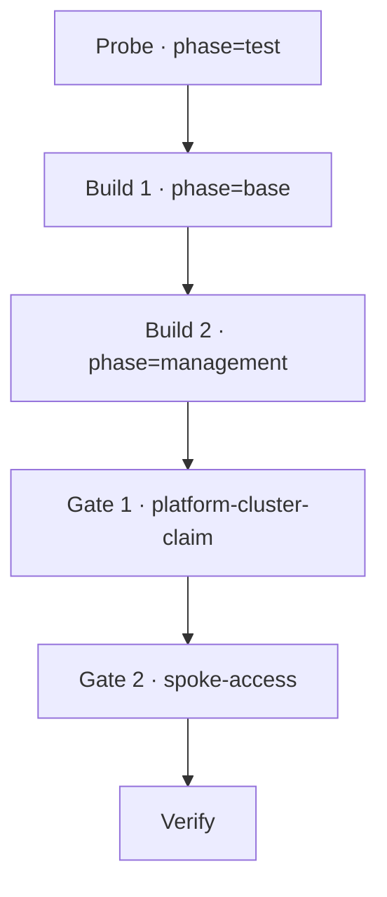
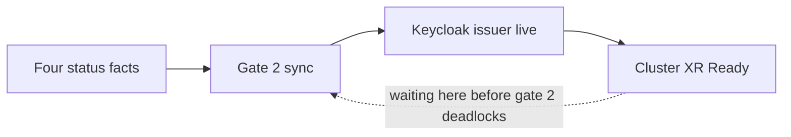

# Build the platform from nothing

Take a brand-new, empty AWS account and this repository to a running,
verified platform. **Everything you need is on this page** — the
prerequisites, the credential probe, the two builds, the cluster access,
the two gate syncs, the verification checklist, and what to do when a
step disagrees with what is written here. Other pages are linked only
for optional depth; you do not need to open one to finish.

The human work is five actions in order:

1. a cheap read-only **credential probe** (one workflow run),
2. the **base** build (one workflow run),
3. the **management** build (one workflow run),
4. the **two gate syncs**, `platform-cluster-claim` then `spoke-access`,
5. the **verification sweep** at the end.

Everything between and after those actions is the platform reconciling
itself.

!!! warning "What is attested, and what is not"
    Every mechanism below has run on a clean build — six from-scratch
    builds to date, most recently build #6 on 2026-09-09, whose run IDs
    and measured durations are quoted throughout. **No person has yet
    executed this page as written from their own machine.** Two kinds of
    gap follow from that, and both are marked in place:

    - the workflow runs to date were dispatched through the GitHub API
      rather than the web form (the form sends the same dispatch with
      the same two inputs);
    - the workstation-side commands (`aws eks update-kubeconfig`,
      `terraform output`, the Argo CD CLI) are attested *inside CI or an
      agent session*, not from a workstation.

    Where nobody has run something, this page says **unverified** on the
    spot instead of implying proof. A human walking this page end to end
    on a fresh account is what flips its marker from `contract` to
    `stable`.

## Words used on this page

| Term | Meaning here |
|---|---|
| **hub** | The management EKS cluster, `k8-platform-mgmt`. Runs Argo CD and Crossplane. |
| **spoke** | The platform services EKS cluster, `k8-platform-services`. Runs ingress, DNS, secrets, SSO, the demo app, monitoring. |
| **XR** / composite resource | A Crossplane v2 composite resource — the object that makes real cloud infrastructure exist. (Crossplane v1 called these "claims"; the name survives only in the literal Argo CD Application name `platform-cluster-claim`.) |
| **gate** | An Argo CD Application deliberately configured *without* automated sync, because synchronizing it spends real money. You sync it by hand. |
| `<domain>` | Your account's public DNS domain, discovered from its Route53 hosted zone. |
| `<region>` | The AWS region you build in. `us-east-1` unless you changed it. |
| `<account-id>` | Your 12-digit AWS account ID. |

## 0. Before you start

### What the account must have

| You need | Why | Who provides it |
|---|---|---|
| A fresh AWS account you can use freely | The build creates real, billed infrastructure | You |
| **One public Route53 hosted zone** in that account | The build discovers your domain from it and derives every hostname. It never registers a domain for you. | You, or the sandbox that issued the account |
| Room for at least 5 more EC2 instances | The hub runs 2 nodes, the spoke 2, the diagnostic relay 1 | Account quota |
| Permission to run workflows in this repository | The two builds are `workflow_dispatch` runs | Repository access |

If the account has **no** public hosted zone, the build hard-fails on
purpose, with `ERROR: No public hosted zone found in this AWS account.`
Create the zone, then start again.

If the account has **more than one** public hosted zone, the build takes
the first one the Route53 API returns. Leave exactly one in a fresh
account so there is nothing to guess.

### The three repository secrets

Set these once per account, in the repository's
**Settings → Secrets and variables → Actions → New repository secret**:

| Secret | Value |
|---|---|
| `AWS_ACCESS_KEY_ID` | Access key for an identity with administrative rights in the account |
| `AWS_SECRET_ACCESS_KEY` | Its secret |
| `AWS_REGION` | The region to build in, e.g. `us-east-1` |

Nothing else is configured by hand. You do **not** create a state
bucket, write a `terraform.tfvars`, or choose a domain: the build
bootstraps its own Terraform state bucket and lock table from the
account ID, discovers the hosted zone and derives the domain from it,
and generates the Cognito test user's credentials fresh on every run so
they are never committed.

!!! important "Use the same AWS identity locally that you put in the secrets"
    On the hub you are a Kubernetes admin **because your identity
    created the cluster** (`enable_cluster_creator_admin_permissions`).
    The identity that creates it is whatever is in the two secrets
    above. If your workstation credentials are a *different* principal,
    your `kubectl` against the hub will be refused and the two gate
    syncs — steps 5 and 6 — become impossible. Use one identity for
    both, which in a sandbox account usually means the single `cloud_user`
    the sandbox issues.

### What your machine needs

| Tool | Used for | Minimum |
|---|---|---|
| `aws` CLI | kubeconfig, account and zone lookups, verification reads | v2 |
| `kubectl` | the two gate syncs and every cluster read | matching EKS 1.32 |
| `jq` | reading JSON in the verification steps | any |
| `curl` | the endpoint checks | any |
| `git` + `terraform` | only to read the Argo CD URL and password (step 4) | `terraform` ≥ 1.6 |
| A checkout of this repository | same | — |

You also need a network path to the two Kubernetes API servers. The
platform assumes you bring your own — it provisions no VPN and no
bastion for human use. In practice both clusters currently enable their
**public** API endpoint with no source-CIDR restriction, so an admin
with AWS credentials reaches either API from anywhere; treat that as the
current shape of the account, not as a security posture the platform
enforces.

### Two values you will paste repeatedly

```bash
aws sts get-caller-identity --query Account --output text    # <account-id>
aws route53 list-hosted-zones \
  --query 'HostedZones[?Config.PrivateZone==`false`] | [0].Name' \
  --output text                                             # <domain>, with a trailing dot
```

Drop the trailing dot from the zone name: that string is `<domain>`, and
every hostname in this build is derived from it —
`hello.platform.<domain>`, `argocd.management.<domain>`,
`auth.platform.<domain>`.

## The shape of the build



The two builds are imperative and ordered — management reads base's
remote state. From the moment the bootstrap Application exists,
everything else is GitOps: the two gates are the only places the
platform waits for a human, and they wait on purpose, because each one
brings real billed infrastructure into existence.

| Stage | Your action | How you know it passed | Machine duration on build #6 |
|---|---|---|---|
| Probe | Run the workflow with `phase=test`, `action=test-e2e` | **Red run** with the credential and zone checks passing and only the state-backend checks failing | a read-only run; no Terraform, no apply |
| Base | Run with `phase=base`, `action=apply-and-verify` | Green run; `[base] e2e-verify` printed its `OK:` lines | 3m23s |
| Management | Run with `phase=management`, `action=apply-and-verify` | Green run; `[management] e2e-verify` printed its `OK:` lines | 21m18s (build #5: about 17 min) |
| Gate 1 | Sync `platform-cluster-claim` at an explicit SHA | The cluster XR publishes four status facts and the node group is Ready | about 15 min from the sync |
| Gate 2 | Sync `spoke-access` at the same SHA | The spoke registration Secret appears in `argocd` on the hub; the composites reach Ready | Secret in the first 30 s; XSpokeAccess Ready at 4m10s |
| Fan-out | none | Per-spoke Applications appear and go Synced/Healthy | minutes |
| Verify | The checklist in step 7 | hello returns 200 over valid TLS | — |

## 1. Probe the credentials before spending twenty minutes

There is a cheap, read-only run that tells you whether the three secrets
work and whether the account has a usable hosted zone. Use it first.

In GitHub: **Actions → Terraform Test → Run workflow**. Leave the branch
on `main`, then choose:

- **phase**: `test`
- **action**: `test-e2e`

Press the green **Run workflow** button.

!!! success "On an empty account this run is SUPPOSED to be red"
    The probe runs three read-only suites. On a brand-new account the
    expected result is a **failed (red) run** with this exact shape:

    | Suite | Expected on an empty account |
    |---|---|
    | `tests/e2e/test_aws_creds.sh` | **PASS** — account ID, caller ARN, region all resolve |
    | `tests/e2e/test_route53_zone.sh` | **PASS**, 4 of 4 — a public zone exists, has an Id and a Name, and is reachable |
    | `tests/e2e/test_state_backend.sh` | **FAIL**, 2 assertions — the state bucket and the DynamoDB lock table do not exist yet |

    Nothing has bootstrapped the state backend yet, so those two checks
    cannot pass, and the suite's own comments say so. A red run with
    that signature means **your credentials and your zone are good — go
    on to step 2.**

    Evidence that it behaves this way: run **34396268449**, 2026-09-09,
    on a fresh account — Route53 4/4 PASS, state-backend 2 FAIL (both
    `head-bucket` and `describe-table` returning 254).

What a *real* problem looks like in this run:

- the credentials suite failing — the secrets are wrong, missing, or the
  key is disabled. Fix the secrets; do not continue.
- the zone suite failing — the account has no public hosted zone, or the
  identity cannot read Route53. Create the zone or fix the permissions;
  do not continue.

After the base build has run once, this same probe goes fully green,
because the backend then exists. That is the only difference.

## 2. Build the base layer

**Actions → Terraform Test → Run workflow**, branch `main`:

- **phase**: `base`
- **action**: `apply-and-verify`

The run bootstraps the Terraform state backend first — an S3 bucket
named `k8-platform-tfstate-<account-id>` with versioning and encryption,
plus a DynamoDB lock table `k8-platform-tfstate-lock` — then discovers
the hosted zone, generates the Cognito test user's credentials, applies
`terraform/base`, and verifies.

**What it creates:** the shared VPC and private subnets, the DNS wiring
onto your hosted zone, a DNS-validated wildcard ACM certificate, and the
Cognito user pool that later federates into the platform's sign-in.

**What its verify step actually asserts** (`[base] e2e-verify`):

| Assertion | Printed as |
|---|---|
| The ACM certificate's status is `ISSUED` | `OK: ACM certificate ISSUED (<arn>)` |
| The Cognito user pool exists and is describable | `OK: Cognito user pool exists (<pool-id>)` |
| The generated test user exists in that pool | `OK: Cognito test user exists (<email>)` |

**How you know it passed:** the run's conclusion is green *and* those
three `OK:` lines are in the `[base] e2e-verify` step. The workflow also
posts a summary comment on the commit (or the pull request, if the
dispatch ref has one) listing every step's outcome with log excerpts, so
a failure does not require reading the raw log first.

Reference run: **34396955442**, `apply-and-verify`, success,
19:45:34Z–19:48:57Z — **3m23s**.

## 3. Build the management layer

Same form, branch `main`:

- **phase**: `management`
- **action**: `apply-and-verify`

**What it creates:** the hub — EKS cluster `k8-platform-mgmt`, Argo CD,
Crossplane, the External Secrets operator, ExternalDNS, ingress-nginx,
the `cluster-network` EnvironmentConfig that carries base's outputs into
Crossplane, and **one** Argo CD Application called `bootstrap`.

This is the **last imperative step of the build**. Once `bootstrap`
exists, Argo CD syncs this repository's `argocd/` tree from `main`
continuously — projects, composite resource definitions, compositions,
and every child Application, including the two gates.

**What its verify step actually asserts** (`[management] e2e-verify`):

| Assertion | Printed as |
|---|---|
| The EKS cluster reports `ACTIVE` | `OK: EKS cluster ACTIVE (k8-platform-mgmt)` |
| At least one worker node is Ready | `OK: N node(s) Ready` |
| At least one Running pod in each of `argocd`, `crossplane-system`, `external-dns`, `external-secrets`, `ingress-nginx` | one `OK: <ns> — N pod(s) running` line each |
| `argocd-server`'s ServiceAccount carries its IRSA role annotation | `OK: ArgoCD SA IRSA role — <arn>` |
| An Argo CD Ingress exists with a hostname | `OK: ArgoCD ingress configured for host <host>` |

One further step, `[management] argocd-url`, waits up to five minutes
for ExternalDNS to create the Route53 record and then requests the URL.
It is deliberately allowed to **fail without failing the run**, because
DNS and the load balancer often settle after the run ends. Note for
later: it makes that request with certificate verification *disabled*,
so it proves "Argo CD answers", not "Argo CD answers over a valid
public certificate".

**How you know it passed:** green conclusion plus the `OK:` lines above.
A red `[management] argocd-url` step under an otherwise green run is not
a build failure.

Reference run: **34397369089**, success, 19:49:39Z–20:10:57Z —
**21m18s**. Build #5's equivalent took about 17 minutes. Expect fifteen
to twenty-one minutes of machine time.

## 4. Get cluster access and the Argo CD credentials

### A kubeconfig for the hub

```bash
aws eks update-kubeconfig --name k8-platform-mgmt --region <region>
kubectl get applications -n argocd
```

You should see `bootstrap` Synced/Healthy and its children, with
`platform-cluster-claim` and `spoke-access` present and **OutOfSync** —
that is the two gates waiting for you, not a defect.

*Attested:* this exact `aws eks update-kubeconfig` command runs inside
the management verify step on every clean build, and again inside the
management module's own provisioner. *Unverified:* nobody has run it
from a workstation, so if your network path or IAM identity differs from
CI's the first failure will show up here.

### The Argo CD URL and admin password

Both are **Terraform outputs of the management module**. Read them from
a checkout of this repository, pointing Terraform at the backend the
build created:

```bash
cd terraform/management
terraform init \
  -backend-config="bucket=k8-platform-tfstate-<account-id>" \
  -backend-config="key=k8-platform/management/terraform.tfstate" \
  -backend-config="region=<region>" \
  -backend-config="dynamodb_table=k8-platform-tfstate-lock"

terraform output -raw argocd_server_url      # https://argocd.management.<domain>
terraform output -raw argocd_admin_password  # 24 characters, generated by Terraform
```

Sign in at that URL as user `admin` with that password.

!!! danger "Do not read `argocd-initial-admin-secret`"
    That Secret holds the password Argo CD generated for *itself* at
    install time. The management module bcrypts its own generated
    password into `argocd-secret` afterwards and restarts the Argo CD
    server, so the initial-admin value no longer opens the account. The
    two outputs above are the only correct source.

*Attested:* `terraform init` with exactly those four `-backend-config`
flags and `terraform output -raw <name>` from `terraform/management` run
on every clean build inside the workflow. *Unverified:* nobody has run
them from a workstation.

You can finish the whole build without these credentials — the gate
syncs below have a `kubectl` form that needs only your kubeconfig. The
UI is for watching. For the fuller administrator picture — both
clusters, what your IAM identity is allowed to do on each, where every
discovered platform fact lives, and the gaps in all of that — see
[Get admin access and platform facts](admin-access.md). It is optional
depth, not a step of this build.

!!! note "Sandbox aside — only if you are inside the Anthropic agent sandbox"
    Skip this unless you are an agent running in that sandbox. The
    sandbox cannot speak to an EKS API server at all: its egress gateway
    verifies upstream certificates against public roots, and the EKS API
    presents a certificate signed by the cluster's private CA, so
    `kubectl` is rejected before it reaches the cluster. The repository
    ships a relay for exactly this case — it tunnels raw TCP over an AWS
    Systems Manager session, whose own certificate is publicly trusted,
    so `kubectl` still verifies the real cluster CA end to end:

    ```bash
    # one-shot
    scripts/sandbox-kubeconfig.sh -c k8-platform-mgmt \
      --exec kubectl get applications -n argocd
    # or leave the tunnel up
    eval "$(scripts/sandbox-kubeconfig.sh -c k8-platform-mgmt)"
    ```

    It needs `aws`, `kubectl`, `jq` and `session-manager-plugin` on
    PATH, and works against the spoke as `-c k8-platform-services`. This
    is a build-and-debug capability for people and agents working *on*
    the platform, explicitly not part of the platform's runtime. From a
    workstation with a network path, plain `aws eks update-kubeconfig`
    is the path and the relay adds nothing.

## 5. Gate 1 — create the platform services cluster

### Sync at an explicit commit SHA, never at a branch name

A sync operation that names a **branch** resolves against the Argo CD
repo-server's cache, which lags by roughly three minutes. Twice on
earlier builds that cost a wasted gate pull against stale source. Sync
both gates at an explicit commit SHA and confirm afterwards that the
Application recorded the SHA you asked for.

The SHA to use is the one `bootstrap` has already synced — by
construction that is the current `main`, and the repo-server has it
cached:

```bash
SHA=$(kubectl -n argocd get application bootstrap \
        -o jsonpath='{.status.sync.revision}')
echo "$SHA"
```

*Unverified:* build #6 took the same value from the repository instead
(`bc1cbb6fe27b976dee0b4e86953114481ca15d51`, confirmed equal to what
both gates recorded). Reading it from `bootstrap`'s status is the same
number by construction, but that read has not itself been executed on a
clean build. If you prefer the attested route, use the full SHA of
`origin/main` from your checkout and satisfy yourself that `bootstrap`
reports the same one.

### Sync it

The `kubectl` form is the one every clean build has used, and it needs
nothing but your kubeconfig:

```bash
kubectl -n argocd patch application platform-cluster-claim --type merge \
  -p "{\"operation\":{\"sync\":{\"revision\":\"$SHA\"}}}"
```

The Argo CD CLI form is equivalent, and so is clicking **Sync** in the
UI with the revision field set to the SHA — *both unverified*, in the
sense that no clean build has used them:

```bash
argocd login argocd.management.<domain> --username admin
argocd app sync platform-cluster-claim --revision "$SHA"
```

Then confirm the Application acted on the revision you asked for:

```bash
kubectl -n argocd get application platform-cluster-claim \
  -o jsonpath='{.status.sync.revision}{"\n"}'
```

If that value is not your `$SHA`, stop and work out why before going
further; a gate that synced stale source has built the wrong thing.

### Wait for the four published facts — not for Ready

```bash
for f in oidcIssuer endpoint clusterCaData certificateArn; do
  printf '%s=%s\n' "$f" \
    "$(kubectl -n platform get xplatformcluster platform \
         -o jsonpath="{.status.$f}" 2>/dev/null | head -c 32)"
done

kubectl get nodegroups.eks.aws.m.upbound.io -A
```

Repeat until all four facts are non-empty (`clusterCaData` is long —
that is why the command truncates it) and the node group reports
`READY=True`. Its name is generated, e.g. `platform-78032583fa77` on
build #6.

!!! warning "Do not wait for the composite resource to become Ready here"
    The platform-cluster XR composes an EKS identity-provider
    association that validates the platform's own Keycloak issuer — and
    Keycloak only deploys after gate 2 registers the spoke. Waiting for
    `Ready` before gate 2 **deadlocks a fresh build**. Gate 2 consumes
    the four facts above, so those plus a node group that can run
    workloads are exactly what you wait for.



**Budget:** on build #6 the four facts plus a Ready node group took
about **15 minutes** from the sync; on build #5 the XR reached
Synced+Ready in 21 minutes. This is the longest wait in the build. If
nothing has advanced after roughly 30 minutes, trace it (step 8) —
do not sync again, and do not delete anything.

## 6. Gate 2 — register the spoke with the hub

Same form, same SHA:

```bash
kubectl -n argocd patch application spoke-access --type merge \
  -p "{\"operation\":{\"sync\":{\"revision\":\"$SHA\"}}}"

kubectl -n argocd get application spoke-access \
  -o jsonpath='{.status.sync.revision}{"\n"}'
```

This creates the access path the hub and the spoke add-ons use against
the new cluster: an OIDC provider for the spoke's issuer, the IRSA roles
for ExternalDNS and the secrets operator, an EKS access entry mapping
the hub's Argo CD role to cluster-admin on the spoke — and the spoke's
**registration Secret** on the hub.

### The registration Secret

```bash
kubectl -n argocd get secret -l argocd.argoproj.io/secret-type=cluster
kubectl -n argocd get secret platform-spoke \
  -o jsonpath='{.metadata.annotations}' | jq .
```

Expect a Secret named `platform-spoke` carrying the six
`k8-platform.io/*` annotations — `domain`, `subdomain`, `region`,
`certificate-arn`, `external-dns-role-arn`, `eso-role-arn`. That Secret
is both Argo CD's connection credential for the spoke and the bus that
carries the account's discovered facts to every add-on.

It is **complete or absent**: every value is marked required, so the
composition will not create the Secret at all until every fact resolves.
A *partially* populated registration Secret is therefore not a state the
build passes through — it is a defect to report (step 8).

On build #6 it appeared within the first 30-second check, carrying the
full contract.

### Now Ready is the right thing to wait for

```bash
kubectl get xplatformclusters,xspokeaccesses -A
```

Both composites should reach `READY=True`. On a fresh build the EKS
identity-provider association retries until Keycloak's issuer is
serving; that retry loop is expected, not a failure. Build #6:
XSpokeAccess Ready at **4m10s** after the sync, and the platform-cluster
XR Ready about **20 minutes** after its own gate-1 sync, once gate 2 had
unlocked Keycloak.

### Fan-out happens by itself

Once the spoke is registered, fact-driven ApplicationSets generate the
add-on stack against it in dependency order. There are no further
commands. Expect these Applications to appear in `argocd` on the hub,
named from the spoke's short name (`spoke`, from committed source):

`spoke-ingress-nginx`, `spoke-external-dns`, `spoke-eso`,
`spoke-storage`, `spoke-keycloak`, `spoke-hello`,
`spoke-observability-kube-prometheus-stack`,
`spoke-observability-loki`, plus `hub-observability-alloy`, which
deliberately targets the hub rather than the spoke.

## 7. Verify that it works

Walk this checklist. It is the short form; the full expected inventory,
including every Application and composite and the ones that are
expectedly not green, is
[What a finished platform contains](../reference/finished-platform.md).

| # | Check | Command | Expected |
|---|---|---|---|
| 1 | Delivery surface | `kubectl get applications -n argocd` | Every Application `Synced`/`Healthy` **except `workload1-cluster`, which is `OutOfSync` by design** — it is the unpulled second-cluster gate |
| 2 | The behavioral gate | `curl -sS -o /dev/null -w '%{http_code}\n' https://hello.platform.<domain>/` | `200`, with TLS verification **on** (no `-k`). The body contains `hello from the k8-platform platform-services cluster` |
| 3 | Argo CD surface | `curl -sS -o /dev/null -w '%{http_code}\n' https://argocd.management.<domain>` | `200` with TLS verification on |
| 4 | SSO discovery | `curl -sS https://auth.platform.<domain>/realms/platform/.well-known/openid-configuration \| jq -r .issuer` | HTTP 200, and the issuer equals `https://auth.platform.<domain>/realms/platform` |
| 5 | Spoke storage | on the spoke: `kubectl get sc` and `kubectl get pvc -A` | `gp3 (default)`, provisioner `ebs.csi.aws.com`; **3 of 3 PVCs in namespace `monitoring` `Bound`** on `gp3` |
| 6 | Composite resources | `kubectl get xplatformclusters,xspokeaccesses,xdatabases,xplatformsecrets -A` | All `SYNCED=True` and `READY=True`: the platform-cluster XR, its spoke-access XR, `keycloak-db`, and the `keycloak-admin` / `keycloak-oidc-clients` platform secrets |

Checks 2, 3 and 4 are plain public HTTPS — no cluster access needed.
Check 1 and 6 read the hub. Check 5 reads the **spoke**, which has its
own access story:

```bash
aws eks update-kubeconfig --name k8-platform-services --region <region>
```

On the spoke, AWS IAM grants the account's `cloud_user` principal
**read-only** (`AmazonEKSAdminViewPolicy`) — enough for the two reads in
check 5, and nothing more. If your identity is not `cloud_user`, IAM
gives you no spoke access at all; the spoke's admin path is a directory
group instead (below). Inside the agent sandbox, use the relay:
`scripts/sandbox-kubeconfig.sh -c k8-platform-services --exec kubectl get pvc -A`.

### What build #6 measured

| Check | Result on 2026-09-09 |
|---|---|
| hello endpoint | HTTP 200 with the expected body marker, certificate verification enabled, answering after 1 s |
| Argo CD URL | HTTP 200, certificate verification enabled. **Note:** no automated check asserts the *certificate* half — the management phase's own check disables verification — so treat a verified-certificate result here as observed by hand, not gate-asserted |
| Keycloak discovery | HTTP 200 with the expected issuer |
| Spoke storage | `gp3 (default)` / `ebs.csi.aws.com`, EBS CSI addon ACTIVE `v1.65.0-eksbuild.2`, **3 of 3 monitoring PVCs Bound** |
| Observability | `spoke-observability-kube-prometheus-stack` and `spoke-observability-loki` both `Healthy` |
| Applications | all `Synced`/`Healthy` except `workload1-cluster` (OutOfSync by design) |
| Whole-build posture | no AWS or Kubernetes state hand-mutated at any point |

One recorded caveat to be aware of, because your build will differ:
build #6's monitoring PVCs were created *before* the default
StorageClass existed and bound retroactively once it arrived. A
from-scratch build creates them *after* the class exists. That
ordering — class first, then PVC — has not been proven by any build yet,
so check 5 is the one most worth reporting on either way.

### Optional: the federated `kubectl` path

This is not part of the build and not required to declare it working.
It proves the identity chain end to end: a directory account, no AWS
credentials, group-derived Kubernetes access on the spoke. It needs
`kubectl krew install oidc-login`, a browser on the same machine, and an
account in the platform's directory that belongs to `k8s-admins` or
`k8s-viewers` — a fresh build does not create one for you, so you would
add it to the Cognito user pool the base build created. The kubeconfig
user stanza is:

```yaml
users:
  - name: platform-oidc
    user:
      exec:
        apiVersion: client.authentication.k8s.io/v1beta1
        command: kubectl
        args:
          - oidc-login
          - get-token
          - --oidc-issuer-url=https://auth.platform.<domain>/realms/platform
          - --oidc-client-id=kubernetes
          - --oidc-extra-scope=profile
          - --oidc-use-pkce
```

`kubectl auth whoami` should then report you as `kc:<your-email>` with
`kc:k8s-admins` or `kc:k8s-viewers` in your groups. Build #6's oracle
exercised this path with an ephemeral federated user and got exactly
that; doing it by hand as a person is **unverified**.

## 8. When something goes wrong

### The one rule that matters most

**Do not improvise a fix, and do not hand-mutate AWS or Kubernetes to
get past a step.** No hand-written IAM policy, no security-group rule,
no `kubectl apply` of a missing object, no console click to nudge a
resource along. A platform that needed a manual step is not evidence
that the platform works, and this page's whole purpose is that the
repository — not one hand-tended account — is the thing that works.

So: **a divergence between this page and reality is the finding.** File
it as a bug with the symptom, the evidence you have, what you ruled out,
and where you stopped. A page that is wrong is worth more as a filed
defect than as a workaround nobody recorded.

What *is* always allowed: reading. Every diagnostic below is read-only.

### Read-only diagnostics that already exist

| Command | What it tells you |
|---|---|
| `scripts/whereami.sh` | Account ID, region, cluster names, hosted zone, kubectl context, Argo CD URL, Crossplane version — run it first, always |
| `scripts/k8s-status.sh` | Nodes, the namespaces that matter, pod-state counts |
| `scripts/argocd-apps.sh` | Projects and Applications with sync/health; `scripts/argocd-apps.sh <app>` for one in full |
| `scripts/crossplane-trace.sh <kind>/<name> -n <ns>` | Walks XR → composed managed resources → provider status, printing conditions at every layer. Add `--watch` to follow it |

For a stuck gate-1 cluster, the useful one is
`scripts/crossplane-trace.sh xplatformcluster/platform -n platform --watch`.

### Known slow spots, with their budgets

| Spot | Budget | What it means |
|---|---|---|
| Spoke EKS cluster + node group (gate 1) | about 15 min to the four facts; 20–25 min to the XR Ready | The longest wait in the build. Past ~30 min with no change, trace it |
| The Argo CD hostname after the management build | 5 min for ExternalDNS to write the Route53 record | The build's own check allows this to fail without failing the run; DNS and the load balancer often settle afterwards |
| The hello endpoint after `spoke-hello` goes Healthy | 5 min (the repository's own oracle polls for 300 s) | Past that, suspect the load balancer's health, ingress routing, or the certificate, in that order |
| Keycloak's OIDC discovery endpoint | 10 min (the oracle polls for 600 s) | Keycloak starts after its database and its secrets; it is the last thing to come up |
| The cluster XR's identity-provider association | until Keycloak's issuer serves | Retrying here after gate 2 is the expected path, not a failure |

### Re-running safely

- `action=apply-and-verify` is safe to repeat: Terraform converges and
  the verify steps re-assert the same facts.
- `action=verify` re-runs only the checks against whatever is applied.
- One run per branch and phase executes at a time; a second dispatch
  queues rather than interrupting the first.
- **Never cancel a run mid-apply.** It leaves a held state lock and
  half-applied resources.
- Read the failed run's summary comment or step log *before* changing
  anything — the verify steps print the specific assertion that failed.

Tearing the platform down again is out of scope for this page:
`action=destroy` exists per phase, but an orderly teardown deletes the
composite resources first and waits for deprovisioning, then works
downward, and it has rules of its own.

## Why the build looks like this

Two of the four build actions are gates by design, and two are
imperative by necessity:

| Action | Why a human does it |
|---|---|
| Base apply | Nothing exists yet to reconcile it — this is the bottom turtle |
| Management apply | It creates the GitOps controller itself, so it cannot be GitOps |
| `platform-cluster-claim` sync | Synchronizing it provisions a real EKS cluster; auto-sync would mean a typo fix starts a cluster |
| `spoke-access` sync | It grants real AWS access and must observe the cluster's published facts, so auto-sync would race the provision |

---

*Tracking: bead `kp-2al.10` (the human-executed bring-up this page is
written for, and the only thing that flips its marker to `stable`),
`kp-2al.15` (this page's declaration of the supported path),
`OI-2026-07-06-4` (no human-executed bring-up yet). Decisions:
ADR-0017 (bring-up is a user-facing product surface), ADR-0010 (cluster
facts ride the registration Secret), ADR-0008 (the SSM relay is
implementation-time only), ADR-0006 (behavioral verification coupled to
the build is the oracle). Reference runs, all 2026-09-09, clean build
#6: probe 34396268449, base 34396955442, management 34397369089, gate
SHA `bc1cbb6`, oracle suite `build6-2220` (pass=25 skip=3 fail=0).
Lesson L37 is why the gates sync at an explicit SHA.*
