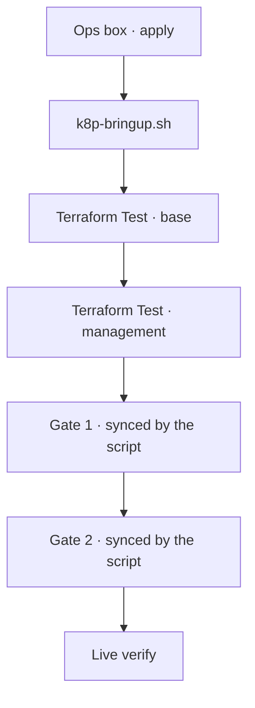

# Build the platform from nothing

Take a brand-new, empty AWS account and this repository to a running,
verified platform **from a browser**: one tab on GitHub Actions, one on
the AWS console, and nothing installed or configured on your own
machine. No AWS access key, no kubeconfig, no GitHub token ever exists
on the computer you type at. **Everything you need is on this page.**

The human work is four workflow runs and one script:

1. **Ops box** → `apply` — creates the small EC2 machine you drive the
   build from,
2. open its browser shell and run **`k8p-bringup.sh`**,
3. when the script says `ACTION NEEDED`, run **Terraform Test** with
   `phase=base`,
4. when it says so again, run **Terraform Test** with
   `phase=management`,
5. when it prints `BRING-UP COMPLETE`, run **Live verify** for the
   platform's own verdict.

The script does the interpreting: it waits for each stage with the
budgets measured on earlier builds, syncs the two gates at an explicit
commit and confirms each one by its completed operation, watches the
Application stack converge, and ends in a single red or green. You
click buttons and read one word.

!!! warning "What is attested, and what is not"
    Every mechanism on this page has run on a clean build. Eight
    from-scratch builds proved the platform itself (`SUBSTRATE-READINESS.md`,
    with run IDs). Build #9 (2026-09-12, a fresh account) was the first
    driven **by the ops box and this script**, and the run IDs and
    durations quoted below come from it. Two things remain
    **unverified**, and both are marked in place:

    - the browser shell has been reached only through the same AWS
      Systems Manager channel the console uses (`send-command`), not by a
      person clicking **Connect** in the console;
    - **no person has executed this page as written.** A human walking
      it end to end on a fresh account, with no other context, is what
      flips its marker from `contract` to `stable` (bead `kp-2al.10`).

    Where nobody has run something, this page says **unverified** on the
    spot rather than implying proof.

## Words used on this page

| Term | Meaning here |
|---|---|
| **ops box** | A `t3.small` EC2 instance in the account's default VPC, created by the **Ops box** workflow. It carries an IAM instance profile, a checkout of this repository and the pinned toolchain. It is the only machine anything runs on. |
| **browser shell** | AWS Systems Manager **Session Manager** opened from the AWS console: a terminal in a browser tab. No SSH, no key pair, no open inbound port. |
| **hub** | The management EKS cluster, `k8-platform-mgmt`. Runs Argo CD and Crossplane. |
| **spoke** | The platform services EKS cluster, `k8-platform-services`. Runs ingress, DNS, secrets, SSO, the demo app, monitoring. |
| **XR** / composite resource | A Crossplane v2 composite resource, the object that makes real cloud infrastructure exist. (Crossplane v1 called these "claims"; the name survives only in the literal Argo CD Application name `platform-cluster-claim`.) |
| **gate** | An Argo CD Application deliberately configured *without* automated sync, because synchronizing it spends real money. `k8p-bringup.sh` syncs the two that belong to this build, `platform-cluster-claim` and `spoke-access`. The third, `workload1-cluster`, is the unpulled second-cluster gate and stays `OutOfSync` by design. |
| `<domain>` | Your account's public DNS domain, discovered from its Route53 hosted zone. The script prints it. |
| `<region>` | The AWS region you build in. `us-east-1` unless you changed it. |

## 0. Before you start

### What the account must have

| You need | Why | Who provides it |
|---|---|---|
| A fresh AWS account you can use freely | The build creates real, billed infrastructure | You |
| **One public Route53 hosted zone** in that account | The build discovers your domain from it and derives every hostname. It never registers a domain for you. | You, or the sandbox that issued the account |
| Room for at least **7** EC2 instances | The hub runs 3 nodes, the spoke 2, the diagnostic relay 1, and the ops box is the seventh. A sandbox account's 9-instance cap leaves two spare | Account quota |
| Permission to run workflows in this repository | Every build action is a `workflow_dispatch` run | Repository access |
| Permission to open Session Manager in the AWS console | That is how you reach the ops box | The account's console sign-in |

If the account has **no** public hosted zone, the ops box's status
screen shows `RED public hosted zone` and the build cannot proceed.
Create the zone, then continue.

If the account has **more than one** public hosted zone, the build takes
the first one the Route53 API returns. Leave exactly one in a fresh
account so there is nothing to guess.

### The three repository secrets

Set these once per account, in the repository's
**Settings → Secrets and variables → Actions → New repository secret**:

| Secret | Value |
|---|---|
| `AWS_ACCESS_KEY_ID` | Access key for an identity with administrative rights in the account |
| `AWS_SECRET_ACCESS_KEY` | Its secret |
| `AWS_REGION` | The region to build in, e.g. `us-east-1` |

These are the **only** credentials anywhere in the procedure, and they
live in GitHub, not on your machine. Nothing else is configured by
hand: the workflows bootstrap their own Terraform state bucket and lock
table from the account ID, discover the hosted zone and derive the
domain from it, and generate the Cognito test user's credentials fresh
on every run so they are never committed.

!!! note "The generated Cognito password is visible in the run log"
    "Never committed" is not "never disclosed": every step that exports
    the generated test-user password prints it in **cleartext** in the
    workflow log, so anyone who can read the run can read it. Treat it
    as a disposable, single-account credential.

### What your machine needs

A web browser. That is the design, not an accident: the ops box exists
so that this project's credentials are issued by AWS to an instance and
never exist as a file on a computer that also holds anything else. If
you find yourself installing `aws`, `kubectl` or `terraform` locally to
finish this page, stop: something on the page is wrong, and the
divergence is the finding (step 6).

## The shape of the build



The two Terraform builds are imperative and ordered: management reads
base's remote state. From the moment the `bootstrap` Application
exists, everything else is GitOps; the two gates are the only places
the build waits for a decision, and `k8p-bringup.sh` takes it for you,
because on this account they cost nothing extra. The script never asks
GitHub whether a run went green. It asks AWS and the cluster whether
the thing the run was supposed to create is actually there.

| Stage | Your action | What the script waits for | Measured |
|---|---|---|---|
| Ops box | **Ops box** → `apply` | — (the run's own self-test) | 2m18s (build #9) |
| Base | **Terraform Test** → `base`, `apply-and-verify` | base's Terraform state written and unlocked, wildcard certificate `ISSUED`, Cognito user pool present | 3m21s (build #8), 3m14s (build #9) |
| Management | **Terraform Test** → `management`, `apply-and-verify` | management's state written and unlocked, hub `ACTIVE`, node group `ACTIVE`, `bootstrap` Application present; then `crossplane-resources` Synced/Healthy | 20m15s (build #8), 18m42s (build #9); transients settle about 8 min later |
| Gate 1 | none | the platform-cluster XR publishes four facts and the spoke node group is Ready | 13m48s (build #8), 14m31s (build #9); 14–25 min across builds |
| Gate 2 | none | `XSpokeAccess` Ready | 5m22s (build #8), 4m00s (build #9) |
| Converge | none | every Application Synced/Healthy except `workload1-cluster` | about 4 min after gate 2 |
| Verify | **Live verify** | — | 14m46s (build #9) |

## 1. Create the ops box

In GitHub: **Actions → Ops box → Run workflow**. Leave the branch on
`main`, set **action** to `apply`, press **Run workflow**.

**What it does**, in order: bootstraps the Terraform state backend (the
S3 bucket `k8-platform-tfstate-<account-id>` and the DynamoDB table
`k8-platform-tfstate-lock`) if nothing has yet, applies
`terraform/opsbox`, waits for the instance's Systems Manager agent to
register, waits for the instance's first-boot bootstrap to finish, and
then runs the platform's status script **on the box** and prints its
output in the run log.

**What it creates:** an IAM role `k8-platform-opsbox` with read access
to the account, cluster-access rights on EKS and the documented
directory-admin actions; an instance profile carrying it; an
egress-only security group; and one `t3.small` in a default-VPC subnet
whose Availability Zone actually offers that type. The instance clones
this repository at the ref you dispatched from and installs the pinned
toolchain from `versions.env`, so the box and CI never disagree about a
tool version.

**How you know it passed.** The run is green, and two steps carry what
you need:

- **verify the box** prints a `PLATFORM STATUS` screen. On a fresh
  account it reads `GREEN credentials`, `GREEN public hosted zone`, and
  `RED` for all five build stages, ending `NOT COMPLETE`. **That is the
  correct answer**: the box can see the account and its zone, and there
  is no platform yet. The step reports the output and does not fail the
  run on it. This screen replaces the separate credential probe earlier
  versions of this page asked for.
- **How to reach it** prints a **console URL**. Keep that tab open; it
  is your door to the box.

Reference run: **34673149665**, `apply`, success, **2m18s**
end to end (build #9). Instance in `us-east-1d`; self-test showed the
checkout at the dispatched commit and `aws kubectl jq yq helm` all
present.

!!! note "Creating the ops box bootstraps the state backend"
    After this run the bucket and the lock table exist. That is what
    lets the box's Terraform state live in the same backend the platform
    uses. Two consequences: the platform builds below find the backend
    already there (they create it only if absent), and a torn-down
    account is **not** a fresh one until the backend is deleted too
    ([Tear the platform down to nothing](tear-the-platform-down.md),
    step 7).

What a *real* problem looks like in this run:

- **State backend** fails on `InvalidClientTokenId` or `AccessDenied`:
  the secrets are wrong, missing, or belong to a dead account. Fix the
  secrets; do not continue.
- **terraform apply** fails on `No default-VPC subnet sits in an AZ
  that offers t3.small`: the account offers the type nowhere. Change
  `instance_type` in `terraform/opsbox/variables.tf` on a branch and
  dispatch from it.
- **verify the box** prints `BOOTSTRAP-INCOMPLETE` followed by the tail
  of the bootstrap log: first boot failed partway. The log tail names
  the step. Fix it on a branch; do not repair the instance by hand.
- **verify the box** shows `RED public hosted zone`: the account has no
  public zone, or the box's role cannot read Route53. Create the zone,
  then dispatch `verify` to re-run the status screen.

## 2. Open the browser shell

Sign in to the AWS console for the account and open the console URL the
run printed. It lands on **Systems Manager → Session Manager** for the
instance `k8-platform-opsbox`; press **Start session** (or **Connect**).
If you closed the run, the instance is under **EC2 → Instances**, and
**Connect → Session Manager** does the same thing.

You get a terminal. Every operator lands in the repository checkout at
`/opt/k8-platform` with the bring-up scripts on `PATH`. Ask where the
platform is:

```bash
k8p-status.sh
```

You should see the same screen the run printed: credentials and zone
green, the build stages red, `NOT COMPLETE`. Everything this screen
says is a live read against AWS or the cluster; nothing on it is a
cached workflow result.

*Unverified:* build #9 reached the box through the same Systems
Manager channel, but by sending commands to it rather than by a person
pressing **Start session** in the console. If the session opens as a
user other than `ssm-user` or does not land in the checkout, that is a
finding to report (step 6), not something to fix in place.

## 3. Drive the bring-up

```bash
k8p-bringup.sh
```

The script is **resumable and idempotent**: every stage is checked
against the world before it is attempted, so if your browser tab dies,
open a new session and run it again. It works out where it is and
continues. Running it after everything is done just prints green.

It stops twice with a boxed `ACTION NEEDED`, telling you exactly which
form to fill in. Both are the same form, **Actions → Terraform Test →
Run workflow**, branch `main`.

### First stop: build the base layer

```text
ACTION NEEDED
  Open:  https://github.com/lago-morph/k8s-platform/actions/workflows/terraform-test.yml
  Click: Run workflow
  Set:   phase = base,  action = apply-and-verify
```

Leave the script running and do that. **What the run creates:** the
shared VPC and private subnets, the DNS wiring onto your hosted zone, a
DNS-validated wildcard ACM certificate, and the Cognito user pool that
later federates into the platform's sign-in. The script notices base is
up when the run's Terraform state has been written and its lock
released, the certificate is `ISSUED` and the user pool exists (the
last two are the facts the run's own `[base] e2e-verify` step asserts),
and prints `GREEN base applied`. The state condition matters: on build
#9 the certificate and the pool both existed about two minutes before
the apply had finished the VPC, so the facts alone go green too early.

Reference run: **34673406430**, `apply-and-verify`, success, **3m14s**
(build #9).

### Second stop: build the management layer

```text
ACTION NEEDED
  Set:   phase = management,  action = apply-and-verify
```

**What the run creates:** the hub, EKS cluster `k8-platform-mgmt`, with
Argo CD, Crossplane, the External Secrets operator, ExternalDNS,
ingress-nginx, the `cluster-network` EnvironmentConfig that carries
base's outputs into Crossplane, and **one** Argo CD Application called
`bootstrap`. This is the last imperative step of the build: once
`bootstrap` exists, Argo CD syncs this repository's `argocd/` tree from
`main` continuously.

This one takes about twenty minutes. The script declares management up
when its Terraform state is written and unlocked, the cluster and its
node group are `ACTIVE` **and** the `bootstrap` Application exists, then
waits for `crossplane-resources` to reach
Synced/Healthy before it touches a gate, because a gate synced before
the composite resource definitions land builds nothing.

!!! warning "The run's `[management] argocd-url` step reports green either way"
    That step is `continue-on-error`, so its conclusion is success
    whether or not Argo CD answered; on earlier builds its log said
    `FAIL: ArgoCD UI returned HTTP 000` under a green tick. The script
    does not read it and neither should you. It checks the platform's
    endpoints itself at the end.

Reference run: **34673599867**, `apply-and-verify`, success, **18m42s**
(build #9).

### No more stops: the gates and the convergence

From here the script needs nothing from you. Watch it, or come back
later and run it again to see where it is.

**Gate 1**, the platform services cluster. The script reads the commit
`bootstrap` is serving as `main`, syncs `platform-cluster-claim` at
that explicit SHA, and confirms the Application **completed a sync
operation** at that SHA before it waits. Then it waits for the two
things gate 2 actually consumes: the platform-cluster XR's four
published facts (`oidcIssuer`, `endpoint`, `clusterCaData`,
`certificateArn`) and a Ready spoke node group. This provisions a real
EKS cluster and is the longest wait in the build: **14 to 25 minutes**
across the builds measured so far, **14m31s** on build #9. The
budget is 40 minutes; past about 35 with no change, trace it (step 6).

**Gate 2**, registering the spoke. Same SHA, same confirmation, then a
wait for `XSpokeAccess` to reach Ready. **4m00s** on build #9. This
creates the OIDC provider for the spoke's issuer, the IRSA roles for
ExternalDNS and the secrets operator, an EKS access entry for the hub's
Argo CD role, and the spoke's registration Secret on the hub, which is
both Argo CD's connection credential for the spoke and the bus that
carries the account's discovered facts to every add-on.

**Converge and verify.** Fact-driven ApplicationSets generate the
spoke's add-on stack in dependency order. The script waits until every
Application is Synced/Healthy except `workload1-cluster`, then for a
real HTTP `200` from `https://hello.platform.<domain>/` over the public
internet, and prints the response body. Then:

```text
BRING-UP COMPLETE
```

On build #9 the stack had converged **42 minutes** after the script
first asked for the management build (management 14m56s from that
request to the script's detection, the transient Applications 2m56s,
gate 1 14m31s, gate 2 4m00s, convergence 4m47s). If the script ends
`STOPPED` instead, it names the stage and, where one exists, the exact
trace command to run next. Fix nothing by hand; see step 6.

Build #9's first pass did end `STOPPED`, on the endpoint check, with the
platform serving: the box's resolver had cached a negative answer for
`hello.platform` because the script necessarily asked for it before
ExternalDNS wrote the record, and Route53's negative TTL (900 s) is
longer than the check's budget. The script now reads the record from
Route53 itself and pins the request to its target, and the re-run
reached `BRING-UP COMPLETE` in two seconds. That is exactly the
resumable path described above, exercised for real.

## 4. Verify that it works

Two things, in this order.

### The status screen

```bash
k8p-status.sh
```

Every line `GREEN`, ending `ALL GREEN — the platform is up and serving.`
This is the same set of live reads the driver used, so it should agree
with the driver; if it does not, the disagreement is a finding.

### The platform's own oracle

The final word does not come from the ops box. It comes from the
repository's behavioural suite, `tests/live/checks/**`, which the
**Live verify** workflow runs from CI under a scoped read-only role.
The scripts on the box are deliberately not a third opinion about
whether the platform works.

**Actions → Live verify → Run workflow**, branch `main`, profile
`full`. Its conclusion **is** the verdict: the suite's exit code is not
swallowed, and an all-skipped run counts as red. Green means every
git-declared kind was verified by a passing check against the live
account, including the hello endpoint over valid TLS, the Argo CD
endpoint, Keycloak's OIDC discovery, the composites and the spoke's
storage.

Reference run: **34676173964**, profile `full`, success (build #9).

The full expected inventory, including the rows that are expectedly not
green, is [What a finished platform contains](../reference/finished-platform.md).
The Argo CD UI is for watching, not for building; its URL and admin
password, and what your identity may do on each cluster, are on
[Get admin access and platform facts](admin-access.md). Nothing on
this page needs them.

## 5. Why the build looks like this

| Action | Why it is a separate button, or a separate machine |
|---|---|
| Ops box apply | The operator's own computer must hold no credentials for this project. A box with an instance profile is how AWS issues them without a file existing anywhere a person touches |
| Base apply | Nothing exists yet to reconcile it; this is the bottom turtle |
| Management apply | It creates the GitOps controller itself, so it cannot be GitOps |
| `platform-cluster-claim` sync | Synchronizing it provisions a real EKS cluster; auto-sync would mean a typo fix starts a cluster. The script syncs it because the owner ruled the gates cost nothing on this account |
| `spoke-access` sync | It grants real AWS access and must observe the cluster's published facts, so auto-sync would race the provision |
| Live verify | The verdict must come from the committed oracle, not from whatever ran the build |

## 6. When something goes wrong

### The one rule that matters most

**Do not improvise a fix, and do not hand-mutate AWS or Kubernetes to
get past a step.** No hand-written IAM policy, no security-group rule,
no `kubectl apply` of a missing object, no console click to nudge a
resource along. A platform that needed a manual step is not evidence
that the platform works, and this page's whole purpose is that the
repository, not one hand-tended account, is the thing that works.

So: **a divergence between this page and reality is the finding.** File
it as a bug with the symptom, the evidence you have, what you ruled out,
and where you stopped.

What *is* always allowed: reading. Every diagnostic below is read-only,
and every one of them is on the ops box's `PATH` or in its checkout.

### Read-only diagnostics on the box

| Command | What it tells you |
|---|---|
| `k8p-status.sh` | One screen: where the platform actually is, every line a live read |
| `scripts/whereami.sh` | Account ID, region, cluster names, hosted zone, kubectl context, Argo CD URL, Crossplane version |
| `scripts/k8s-status.sh` | Nodes, the namespaces that matter, pod-state counts |
| `scripts/argocd-apps.sh` | Projects and Applications with sync/health; `scripts/argocd-apps.sh <app>` for one in full |
| `scripts/crossplane-trace.sh <kind>/<name> -n <ns>` | Walks XR → composed managed resources → provider status, printing conditions at every layer. Add `--watch` to follow it |

For a stuck gate 1 the useful one is
`scripts/crossplane-trace.sh xplatformcluster/platform -n platform --watch`;
for gate 2, `xspokeaccess/platform`. The driver prints these itself when
it stops there. The box grants itself cluster-admin on the hub on first
use (an EKS access entry for its own role); the spoke's API is reachable
from the box by network but the box holds no access entry there, so
spoke-side reads are not part of this page.

### Known slow spots, with their budgets

| Spot | Budget | What it means |
|---|---|---|
| Spoke EKS cluster + node group (gate 1) | 14–25 min to the four facts on the builds measured; the script allows 40 | The longest wait in the build. Past about 35 min with no change, trace it |
| `crossplane-resources`, `keycloak-db`, `keycloak-secrets` after management | about 8 min | Transient `OutOfSync`; the script waits for the first before syncing a gate |
| The hello endpoint after the stack converges | 10 min in the script | DNS and the load balancer settle after the spoke is up. The script resolves the name from Route53, not the box's resolver, because the VPC resolver caches a negative answer for 900 s once the name has been asked for too early (build #9) |
| The Argo CD hostname after the management build | 5 min | Its record and load balancer often settle after the run ends |
| Keycloak's OIDC discovery endpoint | 10 min (the oracle polls for 600 s) | Keycloak starts after its database and its secrets; it is the last thing to come up |
| Federated `kubectl` after the identity-provider association is `ACTIVE` | about 10–25 min after the build completes | EKS does not honour tokens from the issuer the moment the association exists. `Unauthorized` in that window is expected; retry, change nothing. Only Live verify's federation check touches this |

### Re-running safely

- `k8p-bringup.sh` is safe to run at any time; it changes nothing that
  is already true.
- `action=apply-and-verify` is safe to repeat: Terraform converges and
  the verify steps re-assert the same facts. `action=verify` re-runs
  only the checks.
- One run per branch and phase executes at a time; a second dispatch
  queues rather than interrupting the first.
- **Never cancel a Terraform run mid-apply.** It leaves a held state
  lock and half-applied resources.
- To pick up newer scripts on an existing box, `refresh.sh` pulls the
  checkout and re-runs the toolchain installer. The **Ops box**
  workflow's `verify` action re-runs the self-test and reprints the
  console URL without re-applying.

## When you are done with this account

Taking the platform back to nothing is its own ordered procedure, and
doing it in the wrong order strands paid resources:
[Tear the platform down to nothing](tear-the-platform-down.md). The ops
box is not part of the platform and survives that teardown on purpose,
so you can watch it happen from the box; **Ops box → `destroy`**
removes the box when you are finished, and the teardown page's step 7
covers the state backend that both share.

## Appendix: what the script does, by hand

Kept so a reader can see exactly what `k8p-bringup.sh` decides and
check any step of it. These are the commands the script runs, in the
order it runs them; none of them is a step of this page.

```bash
# access to the hub (the box grants its own role cluster-admin, once)
aws eks update-kubeconfig --name k8-platform-mgmt --region <region>

# the commit both gates sync at: the one bootstrap is serving as main
SHA=$(kubectl -n argocd get application bootstrap -o jsonpath='{.status.sync.revision}')

# sync a gate at that explicit SHA, never at a branch name (the repo-server's
# branch cache lags by about three minutes)
kubectl -n argocd patch application platform-cluster-claim --type merge \
  -p "{\"operation\":{\"sync\":{\"revision\":\"$SHA\"}}}"

# confirm it by the COMPLETED OPERATION: phase, the revision it synced, the state
kubectl -n argocd get application platform-cluster-claim \
  -o jsonpath='{.status.operationState.phase}{" "}{.status.operationState.syncResult.revision}{" "}{.status.sync.status}{"\n"}'
# expect: Succeeded <SHA> Synced

# gate 1 is done when all four facts are non-empty and the node group is Ready
for f in oidcIssuer endpoint clusterCaData certificateArn; do
  printf '%s=%s\n' "$f" "$(kubectl -n platform get xplatformcluster platform -o jsonpath="{.status.$f}" | head -c 32)"
done
kubectl get nodegroups.eks.aws.m.upbound.io -A

# gate 2, same form, then wait for Ready
kubectl -n argocd patch application spoke-access --type merge \
  -p "{\"operation\":{\"sync\":{\"revision\":\"$SHA\"}}}"
kubectl get xplatformclusters,xspokeaccesses -A

# converged: everything Synced/Healthy except workload1-cluster
kubectl -n argocd get applications
curl -sS -o /dev/null -w '%{http_code}\n' https://hello.platform.<domain>/
```

!!! warning "Do not confirm a gate from `.status.sync.revision`"
    Argo CD populates `.status.sync.revision` from the target revision it
    has **observed in the repository**, not from a sync that happened.
    Measured on build #7: a gate that had never synced already reported
    the right SHA there. Reading it on `bootstrap` to learn which revision
    the repo-server is serving is a different, legitimate question; as
    proof that a sync happened it is useless, which is why the script and
    the appendix read the completed operation instead.

---

*Tracking: bead `kp-2al.34` (the ops box and the scripts, and this
page's rewrite around them), `kp-2al.10` (the human-executed bring-up
this page is written for, and the only thing that flips its marker to
`stable`), `kp-2al.15` (this page's declaration of the supported path),
`OI-2026-07-06-4` (no human-executed bring-up yet). Decisions:
ADR-0017 (bring-up is a user-facing product surface), ADR-0018
(documentation is verified by fenced execution), ADR-0010 (cluster
facts ride the registration Secret), ADR-0008 (the SSM relay is
implementation-time only), ADR-0006 (behavioral verification coupled to
the build is the oracle). Reference runs, build #9, 2026-09-12, fresh
account: ops box 34673149665, base 34673406430, management 34673599867,
live verify 34676173964, gate SHA `b41f48cdc0e7a532da4c69305d41133bf822e541`. Earlier evidence: clean
builds #6, #7 and #8 (`SUBSTRATE-READINESS.md`), whose corrections
(`kp-2al.23`, `kp-2al.24`, `kp-2al.25`, `kp-2al.26`) the script encodes.
Lesson L37 is why the gates sync at an explicit SHA.*
