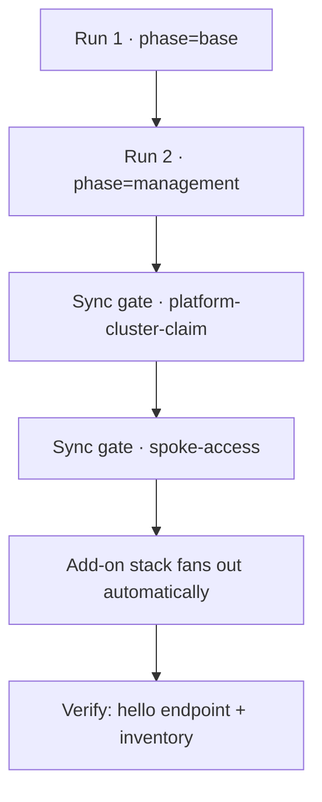

# Build the platform from nothing

Take a fresh AWS account and this repository to a running, verified
platform. The build is **four operator actions**: two "Run workflow"
clicks in GitHub Actions, then two deliberate syncs of the two gate
Applications. Everything between and after those four actions is the
platform reconciling itself.

This is the supported path, and the only one the platform has ever been
built by.

!!! success "What this page is, and what it is not"
    Every clean build of this platform to date used exactly the
    procedure below: the `Terraform Test` workflow for the two
    imperative layers, then the two gate syncs. There is **no CLI and
    no single build script** — `scripts/` holds read-only diagnostics.

    Two honest caveats. The workflow runs to date were started through
    the GitHub API rather than the web form; the form sends the same
    dispatch with the same two inputs, but nobody has yet clicked it.
    And a
    [workstation Terraform runbook](build-the-platform-on-a-workstation.md)
    also exists — it has never been executed by a person and is
    published as an unverified alternative, not as the way to build.

## Before you start

| You need | Why | Where it comes from |
|---|---|---|
| Permission to run workflows in the repository | The build is a `workflow_dispatch` | Repository access |
| AWS credentials stored as repository secrets — `AWS_ACCESS_KEY_ID`, `AWS_SECRET_ACCESS_KEY`, `AWS_REGION` | The workflow applies Terraform with them | You set them once per account |
| A **public Route53 hosted zone** in the account | The platform discovers your domain from it; it never creates your domain | You (or the account) create it |
| Network access to the Kubernetes API of the management cluster, plus `kubectl` | The two gate syncs happen against the cluster | Your own VPN or VPC access into the base VPC |

Nothing else is prepared by hand. In particular you do **not** create a
state bucket, write a `terraform.tfvars`, or choose a domain: the
workflow bootstraps the Terraform state bucket and lock table from the
account ID, discovers the hosted zone and derives the domain from it,
and generates the Cognito test user's credentials fresh on every run so
they are never committed.

## The shape of the build



The two runs are imperative and ordered — management reads base's
remote state. From the moment the bootstrap Application exists,
everything else is GitOps: the two gates are the only places the
platform waits for a human, and they wait on purpose, because each one
brings real billed infrastructure into existence.

| Stage | Your action | How you know it passed |
|---|---|---|
| Base | Run the workflow with `phase=base`, `action=apply-and-verify` | Run conclusion green, with `[base] e2e-verify` reporting the wildcard certificate `ISSUED`, the Cognito user pool reachable, and the test user present |
| Management | Run the workflow with `phase=management`, `action=apply-and-verify` | Run conclusion green, with `[management] e2e-verify` reporting the hub cluster `ACTIVE`, at least one Ready node, a Running pod in each of `argocd`, `crossplane-system`, `external-dns`, `external-secrets`, `ingress-nginx`, the Argo CD IRSA annotation, and the Argo CD ingress host |
| Gate 1 | Sync `platform-cluster-claim` | The platform-cluster XR publishes its four status facts, and the node group reports Ready |
| Gate 2 | Sync `spoke-access` | A spoke registration Secret appears in `argocd` on the hub, and the XR reaches Ready |
| Fan-out | none | Per-spoke Applications appear and go Synced/Healthy |
| Done | One `curl` | HTTP 200 over a valid public certificate |

## 1. Run the base layer

In GitHub, open **Actions → Terraform Test → Run workflow**, and choose:

- **phase**: `base`
- **action**: `apply-and-verify`

Base builds the networking, DNS wiring, and the identity substrate.
The run bootstraps the Terraform state backend first (an S3 bucket
named after the account ID plus a DynamoDB lock table), then applies
and verifies.

Green means the whole run succeeded *and* the `[base] e2e-verify` step
printed its `OK:` lines. The workflow also posts a summary comment on
the commit (or the pull request, when the dispatch ref has one) listing
every step's outcome with log excerpts, so a failure does not require
reading the raw log first.

If the run fails because no public hosted zone exists, that is the
expected hard failure: create the zone and run it again.

## 2. Run the management layer

Same form, with:

- **phase**: `management`
- **action**: `apply-and-verify`

This creates the hub: the `k8-platform-mgmt` EKS cluster, Argo CD,
Crossplane, the secrets operator, and the single bootstrap
Application. It is the **last imperative step of the build**. Once the
bootstrap Application exists, Argo CD syncs this repository's
`argocd/` tree — projects, composite resource definitions,
compositions, and every child Application — continuously.

Green means the run succeeded and `[management] e2e-verify` printed its
`OK:` lines. One step inside it, `[management] argocd-url`, waits for
the DNS record and the load balancer and is deliberately allowed to
fail without failing the run — DNS and the load balancer often settle
after the run ends. When it does succeed it prints the Argo CD URL,
which is `https://argocd.management.<domain>`.

## 3. Get cluster access for the gates

The two gates are operator actions against the hub's Kubernetes API,
so you need a kubeconfig for it:

```bash
aws eks update-kubeconfig --name k8-platform-mgmt --region <region>
kubectl get applications -n argocd
```

You should see the bootstrap Application and its children, with
`platform-cluster-claim` and `spoke-access` present and **OutOfSync** —
that is the gates waiting for you, not a defect.

!!! note "Argo CD sign-in, if you want the UI"
    The Argo CD admin URL and password are outputs of the management
    Terraform module (`argocd_url`, `argocd_admin_password`), read with
    `terraform output` against the shared state backend — never from
    the cluster's initial-admin Secret.
    [Get admin access and platform facts](admin-access.md) gives the
    backend flags and the exact `terraform output` commands. You do not
    need them here: the `kubectl` form below needs only the kubeconfig
    you just wrote.

## 4. Gate 1 — create the platform services cluster

Sync the first gate. Either form works; the `kubectl` form is the one
used on clean builds, and it needs nothing but your kubeconfig:

```bash
kubectl -n argocd patch application platform-cluster-claim --type merge \
  -p '{"operation":{"sync":{"revision":"main"}}}'
```

```bash
# Equivalent, if you have the Argo CD CLI logged in — or click Sync in the UI:
argocd app sync platform-cluster-claim
```

Then wait for the **published facts**, not for the XR to become Ready:

```bash
for fact in oidcIssuer endpoint clusterCaData certificateArn; do
  kubectl wait --for=jsonpath="{.status.${fact}}" --timeout=1500s \
    xplatformclusters -A --all
done
kubectl wait --for=condition=Ready --timeout=1500s \
  nodegroups.eks.aws.m.upbound.io -A --all
```

!!! warning "Do not wait for the composite resource to become Ready here"
    The platform-cluster XR composes an EKS identity-provider
    association that validates the platform's own Keycloak issuer, and
    Keycloak only deploys after gate 2 registers the spoke. Waiting for
    `Ready` before gate 2 deadlocks a fresh build. The second gate
    consumes the four status facts above, so those — plus a node group
    that can run workloads — are what you wait for.

Cluster creation is the longest wait in the build; the timeouts above
are sized for it. If it overruns them, trace the XR rather than syncing
again or deleting anything.

## 5. Gate 2 — register the spoke with the hub

```bash
kubectl -n argocd patch application spoke-access --type merge \
  -p '{"operation":{"sync":{"revision":"main"}}}'
```

This creates the access path the hub and the spoke add-ons use against
the new cluster. Shortly after the sync, a spoke registration Secret
appears in namespace `argocd` on the hub; that Secret is what makes the
new cluster visible to Argo CD. It is written complete or not at all —
a partial one is a defect to file, never a wait state.

Now the XR reaching Ready is the right thing to wait for:

```bash
kubectl wait --for=condition=Ready --timeout=2400s \
  xplatformclusters -A --all
```

On a fresh build, the identity-provider association retries until
Keycloak's issuer is serving. That retry loop is expected, not a
failure.

Once the spoke is registered, the fact-driven ApplicationSets fan the
add-on stack out to it automatically — ingress, DNS, secrets, SSO
components, the demo app — in dependency order. There are no further
commands.

## 6. Verify you are done

```bash
# The behavioral gate — a real hostname with a valid public certificate:
curl -sSf https://hello.platform.<domain>

# The delivery surface:
kubectl get applications -n argocd
```

Then sweep the result against
[What a finished platform contains](../reference/finished-platform.md),
which lists the expected state of every Application and composite
resource — *including* the handful that are expectedly not green on a
fresh build. Anything absent from that inventory, or off-state without
a listed reason there, is a defect worth filing.

## When something fails

- **Read the failed run's summary comment or log before changing
  anything.** The verify steps print the specific assertion that
  failed.
- **Re-run the same dispatch rather than reaching into AWS or the
  cluster by hand.** A hand-patched resource makes the next build's
  result meaningless; the platform's own rule is that a build with
  manual steps is not evidence of anything.
- `action=apply-and-verify` is safe to repeat: Terraform converges, and
  the verify steps re-assert the same facts.
- `action=verify` re-runs only the checks, against whatever is already
  applied.
- One run per branch and phase executes at a time; a second dispatch
  queues rather than interrupting the first. Never cancel a run
  mid-apply — it leaves a held state lock and half-applied resources.

## Why the build looks like this

Two of these four actions are gates by design, and two are imperative
by necessity:

| Action | Why it is a human action |
|---|---|
| Base apply | Nothing exists yet to reconcile it — this is the bottom turtle |
| Management apply | It creates the GitOps controller itself, so it cannot be GitOps |
| `platform-cluster-claim` sync | Synchronizing it provisions a real EKS cluster; auto-sync would mean a typo fix starts a cluster |
| `spoke-access` sync | It grants real AWS access and must observe the cluster's published facts, so auto-sync would race the provision |

---

*Tracking: bead `kp-2al.15` (this page's declaration of the supported
path), `OI-2026-07-06-4` (no human-executed bring-up yet), ADR-0017
(bring-up is a user-facing product surface).*
