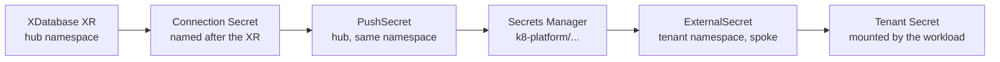

# Fulfil a tenant's database request (admin)

A tenant cannot create a database for themselves on this platform. They
raise a ticket; you place two objects on the management cluster; they
place one object in their own namespace and read the credentials from a
Secret. This page is that documented admin action, start to finish,
with the checks that tell you each half worked.

!!! warning "The mechanism is proven; this procedure is not"
    Every moving part below already runs on a clean build — but for the
    platform's **own** database, not a tenant's. The composite resource,
    the push to Secrets Manager and the pull back down are exactly the
    chain that carries Keycloak's Postgres credentials from the hub to
    the spoke, and that chain passed `keycloak-e2e-live.sh` on clean
    builds #3 and #5 (`SUBSTRATE-READINESS.md`, row 9).

    **Nobody has run it for a tenant.** No tenant database has been
    provisioned, pushed, pulled, consumed or decommissioned through
    these steps, and the manifests below are written from the committed
    Keycloak precedent rather than transcribed from a run. Treat the
    commands as unattested unless a step says otherwise. A tenant
    database taken end to end — request, provision, consume, remove —
    is what flips this page to `stable`.

## Why it works this way

Crossplane runs on the management cluster only, and the GitOps boundary
keeps tenants off it: the `platform-spoke` project can address spoke
clusters and never the management cluster, and the `k8-platform`
project — the one that admits `platform.k8-platform.io` kinds — accepts
sources from this repository only (`argocd/projects/platform-spoke.yaml`,
`argocd/projects/k8-platform.yaml`). So the composite resource is
yours to place, not theirs.

The credentials then have to cross a cluster boundary, because the
database Secret is written where the composite resource lives (the hub)
and the workload runs somewhere else (a spoke). AWS Secrets Manager is
the crossing point, and the two ends are ordinary External Secrets
Operator objects.



## Who does what

| Step | Who | Where |
|---|---|---|
| Raise the request | Tenant | Your ticket system — outside the platform |
| Place the `XDatabase` composite resource | Admin | Management cluster, via a pull request to this repository |
| Place the `PushSecret` | Admin | Management cluster, same namespace as the XR |
| Hand back the Secrets Manager key and the connection facts | Admin | The ticket |
| Place the `ExternalSecret` and consume the Secret | Tenant | Their namespace on a spoke |

## Before you start

| Precondition | How to satisfy it |
|---|---|
| `kubectl` against the management cluster | [Get admin access and platform facts](admin-access.md) |
| Write access to this repository, and the tenant's request in hand | The tenant is already onboarded — [Onboard a tenant](onboard-a-tenant.md) |
| The spoke that runs the tenant's workload is registered and running the secrets operator | The `eso` ApplicationSet delivers the operator and the `aws-secrets-manager` store to every registered spoke (`argocd/apps/spoke/eso.yaml`) |

Two permissions make the whole path work, and both are already in the
repository — you do not grant anything per tenant:

| Side | Grant | Where it lives |
|---|---|---|
| Push (hub) | Create and write Secrets Manager entries under `k8-platform/*` | The `ESOPushSecretWrite` statement on the hub's secrets-operator role, `terraform/management/irsa.tf` |
| Pull (spoke) | Read Secrets Manager entries under `k8-platform/*` | The inline role policy composed per spoke in `crossplane/compositions/xspokeaccess.yaml` |

Both are scoped to the whole `k8-platform/` prefix, in this account and
region. That is deliberate on the write side and a known weakness on
the read side — see the gaps at the foot of this page.

## What the ticket needs to tell you

| From the tenant | Feeds |
|---|---|
| The database name (lower-case, e.g. `orders`) | `spec.databaseName` — the only required field |
| The namespace and cluster their workload runs in | Where they will place the `ExternalSecret`; it is what you name in the Secrets Manager key |
| Size, storage, engine version, if they care | `spec.size`, `spec.storageGB`, `spec.version` — all have defaults |

Field constraints and defaults are in the
[Database (XDatabase) reference](../reference/xdatabase.md). Everything
else — networking, security group, subnet placement, the master
password — the composition decides
(`crossplane/compositions/xdatabase.yaml`).

## 1. Place the composite resource

Commit the XR to a directory in this repository and deliver it with an
Argo CD Application in the `k8-platform` project, modelled on
`argocd/apps/keycloak-db.yaml` (destination
`https://kubernetes.default.svc`, i.e. the hub). The repository has no
committed convention for tenant-owned hub directories yet, so pick one
and stay consistent; the examples here use
`platform-services/<tenant>/database/`.

```yaml
apiVersion: platform.k8-platform.io/v1alpha1
kind: XDatabase
metadata:
  name: orders-db                 # the connection Secret takes this name too
  namespace: tenant-orders        # a namespace on the HUB
  annotations:
    argocd.argoproj.io/sync-wave: "34"
spec:
  engine: postgres
  size: small
  storageGB: 20
  databaseName: orders
  region: us-east-1
```

The name is load-bearing. The composition patches the connection
Secret's name from `metadata.name`, so the XR name *is* the Secret name
— the same contract the Keycloak XR relies on
(`platform-services/keycloak/database/keycloak-db.yaml`).

**How you know it worked.** The composite resource goes `Ready`, and a
Secret appears beside it. Provisioning a managed database is genuinely
slow; the XR sits un-Ready throughout, which is convergence, not
failure.

```bash
kubectl -n tenant-orders get xdatabase orders-db
kubectl -n tenant-orders get secret orders-db -o jsonpath='{.data}' | tr ',' '\n'
kubectl -n tenant-orders get xdatabase orders-db \
  -o jsonpath='{.status.endpoint}:{.status.port}'
```

Read the key names from that second command rather than trusting this
page: the reference describes the connection Secret as carrying
`endpoint` and `port`, while the keys the push side was built against —
recorded as observed live in
`platform-services/keycloak/database/keycloak-db-pushsecret.yaml` — are
`username`, `password`, `host`, `port`. The next step has to name the
keys that actually exist.

## 2. Place the PushSecret

This is the copy into Secrets Manager. It lives in the **same namespace
as the connection Secret**, because its selector is namespace-local,
and it references the hub's cluster-wide store by name.

```yaml
apiVersion: external-secrets.io/v1alpha1
kind: PushSecret
metadata:
  name: orders-db
  namespace: tenant-orders
  annotations:
    argocd.argoproj.io/sync-wave: "35"   # after the XR
spec:
  refreshInterval: 5m
  secretStoreRefs:
    - name: aws-secrets-manager
      kind: ClusterSecretStore
  selector:
    secret:
      name: orders-db                    # the connection Secret
  data:
    - match:
        secretKey: username
        remoteRef:
          remoteKey: k8-platform/tenant-orders/orders-db
          property: username
    - match:
        secretKey: password
        remoteRef:
          remoteKey: k8-platform/tenant-orders/orders-db
          property: password
    - match:
        secretKey: host
        remoteRef:
          remoteKey: k8-platform/tenant-orders/orders-db
          property: host
    - match:
        secretKey: port
        remoteRef:
          remoteKey: k8-platform/tenant-orders/orders-db
          property: port
```

That is the Keycloak PushSecret with the names changed. Compare it
side by side with the original —
`platform-services/keycloak/database/keycloak-db-pushsecret.yaml` — if
anything here surprises you.

**Choosing the Secrets Manager key.** Only the `k8-platform/` prefix is
load-bearing; it is what both IAM grants are scoped to. Everything
after it is a convention, and the repository has two: the Keycloak push
uses the flat `k8-platform/keycloak-db`, and the platform-secret
composition generates `k8-platform/<namespace>/<name>`
(`crossplane/compositions/platform-secret.yaml`). This page recommends
the second shape for tenant databases, so the path names the tenant.

!!! warning "Do not collide with a platform secret"
    `XPlatformSecret` owns `k8-platform/<namespace>/<name>`
    deterministically. If the tenant has (or may have) a platform secret
    in that namespace, pick a database key that cannot collide with one
    — a suffix such as `-db` in the XR name is enough. Nothing in the
    platform detects a collision for you.

**How you know it worked.**

```bash
kubectl -n tenant-orders get pushsecret orders-db
aws secretsmanager describe-secret \
  --secret-id k8-platform/tenant-orders/orders-db --region <region>
```

The push retries until the source Secret exists, so a PushSecret that
is not yet synced immediately after apply is expected. If it never
syncs, the two usual causes are a key name that the connection Secret
does not carry (step 1) and a store reference that does not resolve.

## 3. Hand back on the ticket

| Give the tenant | Example |
|---|---|
| The Secrets Manager key | `k8-platform/tenant-orders/orders-db` |
| The property names inside it | `username`, `password`, `host`, `port` |
| The database name | `orders` |
| The store to reference | `ClusterSecretStore` named `aws-secrets-manager` — the same name on every cluster |
| The refresh behaviour | Both legs poll every 5 minutes, so a host change after a database replacement takes two refreshes to reach the workload |

They do not need the endpoint separately: it travels as the `host`
property. They never get management-cluster access, and they never see
the hub-side Secret.

## 4. The tenant's side

The tenant places one object in their own namespace, on their own
cluster, through their normal delivery path
([Deploy an application](deploy-an-application.md)). `external-secrets.io`
kinds are admitted for spoke namespaces by the `platform-spoke` project,
so nothing needs to be allowlisted.

```yaml
apiVersion: external-secrets.io/v1beta1
kind: ExternalSecret
metadata:
  name: orders-db
  namespace: orders               # the tenant's namespace on the SPOKE
  annotations:
    argocd.argoproj.io/sync-wave: "-1"   # before the workload
spec:
  refreshInterval: 5m
  secretStoreRef:
    kind: ClusterSecretStore
    name: aws-secrets-manager
  target:
    name: orders-db
    creationPolicy: Owner
    deletionPolicy: Delete
    template:
      engineVersion: v2
      data:
        username: "{{ .username }}"
        password: "{{ .password }}"
        host: "{{ .host }}"
        port: "{{ .port }}"
  data:
    - secretKey: username
      remoteRef:
        key: k8-platform/tenant-orders/orders-db
        property: username
        conversionStrategy: Default
        decodingStrategy: None
        metadataPolicy: None
    - secretKey: password
      remoteRef:
        key: k8-platform/tenant-orders/orders-db
        property: password
        conversionStrategy: Default
        decodingStrategy: None
        metadataPolicy: None
    - secretKey: host
      remoteRef:
        key: k8-platform/tenant-orders/orders-db
        property: host
        conversionStrategy: Default
        decodingStrategy: None
        metadataPolicy: None
    - secretKey: port
      remoteRef:
        key: k8-platform/tenant-orders/orders-db
        property: port
        conversionStrategy: Default
        decodingStrategy: None
        metadataPolicy: None
```

Two details in that manifest are not decoration, and both are carried
over from the committed Keycloak consumer
(`platform-services/keycloak/spoke/keycloak-db-externalsecret.yaml`):

- **Spell out `conversionStrategy`, `decodingStrategy` and
  `metadataPolicy`.** The operator's admission defaults them, and Argo CD
  then diffs the committed manifest against the live object forever. The
  Keycloak manifest records this as observed behaviour, not theory.
- **Put it in an earlier sync wave than the workload.** Argo CD waits
  for a wave to be healthy before advancing, so a Secret created in a
  later wave than the pod that mounts it deadlocks the first sync.

The tenant then mounts the Secret as they would any other — a chart's
`existingSecret`, or `secretKeyRef` env vars in a plain Deployment. The
generic self-service view of the same object is
[Provision a database and connect an application to it](provision-a-database.md);
this page is the part that guide leaves to the operator.

**How the tenant knows it worked.**

```bash
kubectl -n orders get externalsecret orders-db
kubectl -n orders get secret orders-db -o jsonpath='{.data.host}' | base64 -d
```

Until the push lands, the ExternalSecret is simply not ready and the
workload waits on a missing Secret. That is convergence too.

## Decommissioning a tenant database

Deleting the composite resource destroys the database and its data.
There is no documented backup or restore posture — treat it as
irreversible.

```bash
kubectl -n tenant-orders delete xdatabase orders-db
```

Three things are left behind, and only one of them is a bug:

| Left behind | Why | What to do |
|---|---|---|
| The Secrets Manager entry | The push deliberately runs with the default deletion policy (`None`) and the hub role is granted no `DeleteSecret`, so the copy outlives the PushSecret by design — account rotation reaps it | Nothing, unless you are reusing the key name; then confirm the value is replaced before the tenant reads it |
| The tenant's Secret on the spoke | Owned by their ExternalSecret, removed when they remove it | Ask the tenant to delete their ExternalSecret |
| A Secret named `<xr>-master` in the hub namespace | **A registered defect.** The provider generates that Secret to hold the master password and it carries no owner reference back to the XR, so Crossplane's garbage collection does not reap it | Leave it. Do not hand-delete: the orphan is the observable the fix is being written against |

That last row is bead `kp-2al.8`. What it means for you: after a
decommission, expect an orphaned `<xr>-master` Secret holding a password
to a database that no longer exists, and expect it to block reuse of the
same XR name in that namespace if the provider tries to write a fresh
one. It is recorded as a hypothesis rather than a confirmed bug —
`tests/chainsaw/xdatabase/` contains only the XRD-establishment
scenario today, so no real-AWS deletion has ever been asserted. If you
do decommission a tenant database, the state you find afterwards is
evidence worth attaching to that bead.

## Gaps this page names

| Gap | Consequence |
|---|---|
| No tenant self-service for databases | Every database is an admin ticket; this is the accepted MVP position, and self-service is a v2.0 item |
| No tenant database has ever gone through this path | The mechanism is proven for the platform's own Keycloak database only; the tenant-shaped variant is unexecuted |
| Every spoke's secrets-operator role can read all of `k8-platform/*` | Any tenant who learns another tenant's Secrets Manager key can read its database credentials — registered, and deliberately deferred to v2.0 |
| The Secrets Manager path is a convention, not a contract | Nothing generates, validates or reserves the key for a database; collisions with `XPlatformSecret` names are possible and undetected |
| No committed layout for tenant-owned hub manifests | You invent a directory and an Application per tenant; there is no template and no test pinning the shape |
| The connection Secret's key names are not pinned by a published contract | The reference documents `endpoint`/`port`; the working precedent uses `host`/`port`. Read the live Secret before writing the PushSecret |
| The `<xr>-master` Secret is not garbage-collected | Every decommission leaves a credential-bearing orphan behind |
| No backup or restore posture | Deletion is data loss |
| The push copy outlives everything | A decommissioned tenant's credentials remain in Secrets Manager until the account rotates |

---

*Tracking: beads `kp-2al.16` (this page), `kp-2al.8` (the `<xr>-master`
orphan). Earlier register entries: OI-2026-07-06-1 (no cross-cluster
consumption contract), OI-2026-06-07-5 (the hub-to-spoke secret path),
OI-2026-07-06-2 (cross-tenant secret readability), OI-2026-06-06-3 (the
orphaned master Secret). Decisions referenced: ADR-0005 (the secrets
operator carries cross-cluster secret movement), ADR-0010 (cluster
facts ride the registration Secret), ADR-0017 (administration is a
user-facing surface).*
